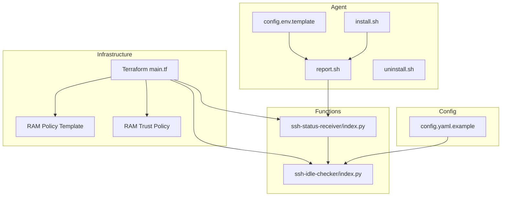
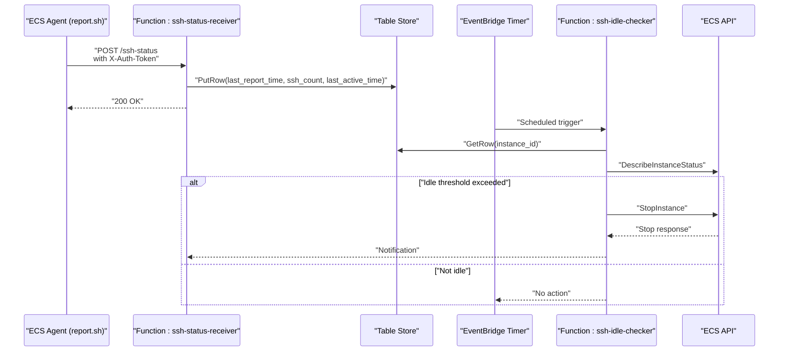
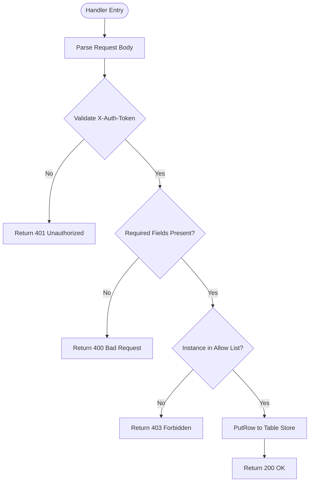
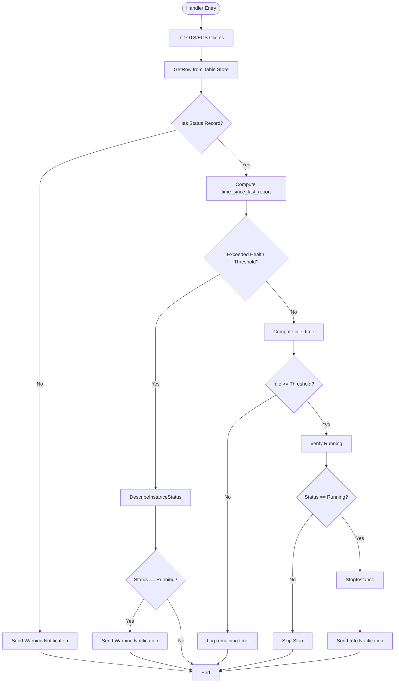
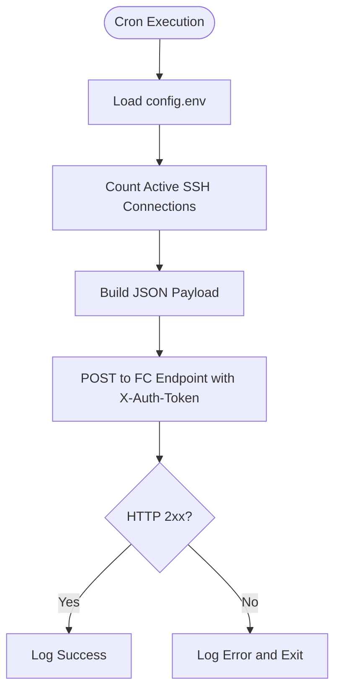
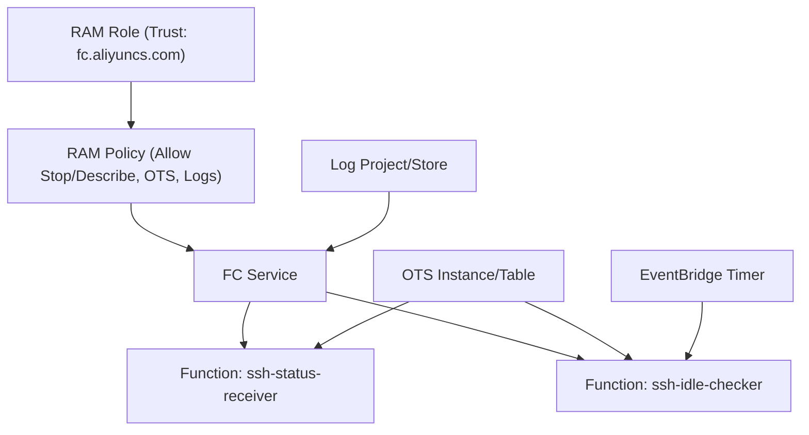
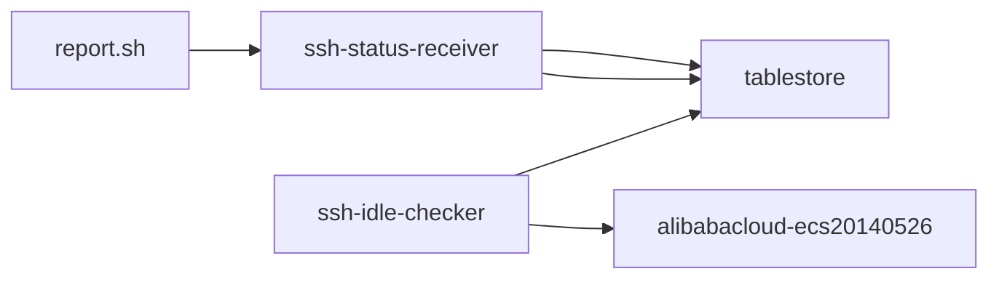

# Advanced Topics

<cite>
**Referenced Files in This Document**
- [config.yaml.example](file://config/config.yaml.example)
- [index.py (ssh-idle-checker)](file://functions/ssh-idle-checker/index.py)
- [index.py (ssh-status-receiver)](file://functions/ssh-status-receiver/index.py)
- [main.tf](file://infra/main.tf)
- [deploy.sh](file://deploy.sh)
- [destroy.sh](file://destroy.sh)
- [config.env.template](file://ecs-agent/config.env.template)
- [install.sh](file://ecs-agent/install.sh)
- [report.sh](file://ecs-agent/report.sh)
- [uninstall.sh](file://ecs-agent/uninstall.sh)
- [ram-policy-template.json](file://infra/ram-policy-template.json)
- [ram-trust-policy.json](file://infra/ram-trust-policy.json)
- [requirements.txt (ssh-idle-checker)](file://functions/ssh-idle-checker/requirements.txt)
- [requirements.txt (ssh-status-receiver)](file://functions/ssh-status-receiver/requirements.txt)
</cite>

## Table of Contents
1. [Introduction](#introduction)
2. [Project Structure](#project-structure)
3. [Core Components](#core-components)
4. [Architecture Overview](#architecture-overview)
5. [Detailed Component Analysis](#detailed-component-analysis)
6. [Dependency Analysis](#dependency-analysis)
7. [Performance Considerations](#performance-considerations)
8. [Troubleshooting Guide](#troubleshooting-guide)
9. [Conclusion](#conclusion)
10. [Appendices](#appendices)

## Introduction
This document provides advanced topics for ECS Auto-Stop, focusing on customization, extensibility, integration, and operational excellence. It covers threshold parameter tuning, notification system extensions, custom authentication methods, integration with external monitoring systems, CI/CD pipeline integration, custom dashboard development, scaling for high-volume deployments, cost optimization strategies, performance tuning, advanced configuration scenarios, multi-region deployment patterns, disaster recovery, and extension points for additional metrics and alerting.

## Project Structure
The project is organized into modular components:
- Infrastructure-as-Code (Terraform) defines cloud resources and IAM policies.
- Function Compute functions implement the SSH status receiver and idle checker.
- ECS agent scripts run on target instances to collect and report SSH activity.
- Configuration files define defaults and thresholds.

**Diagram sources**
- [main.tf:1-305](file://infra/main.tf#L1-L305)
- [index.py (ssh-status-receiver):1-205](file://functions/ssh-status-receiver/index.py#L1-L205)
- [index.py (ssh-idle-checker):1-290](file://functions/ssh-idle-checker/index.py#L1-L290)
- [config.env.template:1-12](file://ecs-agent/config.env.template#L1-L12)
- [install.sh:1-73](file://ecs-agent/install.sh#L1-L73)
- [report.sh:1-86](file://ecs-agent/report.sh#L1-L86)
- [uninstall.sh:1-43](file://ecs-agent/uninstall.sh#L1-L43)
- [config.yaml.example:1-42](file://config/config.yaml.example#L1-L42)

**Section sources**
- [main.tf:1-305](file://infra/main.tf#L1-L305)
- [index.py (ssh-status-receiver):1-205](file://functions/ssh-status-receiver/index.py#L1-L205)
- [index.py (ssh-idle-checker):1-290](file://functions/ssh-idle-checker/index.py#L1-L290)
- [config.env.template:1-12](file://ecs-agent/config.env.template#L1-L12)
- [install.sh:1-73](file://ecs-agent/install.sh#L1-L73)
- [report.sh:1-86](file://ecs-agent/report.sh#L1-L86)
- [uninstall.sh:1-43](file://ecs-agent/uninstall.sh#L1-L43)
- [config.yaml.example:1-42](file://config/config.yaml.example#L1-L42)

## Core Components
- SSH Status Receiver: Validates authentication, accepts reports, writes to Table Store, and returns structured responses.
- SSH Idle Checker: Periodically checks Table Store for SSH activity, verifies instance status, and stops idle instances.
- ECS Agent: Runs on target instances, counts active SSH connections, and posts reports to the receiver.
- Infrastructure: Creates OTS, Function Compute, EventBridge, Log Service, and IAM roles/policies.

Key customization points:
- Thresholds: Idle threshold, health check threshold, and cron schedule.
- Authentication: Token-based header validation.
- Notifications: Webhook-based alerts (DingTalk).

**Section sources**
- [index.py (ssh-status-receiver):46-76](file://functions/ssh-status-receiver/index.py#L46-L76)
- [index.py (ssh-idle-checker):132-159](file://functions/ssh-idle-checker/index.py#L132-L159)
- [report.sh:68-85](file://ecs-agent/report.sh#L68-L85)
- [main.tf:138-197](file://infra/main.tf#L138-L197)
- [config.yaml.example:34-42](file://config/config.yaml.example#L34-L42)

## Architecture Overview
High-level flow:
- ECS agent collects SSH connection count and posts to the HTTP-triggered Function Compute function.
- The receiver validates the token and writes the status to Table Store.
- The scheduler triggers the idle checker periodically, which reads the latest status, checks thresholds, and stops the instance if idle.

**Diagram sources**
- [report.sh:68-85](file://ecs-agent/report.sh#L68-L85)
- [index.py (ssh-status-receiver):110-204](file://functions/ssh-status-receiver/index.py#L110-L204)
- [index.py (ssh-idle-checker):161-289](file://functions/ssh-idle-checker/index.py#L161-L289)
- [main.tf:232-270](file://infra/main.tf#L232-L270)

## Detailed Component Analysis

### SSH Status Receiver (Authentication, Validation, Persistence)
- Authentication: Validates a custom token from the request header against the configured secret.
- Authorization: Restricts accepted instance IDs to a configured allow-list.
- Persistence: Writes last report time, SSH count, and last active time to Table Store.
- Error handling: Returns appropriate HTTP status codes for invalid requests, unauthorized access, and internal errors.

**Diagram sources**
- [index.py (ssh-status-receiver):110-204](file://functions/ssh-status-receiver/index.py#L110-L204)

**Section sources**
- [index.py (ssh-status-receiver):46-76](file://functions/ssh-status-receiver/index.py#L46-L76)
- [index.py (ssh-status-receiver):78-108](file://functions/ssh-status-receiver/index.py#L78-L108)
- [index.py (ssh-status-receiver):110-204](file://functions/ssh-status-receiver/index.py#L110-L204)

### SSH Idle Checker (Thresholds, Health Checks, Notifications)
- Thresholds: Compares last active time and last report time against configured thresholds.
- Health checks: Confirms the instance is still running before acting.
- Actions: Stops the instance and sends notifications via webhook.

**Diagram sources**
- [index.py (ssh-idle-checker):161-289](file://functions/ssh-idle-checker/index.py#L161-L289)

**Section sources**
- [index.py (ssh-idle-checker):28-30](file://functions/ssh-idle-checker/index.py#L28-L30)
- [index.py (ssh-idle-checker):207-229](file://functions/ssh-idle-checker/index.py#L207-L229)
- [index.py (ssh-idle-checker):231-289](file://functions/ssh-idle-checker/index.py#L231-L289)

### ECS Agent (Collection, Reporting, Cron)
- Collection: Counts active SSH connections using multiple fallbacks (ss, netstat, who).
- Reporting: Posts JSON payload with instance ID, SSH count, and timestamp to the receiver.
- Scheduling: Adds a cron job to run every 5 minutes.

**Diagram sources**
- [report.sh:17-85](file://ecs-agent/report.sh#L17-L85)
- [install.sh:50-62](file://ecs-agent/install.sh#L50-L62)

**Section sources**
- [report.sh:39-66](file://ecs-agent/report.sh#L39-L66)
- [report.sh:68-85](file://ecs-agent/report.sh#L68-L85)
- [install.sh:50-62](file://ecs-agent/install.sh#L50-L62)

### Infrastructure (IAM, OTS, FC, EventBridge)
- IAM: RAM role assumed by Function Compute with scoped permissions.
- OTS: Dedicated instance/table for storing SSH status.
- FC: Two functions (receiver and checker) with environment variables injected.
- EventBridge: Timer-based scheduling for periodic checks.

**Diagram sources**
- [main.tf:106-132](file://infra/main.tf#L106-L132)
- [ram-policy-template.json:1-36](file://infra/ram-policy-template.json#L1-L36)
- [ram-trust-policy.json:1-15](file://infra/ram-trust-policy.json#L1-L15)
- [main.tf:62-82](file://infra/main.tf#L62-L82)
- [main.tf:138-197](file://infra/main.tf#L138-L197)
- [main.tf:256-270](file://infra/main.tf#L256-L270)

**Section sources**
- [main.tf:106-132](file://infra/main.tf#L106-L132)
- [ram-policy-template.json:1-36](file://infra/ram-policy-template.json#L1-L36)
- [ram-trust-policy.json:1-15](file://infra/ram-trust-policy.json#L1-L15)
- [main.tf:62-82](file://infra/main.tf#L62-L82)
- [main.tf:138-197](file://infra/main.tf#L138-L197)
- [main.tf:256-270](file://infra/main.tf#L256-L270)

## Dependency Analysis
- Functions depend on Alibaba Cloud SDKs and Table Store client.
- Receiver depends on authentication and instance allow-list.
- Idle checker depends on OTS read/write and ECS describe/stop APIs.
- Agent depends on curl and cron.

**Diagram sources**
- [requirements.txt (ssh-idle-checker):1-4](file://functions/ssh-idle-checker/requirements.txt#L1-L4)
- [requirements.txt (ssh-status-receiver):1-2](file://functions/ssh-status-receiver/requirements.txt#L1-L2)
- [report.sh:68-85](file://ecs-agent/report.sh#L68-L85)

**Section sources**
- [requirements.txt (ssh-idle-checker):1-4](file://functions/ssh-idle-checker/requirements.txt#L1-L4)
- [requirements.txt (ssh-status-receiver):1-2](file://functions/ssh-status-receiver/requirements.txt#L1-L2)
- [report.sh:68-85](file://ecs-agent/report.sh#L68-L85)

## Performance Considerations
- Reduce overhead:
  - Adjust cron interval to balance freshness vs. cost.
  - Use minimal memory and short timeouts for functions.
- Optimize IO:
  - Batch writes if extending receiver to include additional metrics.
  - Use OTS TTL cautiously; current table does not expire rows.
- Network:
  - Ensure endpoints are reachable from agents and Function Compute.
  - Consider enabling retries with exponential backoff in the agent if needed.
- Cost:
  - Use smaller memory sizes for functions where possible.
  - Minimize unnecessary logs and keep retention reasonable.

[No sources needed since this section provides general guidance]

## Troubleshooting Guide
Common issues and resolutions:
- Missing TARGET_INSTANCE_ID or environment variables in the idle checker.
- Missing or invalid X-Auth-Token in the receiver.
- Instance not in ALLOWED_INSTANCE_IDS.
- No status record indicates agent not installed or not reporting.
- Health check failure indicates agent stopped or network issues.
- Stop operation fails due to instance state or permissions.

Operational tips:
- Verify cron job presence and logs on the target instance.
- Check Function Compute logs and OTS table entries.
- Confirm EventBridge timer is active and targets are correct.

**Section sources**
- [index.py (ssh-idle-checker):169-176](file://functions/ssh-idle-checker/index.py#L169-L176)
- [index.py (ssh-status-receiver):140-147](file://functions/ssh-status-receiver/index.py#L140-L147)
- [index.py (ssh-status-receiver):173-181](file://functions/ssh-status-receiver/index.py#L173-L181)
- [index.py (ssh-idle-checker):186-199](file://functions/ssh-idle-checker/index.py#L186-L199)
- [index.py (ssh-idle-checker):213-223](file://functions/ssh-idle-checker/index.py#L213-L223)

## Conclusion
ECS Auto-Stop provides a robust, secure, and extensible foundation for automated instance lifecycle management. By leveraging configurable thresholds, authentication, and notifications, teams can tailor the solution to diverse environments. The modular architecture enables integration with external monitoring, CI/CD, and custom dashboards, while infrastructure-as-code ensures reproducibility and governance.

[No sources needed since this section summarizes without analyzing specific files]

## Appendices

### A. Customization Options

- Threshold parameter adjustment
  - Modify idle threshold, health check threshold, and cron schedule in configuration.
  - Environment variables for functions override defaults.

  **Section sources**
  - [config.yaml.example:34-42](file://config/config.yaml.example#L34-L42)
  - [index.py (ssh-idle-checker):28-30](file://functions/ssh-idle-checker/index.py#L28-L30)
  - [main.tf:256-270](file://infra/main.tf#L256-L270)

- Notification system extensions
  - Extend the receiver’s notification function to support additional channels (e.g., email, Slack).
  - Use environment variables to enable/disable and configure endpoints.

  **Section sources**
  - [index.py (ssh-idle-checker):132-159](file://functions/ssh-idle-checker/index.py#L132-L159)
  - [index.py (ssh-status-receiver):132-159](file://functions/ssh-status-receiver/index.py#L132-L159)

- Custom authentication methods
  - Enforce stricter tokens or integrate with enterprise identity providers.
  - Add multi-factor headers or certificate-based auth at the ingress level.

  **Section sources**
  - [index.py (ssh-status-receiver):46-64](file://functions/ssh-status-receiver/index.py#L46-L64)
  - [main.tf:216-226](file://infra/main.tf#L216-L226)

### B. Integration Patterns

- External monitoring systems
  - Export metrics to OTS or a central metrics store; build dashboards from OTS or logs.
  - Use Function Compute to forward events to monitoring platforms.

  **Section sources**
  - [index.py (ssh-idle-checker):132-159](file://functions/ssh-idle-checker/index.py#L132-L159)
  - [main.tf:88-100](file://infra/main.tf#L88-L100)

- CI/CD pipeline integration
  - Automate deployment via the provided scripts and Terraform plans.
  - Gate deployments with approvals and pre-apply reviews.

  **Section sources**
  - [deploy.sh:60-74](file://deploy.sh#L60-L74)
  - [destroy.sh:21-34](file://destroy.sh#L21-L34)

- Custom dashboard development
  - Query OTS for SSH status and trends.
  - Visualize idle time, stop actions, and health check failures.

  **Section sources**
  - [index.py (ssh-idle-checker):104-130](file://functions/ssh-idle-checker/index.py#L104-L130)
  - [main.tf:69-82](file://infra/main.tf#L69-L82)

### C. Scaling Considerations

- High-volume deployments
  - Use multiple Function Compute functions or separate services per region.
  - Distribute instances across multiple OTS tables or projects to reduce hotspots.
  - Increase EventBridge concurrency and tune function timeouts.

  **Section sources**
  - [main.tf:138-197](file://infra/main.tf#L138-L197)
  - [main.tf:232-270](file://infra/main.tf#L232-L270)

- Cost optimization
  - Right-size function memory and timeouts.
  - Use lower log retention and disable non-critical logs.
  - Consolidate regions and reuse OTS resources.

  **Section sources**
  - [main.tf:143-147](file://infra/main.tf#L143-L147)
  - [main.tf:93-100](file://infra/main.tf#L93-L100)

- Performance tuning
  - Optimize cron intervals and function execution windows.
  - Cache credentials and minimize cold starts.

  **Section sources**
  - [install.sh:50-62](file://ecs-agent/install.sh#L50-L62)
  - [main.tf:162-185](file://infra/main.tf#L162-L185)

### D. Advanced Configuration Scenarios

- Multi-region deployment patterns
  - Deploy identical stacks per region with regional endpoints.
  - Use cross-region replication or centralized monitoring.

  **Section sources**
  - [config.yaml.example:5-6](file://config/config.yaml.example#L5-L6)
  - [index.py (ssh-idle-checker):54-68](file://functions/ssh-idle-checker/index.py#L54-L68)

- Disaster recovery implementations
  - Maintain backups of OTS tables and Function Compute configurations.
  - Automate failback procedures and cross-region recovery.

  **Section sources**
  - [main.tf:62-82](file://infra/main.tf#L62-L82)
  - [main.tf:138-152](file://infra/main.tf#L138-L152)

### E. Extension Points

- Additional monitoring metrics
  - Extend the receiver to capture CPU, memory, disk, and network metrics.
  - Store composite metrics in OTS for richer dashboards.

  **Section sources**
  - [index.py (ssh-status-receiver):78-108](file://functions/ssh-status-receiver/index.py#L78-L108)

- Custom alerting mechanisms
  - Integrate with alert managers (e.g., PagerDuty, Opsgenie) via webhooks.
  - Add severity levels and escalation policies.

  **Section sources**
  - [index.py (ssh-idle-checker):132-159](file://functions/ssh-idle-checker/index.py#L132-L159)
  - [index.py (ssh-status-receiver):132-159](file://functions/ssh-status-receiver/index.py#L132-L159)

- Third-party service integrations
  - Use Function Compute to publish events to message buses or event hubs.
  - Connect to ticketing systems for automated incident creation.

  **Section sources**
  - [index.py (ssh-idle-checker):132-159](file://functions/ssh-idle-checker/index.py#L132-L159)
  - [main.tf:138-152](file://infra/main.tf#L138-L152)