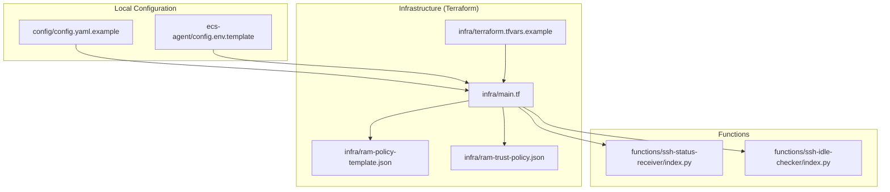
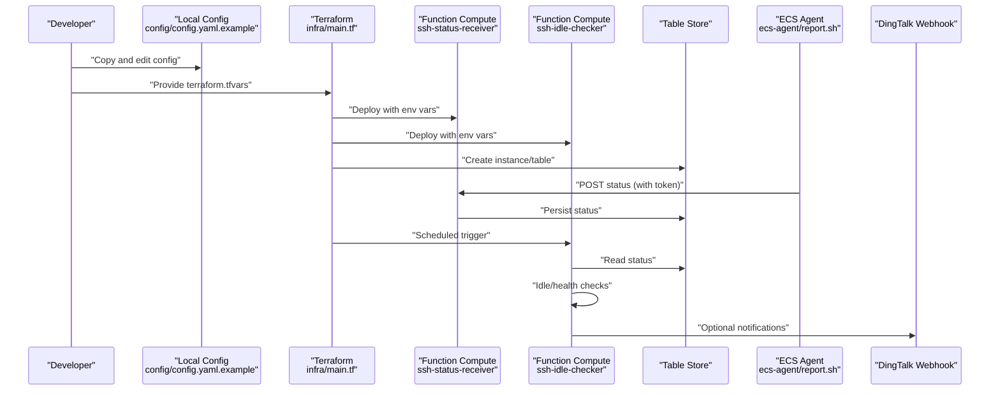
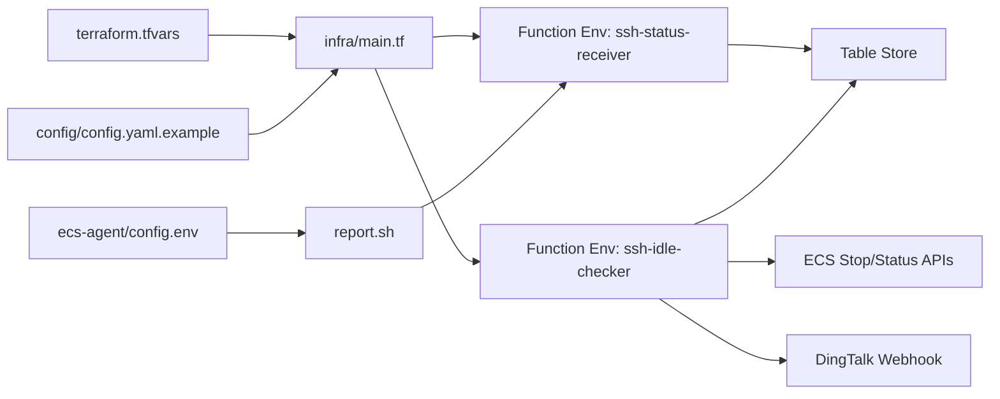

# Configuration Management

<cite>
**Referenced Files in This Document**
- [config.yaml.example](file://config/config.yaml.example)
- [config.env.template](file://ecs-agent/config.env.template)
- [main.tf](file://infra/main.tf)
- [terraform.tfvars.example](file://infra/terraform.tfvars.example)
- [index.py (ssh-idle-checker)](file://functions/ssh-idle-checker/index.py)
- [index.py (ssh-status-receiver)](file://functions/ssh-status-receiver/index.py)
- [deploy.sh](file://deploy.sh)
- [destroy.sh](file://destroy.sh)
- [install.sh (agent)](file://ecs-agent/install.sh)
- [report.sh (agent)](file://ecs-agent/report.sh)
- [ram-policy-template.json](file://infra/ram-policy-template.json)
- [ram-trust-policy.json](file://infra/ram-trust-policy.json)
</cite>

## Table of Contents
1. [Introduction](#introduction)
2. [Project Structure](#project-structure)
3. [Core Components](#core-components)
4. [Architecture Overview](#architecture-overview)
5. [Detailed Component Analysis](#detailed-component-analysis)
6. [Dependency Analysis](#dependency-analysis)
7. [Performance Considerations](#performance-considerations)
8. [Troubleshooting Guide](#troubleshooting-guide)
9. [Conclusion](#conclusion)
10. [Appendices](#appendices)

## Introduction
This document explains how to configure ECS Auto-Stop across all layers: main configuration file, environment variables for the monitoring agent, Function Compute service settings, Table Store database configuration, Alibaba Cloud region settings, security token management, Terraform variables for infrastructure provisioning, thresholds for idle detection and health checks, and DingTalk notification setup. It also provides security best practices, configuration examples, and validation steps.

## Project Structure
The configuration surface spans three major areas:
- Central configuration file for local development and reference
- Environment variables for the ECS monitoring agent
- Terraform-managed cloud resources and Function Compute environment variables

**Diagram sources**
- [config.yaml.example](file://config/config.yaml.example)
- [config.env.template](file://ecs-agent/config.env.template)
- [main.tf](file://infra/main.tf)
- [terraform.tfvars.example](file://infra/terraform.tfvars.example)
- [index.py (ssh-idle-checker)](file://functions/ssh-idle-checker/index.py)
- [index.py (ssh-status-receiver)](file://functions/ssh-status-receiver/index.py)
- [ram-policy-template.json](file://infra/ram-policy-template.json)
- [ram-trust-policy.json](file://infra/ram-trust-policy.json)

**Section sources**
- [config.yaml.example](file://config/config.yaml.example)
- [config.env.template](file://ecs-agent/config.env.template)
- [main.tf](file://infra/main.tf)
- [terraform.tfvars.example](file://infra/terraform.tfvars.example)

## Core Components
- Central configuration file defines Alibaba Cloud region, ECS instance identification, Table Store database configuration, Function Compute service settings, security token, notifications, and thresholds.
- ECS monitoring agent reads environment variables to build periodic reports and POST them to Function Compute.
- Terraform provisions cloud resources and injects environment variables into Function Compute functions.
- Functions implement authentication, status persistence, idle detection, health checks, and optional DingTalk notifications.

**Section sources**
- [config.yaml.example](file://config/config.yaml.example)
- [config.env.template](file://ecs-agent/config.env.template)
- [main.tf](file://infra/main.tf)
- [index.py (ssh-idle-checker)](file://functions/ssh-idle-checker/index.py)
- [index.py (ssh-status-receiver)](file://functions/ssh-status-receiver/index.py)

## Architecture Overview
The configuration pipeline connects local settings to cloud resources and runtime behavior.

**Diagram sources**
- [config.yaml.example](file://config/config.yaml.example)
- [main.tf](file://infra/main.tf)
- [index.py (ssh-idle-checker)](file://functions/ssh-idle-checker/index.py)
- [index.py (ssh-status-receiver)](file://functions/ssh-status-receiver/index.py)
- [report.sh (agent)](file://ecs-agent/report.sh)

## Detailed Component Analysis

### Central Configuration File (config/config.yaml.example)
- Alibaba Cloud region: Used to construct endpoints and resource identifiers.
- ECS instance identification: Target instance to monitor and stop.
- Table Store configuration: Instance name, table name, and endpoint.
- Function Compute configuration: Service name; HTTP endpoint is auto-generated post-deployment.
- Security: Authentication token for Function Compute HTTP endpoint.
- Notifications: DingTalk webhook toggle and URL.
- Thresholds: Idle detection seconds, health check threshold seconds, and cron schedule for checks.

Validation steps:
- Copy the example to config.yaml and update values.
- Confirm region matches deployed Function Compute region.
- Ensure instance ID exists and is accessible by the Function Compute role.

**Section sources**
- [config.yaml.example](file://config/config.yaml.example)

### ECS Monitoring Agent Environment Variables (ecs-agent/config.env.template)
- FC_ENDPOINT: Function Compute HTTP endpoint URL for the status receiver.
- INSTANCE_ID: ECS instance identifier to report.
- AUTH_TOKEN: Secret token shared with the Function Compute function.

Validation steps:
- Copy template to /opt/ssh-monitor/config.env on the target ECS instance.
- Fill in the values from Terraform outputs and terraform.tfvars.
- Confirm cron job runs every 5 minutes and logs are written.

**Section sources**
- [config.env.template](file://ecs-agent/config.env.template)
- [report.sh (agent)](file://ecs-agent/report.sh)
- [install.sh (agent)](file://ecs-agent/install.sh)

### Function Compute Environment Variables (Terraform-managed)
- OTS_ENDPOINT, OTS_INSTANCE_NAME, OTS_TABLE_NAME: Table Store connection parameters injected into both functions.
- AUTH_TOKEN: Shared secret for HTTP endpoint authentication.
- ALLOWED_INSTANCE_IDS: Restricts which instances can report to the receiver.
- TARGET_INSTANCE_ID, REGION_ID: Target instance and region for the idle checker.
- DINGTALK_WEBHOOK: Optional webhook URL for DingTalk notifications.

Validation steps:
- Confirm environment variables are present in both functions after deployment.
- Verify the receiver enforces token and instance ID validation.
- Confirm the checker reads environment variables and performs health/idle checks.

**Section sources**
- [main.tf](file://infra/main.tf)
- [index.py (ssh-idle-checker)](file://functions/ssh-idle-checker/index.py)
- [index.py (ssh-status-receiver)](file://functions/ssh-status-receiver/index.py)

### Table Store Database Configuration
- Instance and table names are provisioned by Terraform.
- Primary key is instance_id; attributes include last_active_time, last_report_time, ssh_count, and report_timestamp.
- Access is granted via RAM policy to the Function Compute role.

Validation steps:
- Confirm OTS instance and table exist after deployment.
- Verify the receiver writes rows and the checker reads them.
- Ensure TTL and max_version align with operational needs.

**Section sources**
- [main.tf](file://infra/main.tf)
- [index.py (ssh-idle-checker)](file://functions/ssh-idle-checker/index.py)
- [index.py (ssh-status-receiver)](file://functions/ssh-status-receiver/index.py)
- [ram-policy-template.json](file://infra/ram-policy-template.json)

### Security Token Management
- Central token is generated securely and stored in terraform.tfvars.
- Function Compute receives the token via environment variables.
- The receiver validates the token via a custom header and rejects unauthorized requests.
- The agent sends the token in the same header.

Best practices:
- Generate tokens with a cryptographically secure random generator.
- Store tokens as sensitive variables in Terraform.
- Rotate tokens periodically and update both Function Compute and agent configurations.
- Limit token scope to the HTTP endpoint and restrict allowed instance IDs.

**Section sources**
- [config.yaml.example](file://config/config.yaml.example)
- [terraform.tfvars.example](file://infra/terraform.tfvars.example)
- [index.py (ssh-status-receiver)](file://functions/ssh-status-receiver/index.py)
- [report.sh (agent)](file://ecs-agent/report.sh)

### Threshold Configuration for Idle Detection and Health Checks
- Idle threshold seconds: Time window after which an instance is considered idle and eligible for stopping.
- Health check threshold seconds: Time window to detect missing reports indicating agent issues.
- Check interval cron: Schedule for the scheduled trigger to evaluate idle and health conditions.

Validation steps:
- Adjust thresholds according to workload patterns.
- Verify the checker compares last_report_time against current time and instance status.
- Confirm the receiver updates last_report_time and last_active_time appropriately.

**Section sources**
- [config.yaml.example](file://config/config.yaml.example)
- [index.py (ssh-idle-checker)](file://functions/ssh-idle-checker/index.py)
- [index.py (ssh-status-receiver)](file://functions/ssh-status-receiver/index.py)

### Notification System Setup for DingTalk Alerts
- Enable notifications in the central configuration and provide a webhook URL.
- The idle checker sends notifications via DingTalk webhook when actions occur or warnings arise.
- The receiver does not send DingTalk notifications by default.

Validation steps:
- Provide a DingTalk webhook URL in terraform.tfvars or central config.
- Confirm the checker posts messages with actionable content.
- Test webhook connectivity and message formatting.

**Section sources**
- [config.yaml.example](file://config/config.yaml.example)
- [index.py (ssh-idle-checker)](file://functions/ssh-idle-checker/index.py)

### Terraform Variable Configuration
Required variables:
- region: Alibaba Cloud region.
- target_instance_id: ECS instance to monitor.
- auth_token: Shared secret for HTTP endpoint.
- dingtalk_webhook: Optional DingTalk webhook URL.

Sensitive handling:
- Mark auth_token and dingtalk_webhook as sensitive in Terraform.
- Use terraform.tfvars to store secrets locally.

Validation steps:
- Copy terraform.tfvars.example to terraform.tfvars and update values.
- Run terraform plan and review outputs for endpoints and roles.
- Confirm Function Compute service and triggers are created.

**Section sources**
- [terraform.tfvars.example](file://infra/terraform.tfvars.example)
- [main.tf](file://infra/main.tf)

### Monitoring Agent Connection Parameters and Reporting Intervals
- Connection parameters: FC_ENDPOINT, INSTANCE_ID, AUTH_TOKEN.
- Reporting interval: Agent runs every 5 minutes via cron.
- Retry/backoff: curl timeouts are set for network reliability.

Validation steps:
- Verify cron job is installed and running.
- Check logs for successful HTTP responses and errors.
- Confirm the receiver accepts POST requests and responds with 2xx.

**Section sources**
- [config.env.template](file://ecs-agent/config.env.template)
- [report.sh (agent)](file://ecs-agent/report.sh)
- [install.sh (agent)](file://ecs-agent/install.sh)

## Dependency Analysis
The configuration dependencies are layered and enforced by Terraform and runtime code.

**Diagram sources**
- [terraform.tfvars.example](file://infra/terraform.tfvars.example)
- [main.tf](file://infra/main.tf)
- [config.yaml.example](file://config/config.yaml.example)
- [config.env.template](file://ecs-agent/config.env.template)
- [report.sh (agent)](file://ecs-agent/report.sh)
- [index.py (ssh-idle-checker)](file://functions/ssh-idle-checker/index.py)
- [index.py (ssh-status-receiver)](file://functions/ssh-status-receiver/index.py)

**Section sources**
- [main.tf](file://infra/main.tf)
- [deploy.sh](file://deploy.sh)

## Performance Considerations
- Function Compute memory and timeout settings are tuned for minimal latency and reliability.
- Table Store operations use lightweight row updates keyed by instance_id.
- Scheduled triggers run every 5 minutes to balance responsiveness and cost.
- Agent polling interval is 5 minutes to reduce overhead while maintaining freshness.

[No sources needed since this section provides general guidance]

## Troubleshooting Guide
Common issues and resolutions:
- Missing or invalid terraform.tfvars: Ensure all required variables are set and region matches.
- Unauthorized or missing token: Verify AUTH_TOKEN in both Terraform and agent config.
- Agent cannot reach Function Compute: Check FC_ENDPOINT correctness and network connectivity.
- No status records in Table Store: Confirm receiver is invoked and allowed instance IDs match.
- Instance not stopping: Verify instance status is Running before stop action and ECS permissions.

Validation steps:
- Use deploy.sh to generate agent config and review outputs.
- Manually run report.sh to validate HTTP responses and logs.
- Inspect Function Compute logs for errors and exceptions.
- Confirm RAM role policy grants required actions and resources.

**Section sources**
- [deploy.sh](file://deploy.sh)
- [report.sh (agent)](file://ecs-agent/report.sh)
- [index.py (ssh-idle-checker)](file://functions/ssh-idle-checker/index.py)
- [index.py (ssh-status-receiver)](file://functions/ssh-status-receiver/index.py)
- [ram-policy-template.json](file://infra/ram-policy-template.json)

## Conclusion
ECS Auto-Stop’s configuration is centralized in the example configuration file and propagated through Terraform-managed environment variables into Function Compute functions. The monitoring agent reports status periodically, which the idle checker evaluates to decide whether to stop the instance. Security is enforced via shared tokens and least-privilege RAM policies. Thresholds and schedules can be tuned for your workload, and DingTalk notifications can be enabled for operational visibility.

[No sources needed since this section summarizes without analyzing specific files]

## Appendices

### Configuration Examples and Validation Steps
- Central configuration: Copy config/config.yaml.example to config/config.yaml and update region, instance_id, Table Store settings, security token, and thresholds.
- Agent configuration: Copy ecs-agent/config.env.template to /opt/ssh-monitor/config.env and set FC_ENDPOINT, INSTANCE_ID, AUTH_TOKEN.
- Terraform variables: Copy infra/terraform.tfvars.example to infra/terraform.tfvars and set region, target_instance_id, auth_token, and optional dingtalk_webhook.
- Deploy and validate: Run deploy.sh to provision resources, review outputs, generate agent config, and test report.sh manually.
- Destroy safely: Run destroy.sh to remove resources after uninstalling the agent.

**Section sources**
- [config.yaml.example](file://config/config.yaml.example)
- [config.env.template](file://ecs-agent/config.env.template)
- [terraform.tfvars.example](file://infra/terraform.tfvars.example)
- [deploy.sh](file://deploy.sh)
- [destroy.sh](file://destroy.sh)