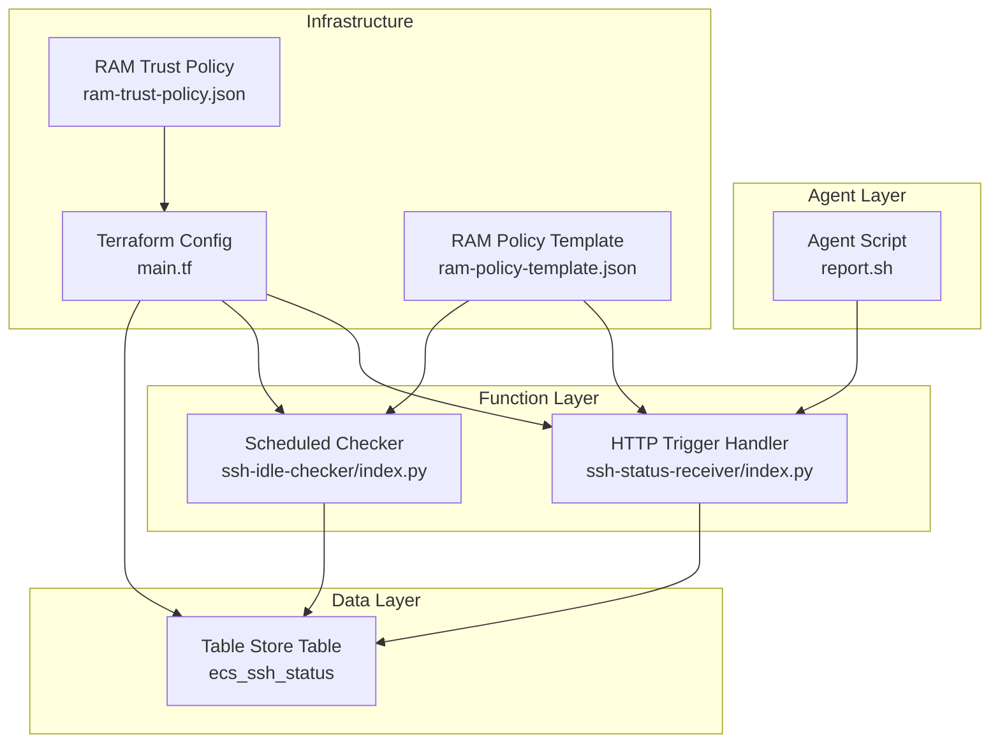
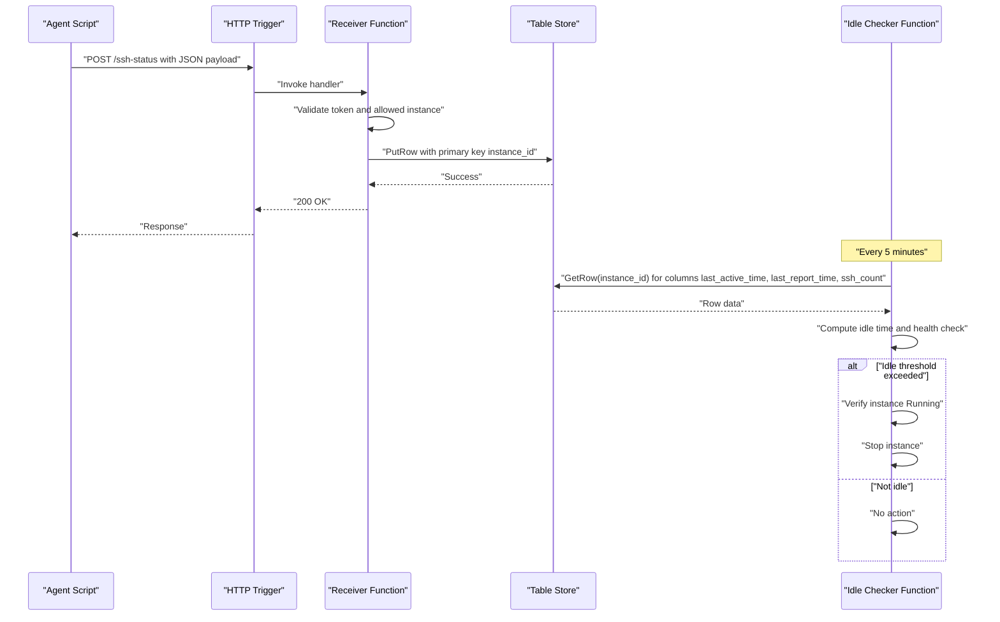
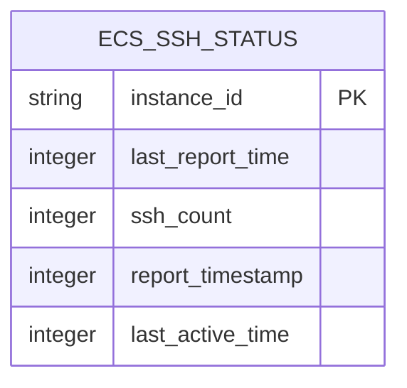
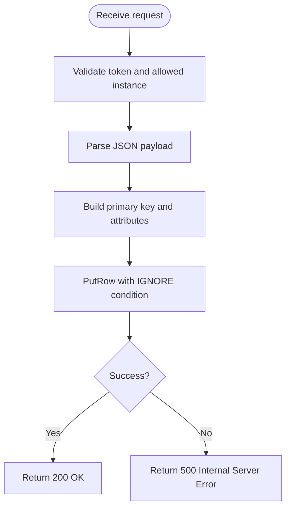
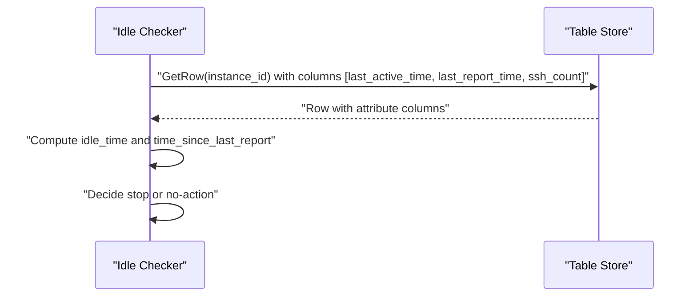
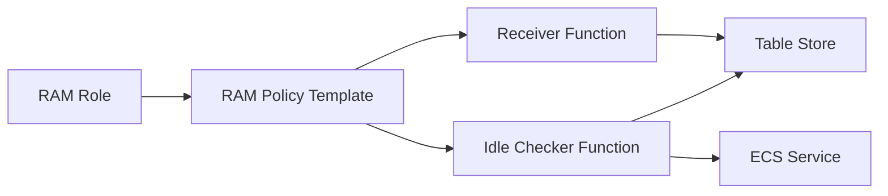

# Data Management

<cite>
**Referenced Files in This Document**
- [ssh-status-receiver/index.py](file://functions/ssh-status-receiver/index.py)
- [ssh-idle-checker/index.py](file://functions/ssh-idle-checker/index.py)
- [main.tf](file://infra/main.tf)
- [config.yaml.example](file://config/config.yaml.example)
- [report.sh](file://ecs-agent/report.sh)
- [config.env.template](file://ecs-agent/config.env.template)
- [ram-policy-template.json](file://infra/ram-policy-template.json)
- [ram-trust-policy.json](file://infra/ram-trust-policy.json)
- [requirements.txt (ssh-status-receiver)](file://functions/ssh-status-receiver/requirements.txt)
- [requirements.txt (ssh-idle-checker)](file://functions/ssh-idle-checker/requirements.txt)
</cite>

## Table of Contents
1. [Introduction](#introduction)
2. [Project Structure](#project-structure)
3. [Core Components](#core-components)
4. [Architecture Overview](#architecture-overview)
5. [Detailed Component Analysis](#detailed-component-analysis)
6. [Dependency Analysis](#dependency-analysis)
7. [Performance Considerations](#performance-considerations)
8. [Troubleshooting Guide](#troubleshooting-guide)
9. [Conclusion](#conclusion)
10. [Appendices](#appendices)

## Introduction
This document describes the data management design and lifecycle for ECS Auto-Stop, focusing on the Table Store schema, data persistence patterns, query operations, and the end-to-end data flow from agent reporting to function processing and database storage. It also covers validation rules, indexing strategies, retention policies, backup/recovery considerations, and common query patterns used by serverless functions.

## Project Structure
The repository organizes data management across three layers:
- Agent layer: Reports SSH connection counts to the HTTP trigger endpoint.
- Function layer: Receives reports and persists them to Table Store; periodically checks idle status and stops instances.
- Infrastructure layer: Defines Table Store table, IAM permissions, triggers, and logging.

**Diagram sources**
- [main.tf:154-197](file://infra/main.tf#L154-L197)
- [ssh-status-receiver/index.py:110-205](file://functions/ssh-status-receiver/index.py#L110-L205)
- [ssh-idle-checker/index.py:161-290](file://functions/ssh-idle-checker/index.py#L161-L290)
- [report.sh:68-85](file://ecs-agent/report.sh#L68-L85)

**Section sources**
- [main.tf:69-82](file://infra/main.tf#L69-L82)
- [ssh-status-receiver/index.py:78-108](file://functions/ssh-status-receiver/index.py#L78-L108)
- [ssh-idle-checker/index.py:104-129](file://functions/ssh-idle-checker/index.py#L104-L129)

## Core Components
- Table Store table definition and schema:
  - Primary key: instance_id (String)
  - Attributes: last_report_time (Integer), ssh_count (Integer), report_timestamp (Integer), last_active_time (Integer)
  - TTL: Never expire; max version: 1
- Data ingestion:
  - Agent script collects SSH connection count and posts JSON payload to the HTTP trigger endpoint.
  - Function validates token and allowed instance IDs, then writes/upserts a row keyed by instance_id.
- Data retrieval and lifecycle:
  - Scheduled function reads last_active_time, last_report_time, and ssh_count to decide whether to stop the instance.
  - Health checks detect missing reports and notify if the agent is not reporting.

**Section sources**
- [main.tf:69-82](file://infra/main.tf#L69-L82)
- [ssh-status-receiver/index.py:78-108](file://functions/ssh-status-receiver/index.py#L78-L108)
- [ssh-idle-checker/index.py:104-129](file://functions/ssh-idle-checker/index.py#L104-L129)
- [report.sh:58-66](file://ecs-agent/report.sh#L58-L66)

## Architecture Overview
The data flow spans from the agent to the HTTP trigger, through the receiver function to Table Store, and finally to the scheduled checker that evaluates status and performs actions.

**Diagram sources**
- [report.sh:68-85](file://ecs-agent/report.sh#L68-L85)
- [ssh-status-receiver/index.py:110-205](file://functions/ssh-status-receiver/index.py#L110-L205)
- [ssh-idle-checker/index.py:161-290](file://functions/ssh-idle-checker/index.py#L161-L290)

## Detailed Component Analysis

### Table Store Schema Design
- Primary key: instance_id (String)
- Attribute columns:
  - last_report_time (Integer): Unix timestamp of the latest report received by the receiver function
  - ssh_count (Integer): Number of active SSH connections observed during the reporting period
  - report_timestamp (Integer): Timestamp captured by the agent at reporting time
  - last_active_time (Integer): Unix timestamp set when ssh_count > 0; otherwise unchanged
- Table properties:
  - TTL: Never expire
  - Max versions: 1
- Indexing strategy:
  - Single-column primary key on instance_id; no secondary indexes are defined
  - Queries are scoped to a single instance_id per request

**Diagram sources**
- [main.tf:69-82](file://infra/main.tf#L69-L82)
- [ssh-status-receiver/index.py:83-96](file://functions/ssh-status-receiver/index.py#L83-L96)

**Section sources**
- [main.tf:69-82](file://infra/main.tf#L69-L82)
- [ssh-status-receiver/index.py:83-96](file://functions/ssh-status-receiver/index.py#L83-L96)

### Data Persistence Patterns
- Upsert semantics:
  - The receiver function uses a put_row operation with IGNORE condition expectation, enabling insert-or-update behavior for the primary key instance_id.
- Atomicity:
  - PutRow is atomic at the row level; no cross-row transactions are used.
- Versioning:
  - Max version is 1; updates overwrite previous versions of the same row.

**Diagram sources**
- [ssh-status-receiver/index.py:140-180](file://functions/ssh-status-receiver/index.py#L140-L180)
- [ssh-status-receiver/index.py:78-108](file://functions/ssh-status-receiver/index.py#L78-L108)

**Section sources**
- [ssh-status-receiver/index.py:78-108](file://functions/ssh-status-receiver/index.py#L78-L108)

### Query Operations for Status Retrieval
- Purpose: Determine whether an instance should be stopped based on idle thresholds and health checks.
- Columns retrieved: last_active_time, last_report_time, ssh_count
- Access pattern:
  - Single-row read by primary key instance_id
  - Used by the scheduled checker to compute idle duration and health status

**Diagram sources**
- [ssh-idle-checker/index.py:104-129](file://functions/ssh-idle-checker/index.py#L104-L129)

**Section sources**
- [ssh-idle-checker/index.py:104-129](file://functions/ssh-idle-checker/index.py#L104-L129)

### Data Lifecycle Management
- Retention:
  - TTL is set to never expire; rows persist indefinitely.
- Cleanup:
  - No automatic cleanup mechanism is implemented in the current configuration.
- Recommendations:
  - Introduce TTL or periodic cleanup jobs if long-term retention is unnecessary.
  - Archive or export historical snapshots for compliance or analytics.

**Section sources**
- [main.tf:78](file://infra/main.tf#L78)

### Data Validation Rules
- Authentication:
  - X-Auth-Token header must match the configured AUTH_TOKEN environment variable.
- Allowed instances:
  - instance_id must be present in ALLOWED_INSTANCE_IDS.
- Request body:
  - Must include instance_id, ssh_count, and timestamp.
  - Values are validated and cast appropriately before persistence.
- Response handling:
  - HTTP 200 on success; 400/401/403/500 on validation or internal errors.

**Section sources**
- [ssh-status-receiver/index.py:46-76](file://functions/ssh-status-receiver/index.py#L46-L76)
- [ssh-status-receiver/index.py:161-181](file://functions/ssh-status-receiver/index.py#L161-L181)

### Backup and Recovery Considerations
- Current state:
  - No explicit backup or recovery mechanisms are defined in the configuration.
- Recommended practices:
  - Enable OTS backups if available in your region.
  - Periodically export table snapshots for disaster recovery.
  - Maintain immutable configuration via Terraform to recreate environments quickly.

**Section sources**
- [main.tf:62-82](file://infra/main.tf#L62-L82)

### Data Access Patterns Used by Functions
- Receiver function:
  - Writes a single row per report; primary key is instance_id.
- Idle checker function:
  - Reads a single row per check; retrieves specific columns for computation.

**Section sources**
- [ssh-status-receiver/index.py:78-108](file://functions/ssh-status-receiver/index.py#L78-L108)
- [ssh-idle-checker/index.py:104-129](file://functions/ssh-idle-checker/index.py#L104-L129)

## Dependency Analysis
- IAM permissions:
  - RAM role allows ECS stop/describe actions for the target instance and OTS get/put/update for the table.
- Function dependencies:
  - Both functions depend on OTS SDK; the idle checker additionally depends on the ECS SDK.
- Environment variables:
  - Endpoint, instance name, table name, tokens, and target instance ID are passed to functions via environment variables.

**Diagram sources**
- [ram-policy-template.json:16-25](file://infra/ram-policy-template.json#L16-L25)
- [ram-policy-template.json:7-15](file://infra/ram-policy-template.json#L7-L15)
- [main.tf:106-132](file://infra/main.tf#L106-L132)

**Section sources**
- [ram-policy-template.json:16-25](file://infra/ram-policy-template.json#L16-L25)
- [ram-policy-template.json:7-15](file://infra/ram-policy-template.json#L7-L15)
- [main.tf:106-132](file://infra/main.tf#L106-L132)

## Performance Considerations
- Indexing:
  - Single-column primary key on instance_id; no secondary indexes.
  - Queries are point lookups by instance_id, which are efficient.
- Throughput:
  - Capacity mode OTS instance is used; ensure adequate provisioned capacity for expected write/read rates.
- Concurrency:
  - PutRow is atomic per row; concurrent updates to the same instance_id are serialized.
- Query optimization:
  - Retrieve only required columns (last_active_time, last_report_time, ssh_count) to minimize network and cost.

**Section sources**
- [main.tf:66](file://infra/main.tf#L66)
- [ssh-idle-checker/index.py:110-116](file://functions/ssh-idle-checker/index.py#L110-L116)

## Troubleshooting Guide
- Missing or invalid authentication token:
  - Receiver returns 401; verify X-Auth-Token header and AUTH_TOKEN environment variable.
- Unauthorized instance ID:
  - Receiver returns 403; ensure instance_id is included in ALLOWED_INSTANCE_IDS.
- Malformed request body:
  - Receiver returns 400; confirm JSON payload includes instance_id, ssh_count, and timestamp.
- Internal server error:
  - Receiver returns 500; check logs and OTS connectivity.
- No status record found:
  - Idle checker sends warning notification; verify agent installation and endpoint configuration.
- Health check alerts:
  - If no reports received within the health threshold while the instance is running, a warning notification is sent.

**Section sources**
- [ssh-status-receiver/index.py:140-180](file://functions/ssh-status-receiver/index.py#L140-L180)
- [ssh-idle-checker/index.py:186-229](file://functions/ssh-idle-checker/index.py#L186-L229)

## Conclusion
The ECS Auto-Stop data management design centers on a simple, robust Table Store schema with a single primary key and minimal attributes. The receiver function persists agent-reported SSH status efficiently, while the idle checker function uses targeted reads to enforce stop policies. Current configuration lacks TTL-based retention and automated cleanup; adding backup/recovery and TTL/cleanup would improve operational sustainability.

## Appendices

### Data Flow From Agent to Database
- Agent collects SSH connection count and posts JSON payload to the HTTP endpoint.
- Receiver validates token and allowed instance, then upserts a row keyed by instance_id.
- Idle checker periodically reads the row to compute idle time and health status.

**Section sources**
- [report.sh:39-66](file://ecs-agent/report.sh#L39-L66)
- [ssh-status-receiver/index.py:110-205](file://functions/ssh-status-receiver/index.py#L110-L205)
- [ssh-idle-checker/index.py:161-290](file://functions/ssh-idle-checker/index.py#L161-L290)

### Common Query Operations
- Insert or update status:
  - PutRow with primary key instance_id and attributes last_report_time, ssh_count, report_timestamp, last_active_time.
- Retrieve status for decision-making:
  - GetRow with primary key instance_id and columns last_active_time, last_report_time, ssh_count.

**Section sources**
- [ssh-status-receiver/index.py:78-108](file://functions/ssh-status-receiver/index.py#L78-L108)
- [ssh-idle-checker/index.py:104-129](file://functions/ssh-idle-checker/index.py#L104-L129)