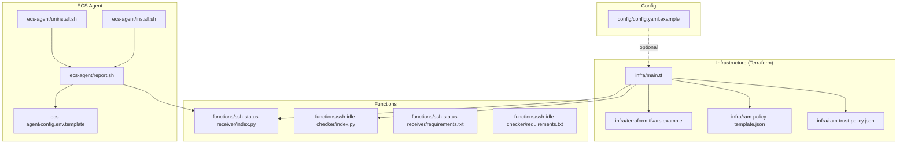
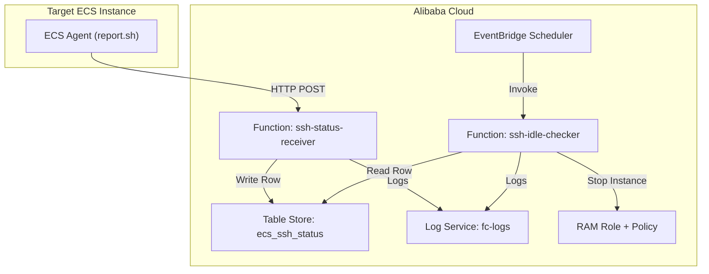
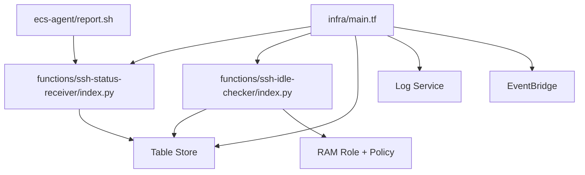

# Deployment and Operations

<cite>
**Referenced Files in This Document**
- [deploy.sh](file://deploy.sh)
- [destroy.sh](file://destroy.sh)
- [main.tf](file://infra/main.tf)
- [ram-policy-template.json](file://infra/ram-policy-template.json)
- [ram-trust-policy.json](file://infra/ram-trust-policy.json)
- [terraform.tfvars.example](file://infra/terraform.tfvars.example)
- [index.py (ssh-status-receiver)](file://functions/ssh-status-receiver/index.py)
- [index.py (ssh-idle-checker)](file://functions/ssh-idle-checker/index.py)
- [requirements.txt (ssh-status-receiver)](file://functions/ssh-status-receiver/requirements.txt)
- [requirements.txt (ssh-idle-checker)](file://functions/ssh-idle-checker/requirements.txt)
- [report.sh](file://ecs-agent/report.sh)
- [install.sh](file://ecs-agent/install.sh)
- [uninstall.sh](file://ecs-agent/uninstall.sh)
- [config.env.template](file://ecs-agent/config.env.template)
- [config.yaml.example](file://config/config.yaml.example)
</cite>

## Table of Contents
1. [Introduction](#introduction)
2. [Project Structure](#project-structure)
3. [Core Components](#core-components)
4. [Architecture Overview](#architecture-overview)
5. [Detailed Component Analysis](#detailed-component-analysis)
6. [Dependency Analysis](#dependency-analysis)
7. [Performance Considerations](#performance-considerations)
8. [Troubleshooting Guide](#troubleshooting-guide)
9. [Conclusion](#conclusion)
10. [Appendices](#appendices)

## Introduction
This document provides comprehensive deployment and operations guidance for ECS Auto-Stop, an automated solution that monitors SSH activity on a target ECS instance and stops it when idle for a configurable period. It covers environment preparation, infrastructure provisioning with Terraform, function packaging, post-installation validation, operational procedures (monitoring, log analysis, performance tuning, capacity planning), maintenance (updates, configuration changes, scaling), rollback and disaster recovery, backup strategies, and best practices for cost optimization, security hardening, and compliance monitoring.

## Project Structure
The repository is organized into the following areas:
- Infrastructure (Terraform): Defines Alibaba Cloud resources (Function Compute, Table Store, Log Service, RAM role/policy, EventBridge scheduler).
- Functions: Python-based serverless functions for receiving SSH status and checking idle instances.
- ECS Agent: Lightweight shell scripts installed on the target ECS instance to monitor SSH connections and report to the HTTP endpoint.
- Configuration: Example configuration files for Terraform variables and optional YAML configuration.

**Diagram sources**
- [main.tf](file://infra/main.tf)
- [terraform.tfvars.example](file://infra/terraform.tfvars.example)
- [ram-policy-template.json](file://infra/ram-policy-template.json)
- [ram-trust-policy.json](file://infra/ram-trust-policy.json)
- [index.py (ssh-status-receiver)](file://functions/ssh-status-receiver/index.py)
- [index.py (ssh-idle-checker)](file://functions/ssh-idle-checker/index.py)
- [requirements.txt (ssh-status-receiver)](file://functions/ssh-status-receiver/requirements.txt)
- [requirements.txt (ssh-idle-checker)](file://functions/ssh-idle-checker/requirements.txt)
- [report.sh](file://ecs-agent/report.sh)
- [install.sh](file://ecs-agent/install.sh)
- [uninstall.sh](file://ecs-agent/uninstall.sh)
- [config.env.template](file://ecs-agent/config.env.template)
- [config.yaml.example](file://config/config.yaml.example)

**Section sources**
- [main.tf](file://infra/main.tf)
- [terraform.tfvars.example](file://infra/terraform.tfvars.example)
- [index.py (ssh-status-receiver)](file://functions/ssh-status-receiver/index.py)
- [index.py (ssh-idle-checker)](file://functions/ssh-idle-checker/index.py)
- [report.sh](file://ecs-agent/report.sh)
- [install.sh](file://ecs-agent/install.sh)
- [uninstall.sh](file://ecs-agent/uninstall.sh)
- [config.env.template](file://ecs-agent/config.env.template)
- [config.yaml.example](file://config/config.yaml.example)

## Core Components
- Infrastructure provisioning with Terraform:
  - Creates Function Compute service and two functions: SSH status receiver and SSH idle checker.
  - Sets up Table Store instance/table for storing SSH status.
  - Creates Log Service project/store for function logs.
  - Defines a RAM role and policy granting minimal permissions to stop the target instance and access OTS/logs.
  - Configures an HTTP trigger for the status receiver and an EventBridge scheduled rule to invoke the idle checker every 5 minutes.
  - Exposes outputs for the HTTP endpoint, OTS instance/table names, service name, RAM role ARN, and log project.
- Functions:
  - SSH status receiver: Validates auth token and allowed instance IDs, then writes SSH counts to OTS.
  - SSH idle checker: Periodically checks OTS for the last active time, verifies instance status, and stops the instance if idle exceeds threshold.
- ECS Agent:
  - Installed on the target ECS instance, collects SSH connection count, and posts to the HTTP endpoint every 5 minutes via cron.
  - Requires FC endpoint, instance ID, and auth token from a config file.

**Section sources**
- [main.tf](file://infra/main.tf)
- [index.py (ssh-status-receiver)](file://functions/ssh-status-receiver/index.py)
- [index.py (ssh-idle-checker)](file://functions/ssh-idle-checker/index.py)
- [report.sh](file://ecs-agent/report.sh)
- [install.sh](file://ecs-agent/install.sh)
- [config.env.template](file://ecs-agent/config.env.template)

## Architecture Overview
The system operates as follows:
- The ECS agent runs on the target instance and periodically posts SSH connection metrics to the Function Compute HTTP endpoint.
- The status receiver function validates the request and writes the metrics to Table Store.
- The idle checker function runs on a schedule, reads the latest metrics from OTS, checks the instance status, and stops the instance if idle beyond the configured threshold.
- Logs are shipped to Log Service for centralized monitoring.

**Diagram sources**
- [report.sh](file://ecs-agent/report.sh)
- [index.py (ssh-status-receiver)](file://functions/ssh-status-receiver/index.py)
- [index.py (ssh-idle-checker)](file://functions/ssh-idle-checker/index.py)
- [main.tf](file://infra/main.tf)
- [ram-policy-template.json](file://infra/ram-policy-template.json)

## Detailed Component Analysis

### Infrastructure Provisioning with Terraform
Key elements:
- Providers and variables: Region, target instance ID, auth token, optional DingTalk webhook.
- OTS instance and table: Stores per-instance SSH metrics with a primary key and attributes for last active time, last report time, and SSH count.
- Log Service project and log store: Centralized logging for Function Compute.
- RAM role and policy: Grants least privilege access to stop the target instance and OTS/logs.
- Function Compute service: Hosts both functions with log configuration.
- Functions:
  - ssh-status-receiver: HTTP trigger accepting POST, environment variables for OTS and auth token.
  - ssh-idle-checker: Environment variables for OTS, target instance, region, optional DingTalk webhook.
- EventBridge: Scheduled rule invoking the idle checker every 5 minutes.
- Outputs: HTTP endpoint, OTS identifiers, service name, RAM role ARN, log project.

Operational notes:
- The HTTP trigger is anonymous; authentication is enforced inside the function via an auth token header.
- The policy restricts actions to the specific instance and OTS/log resources.

**Section sources**
- [main.tf](file://infra/main.tf)
- [ram-policy-template.json](file://infra/ram-policy-template.json)
- [ram-trust-policy.json](file://infra/ram-trust-policy.json)
- [terraform.tfvars.example](file://infra/terraform.tfvars.example)

### Functions: SSH Status Receiver
Responsibilities:
- Validate authentication token from request headers.
- Validate that the reported instance ID is in the allowed list.
- Parse JSON payload and write/update a row in OTS with last report time, SSH count, and optionally last active time.

Security and reliability:
- Rejects non-POST methods, malformed JSON, missing fields, unauthorized instance IDs, and invalid tokens.
- Uses STS credentials from the Function Compute service role to connect to OTS.

**Section sources**
- [index.py (ssh-status-receiver)](file://functions/ssh-status-receiver/index.py)
- [requirements.txt (ssh-status-receiver)](file://functions/ssh-status-receiver/requirements.txt)

### Functions: SSH Idle Checker
Responsibilities:
- On schedule, read the latest SSH status from OTS.
- Perform a health check: if no report within a threshold, notify and return.
- If idle time exceeds threshold and instance is running, stop the instance.
- Send notifications via DingTalk webhook if configured.

Safety checks:
- Verifies instance status before stopping.
- Gracefully handles missing records and non-running instances.

**Section sources**
- [index.py (ssh-idle-checker)](file://functions/ssh-idle-checker/index.py)
- [requirements.txt (ssh-idle-checker)](file://functions/ssh-idle-checker/requirements.txt)

### ECS Agent
Responsibilities:
- Installed on the target ECS instance.
- Runs every 5 minutes via cron to count active SSH connections and POST to the HTTP endpoint.
- Reads configuration from a config file containing FC endpoint, instance ID, and auth token.

Installation and lifecycle:
- Installation script sets up the directory, copies the report script, creates a config template if none exists, sets up logging, and installs the cron job.
- Uninstallation script removes the cron job and directory while preserving logs for auditing.

**Section sources**
- [report.sh](file://ecs-agent/report.sh)
- [install.sh](file://ecs-agent/install.sh)
- [uninstall.sh](file://ecs-agent/uninstall.sh)
- [config.env.template](file://ecs-agent/config.env.template)

### Deployment and Post-Installation Validation
End-to-end deployment flow:
- Prerequisites: Terraform installed, Alibaba Cloud credentials configured, terraform.tfvars present and populated.
- Initialize and plan Terraform, review the plan, then apply.
- Retrieve outputs and generate the ECS agent configuration file locally.
- Manually copy the agent to the target instance, install it, verify the config, test the report script, and tail logs.

Post-installation validation checklist:
- Confirm HTTP endpoint output is reachable and responds to POST.
- Verify the agent’s cron job is active and logs are being written.
- Ensure OTS table receives rows after agent reports.
- Validate that the idle checker runs on schedule and does not stop the instance prematurely.

**Section sources**
- [deploy.sh](file://deploy.sh)
- [main.tf](file://infra/main.tf)
- [report.sh](file://ecs-agent/report.sh)

### Operational Procedures

#### Monitoring System Health
- Function Compute:
  - Use the Function Compute console to inspect invocations, durations, and error rates for both functions.
  - Enable and review logs in Log Service for both functions.
- OTS:
  - Confirm rows appear in the table and that attributes update as expected.
- EventBridge:
  - Verify the scheduled rule is enabled and targets are configured correctly.
- ECS Agent:
  - Check cron job status and logs on the target instance.

#### Log Analysis Techniques
- Function logs:
  - Filter by service name and function name in Log Service.
  - Look for error messages, HTTP status codes, and notification events.
- OTS:
  - Query recent rows to validate reporting cadence and values.
- Agent logs:
  - Inspect the agent log file for HTTP response codes and any curl timeouts.

#### Performance Tuning
- Function memory and timeout:
  - Adjust memory size and timeout for functions based on observed invocation metrics.
- EventBridge frequency:
  - Tune the cron schedule to balance responsiveness and cost.
- OTS:
  - Keep TTL disabled for this use case; ensure adequate provisioned capacity for expected write volume.

#### Capacity Planning
- Estimate write volume to OTS based on agent cadence and number of monitored instances.
- Monitor function concurrency and throttling; scale out by adding more instances if needed.
- Consider regional proximity for reduced latency between agent and Function Compute.

**Section sources**
- [main.tf](file://infra/main.tf)
- [index.py (ssh-status-receiver)](file://functions/ssh-status-receiver/index.py)
- [index.py (ssh-idle-checker)](file://functions/ssh-idle-checker/index.py)
- [report.sh](file://ecs-agent/report.sh)

### Maintenance Operations

#### Function Updates
- Update function code under the functions directory.
- Rebuild the archive data source in Terraform so the new zip is deployed.
- Apply Terraform again to redeploy the updated function(s).

#### Configuration Changes
- Modify terraform.tfvars for region, target instance ID, auth token, and optional DingTalk webhook.
- Regenerate the ECS agent config file and re-copy it to the instance if needed.
- For YAML-based configuration, update the example file and propagate values to Terraform variables.

#### Infrastructure Scaling
- Increase EventBridge rule frequency cautiously; ensure downstream systems can handle higher load.
- Scale OTS capacity if write volume increases significantly.
- Consider multiple Function Compute services or regions for high availability.

**Section sources**
- [main.tf](file://infra/main.tf)
- [terraform.tfvars.example](file://infra/terraform.tfvars.example)
- [config.yaml.example](file://config/config.yaml.example)
- [deploy.sh](file://deploy.sh)

### Rollback Procedures
- Rollback function code:
  - Re-apply Terraform with the previous archive output path or revert to a known-good commit.
- Rollback infrastructure:
  - Use Terraform plan and apply to revert to the prior state.
- Agent rollback:
  - Reinstall the previous agent version on the target instance and restart the cron job.

**Section sources**
- [deploy.sh](file://deploy.sh)
- [main.tf](file://infra/main.tf)
- [install.sh](file://ecs-agent/install.sh)

### Disaster Recovery and Backup Strategies
- DR considerations:
  - Maintain backups of terraform.tfvars (excluding secrets) and agent configurations.
  - Store function code in version control; keep archived zips in a secure location.
- Recovery steps:
  - Recreate infrastructure using Terraform.
  - Re-deploy functions and reconfigure agents.
  - Validate OTS data and logs to ensure continuity.

**Section sources**
- [main.tf](file://infra/main.tf)
- [deploy.sh](file://deploy.sh)

### Security Hardening and Compliance Monitoring
- Least privilege:
  - The RAM policy grants only required actions to the specific instance and OTS/log resources.
- Secrets management:
  - Store auth tokens securely; rotate regularly.
  - Avoid committing secrets to version control; use environment variables or secret managers.
- Network and access:
  - Keep the HTTP trigger anonymous but rely on auth token validation in the function.
  - Restrict allowed instance IDs to prevent cross-instances misuse.
- Compliance:
  - Audit Function Compute invocations and OTS access via Alibaba Cloud audit logs.
  - Retain logs per retention policies and ensure compliance with data residency requirements.

**Section sources**
- [ram-policy-template.json](file://infra/ram-policy-template.json)
- [index.py (ssh-status-receiver)](file://functions/ssh-status-receiver/index.py)
- [index.py (ssh-idle-checker)](file://functions/ssh-idle-checker/index.py)

## Dependency Analysis
The following diagram shows the primary dependencies among components:

**Diagram sources**
- [report.sh](file://ecs-agent/report.sh)
- [index.py (ssh-status-receiver)](file://functions/ssh-status-receiver/index.py)
- [index.py (ssh-idle-checker)](file://functions/ssh-idle-checker/index.py)
- [main.tf](file://infra/main.tf)
- [ram-policy-template.json](file://infra/ram-policy-template.json)

**Section sources**
- [main.tf](file://infra/main.tf)
- [report.sh](file://ecs-agent/report.sh)
- [index.py (ssh-status-receiver)](file://functions/ssh-status-receiver/index.py)
- [index.py (ssh-idle-checker)](file://functions/ssh-idle-checker/index.py)

## Performance Considerations
- Invocation cadence:
  - The agent reports every 5 minutes; adjust EventBridge frequency to balance cost and responsiveness.
- Function sizing:
  - Start with conservative memory and timeout settings; increase based on observed metrics.
- OTS write patterns:
  - Use a single-table design with a primary key per instance; keep TTL disabled for continuous monitoring.
- Network latency:
  - Place the agent and Function Compute in the same region for lower latency.

[No sources needed since this section provides general guidance]

## Troubleshooting Guide
Common issues and resolutions:
- Authentication failures:
  - Ensure the X-Auth-Token header matches the configured auth token and the agent config file.
- Missing or invalid instance ID:
  - Verify the instance ID is included in the allowed list environment variable.
- Function errors:
  - Check Function Compute logs for exceptions and retry logic.
- OTS connectivity:
  - Confirm the OTS endpoint and table names match the environment variables.
- Agent not reporting:
  - Validate cron job presence, script permissions, and network access to the HTTP endpoint.
- Instance not stopping:
  - Confirm the instance is running and within the idle threshold; verify RAM role permissions.

**Section sources**
- [index.py (ssh-status-receiver)](file://functions/ssh-status-receiver/index.py)
- [index.py (ssh-idle-checker)](file://functions/ssh-idle-checker/index.py)
- [report.sh](file://ecs-agent/report.sh)
- [install.sh](file://ecs-agent/install.sh)

## Conclusion
ECS Auto-Stop automates idle detection and instance stopping using a lightweight agent, serverless functions, and managed services. By following the deployment and operational procedures outlined here—covering environment preparation, infrastructure provisioning, function packaging, validation, monitoring, maintenance, rollback, and security—you can reliably operate the system at scale while optimizing costs and maintaining compliance.

[No sources needed since this section summarizes without analyzing specific files]

## Appendices

### Deployment Checklist
- Prepare environment: install Terraform, configure Alibaba Cloud credentials, create terraform.tfvars.
- Initialize and plan Terraform; review changes.
- Apply infrastructure and retrieve outputs.
- Generate ECS agent config and copy to the target instance.
- Install agent, verify configuration, test reporting, and monitor logs.

**Section sources**
- [deploy.sh](file://deploy.sh)
- [install.sh](file://ecs-agent/install.sh)
- [report.sh](file://ecs-agent/report.sh)

### Cleanup and Destruction
- Review destroy plan and confirm.
- Run destroy to remove all resources.
- Uninstall the agent from the target instance.

**Section sources**
- [destroy.sh](file://destroy.sh)
- [uninstall.sh](file://ecs-agent/uninstall.sh)

### Cost Optimization Best Practices
- Right-size function memory and timeouts.
- Use appropriate EventBridge frequency to minimize invocations.
- Monitor and adjust OTS capacity to match write volume.
- Use regional proximity to reduce latency and cost.

[No sources needed since this section provides general guidance]