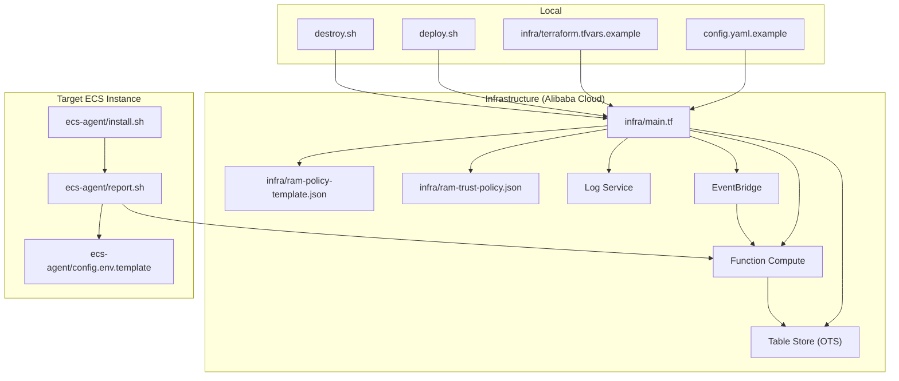
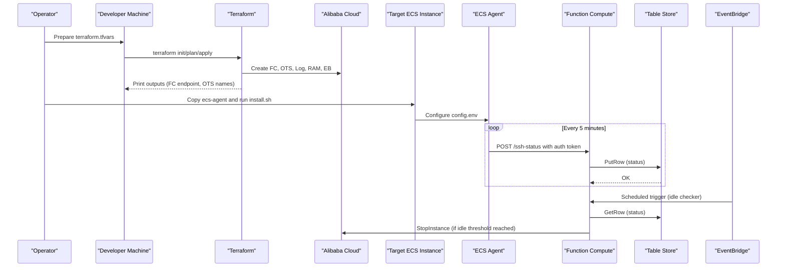
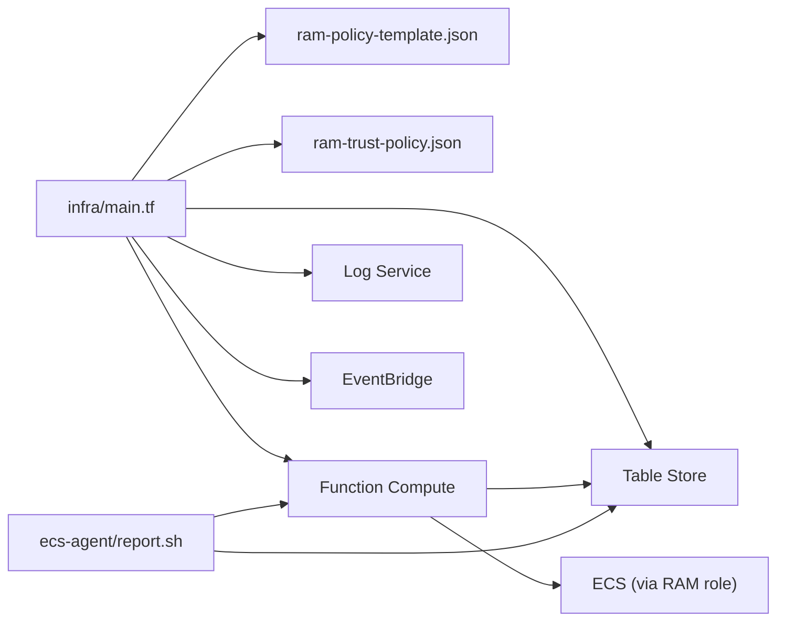

# Getting Started

<cite>
**Referenced Files in This Document**
- [deploy.sh](file://deploy.sh)
- [destroy.sh](file://destroy.sh)
- [config.yaml.example](file://config/config.yaml.example)
- [terraform.tfvars.example](file://infra/terraform.tfvars.example)
- [main.tf](file://infra/main.tf)
- [ram-policy-template.json](file://infra/ram-policy-template.json)
- [ram-trust-policy.json](file://infra/ram-trust-policy.json)
- [index.py (ssh-status-receiver)](file://functions/ssh-status-receiver/index.py)
- [index.py (ssh-idle-checker)](file://functions/ssh-idle-checker/index.py)
- [requirements.txt (ssh-status-receiver)](file://functions/ssh-status-receiver/requirements.txt)
- [requirements.txt (ssh-idle-checker)](file://functions/ssh-idle-checker/requirements.txt)
- [install.sh (ecs-agent)](file://ecs-agent/install.sh)
- [report.sh (ecs-agent)](file://ecs-agent/report.sh)
- [config.env.template (ecs-agent)](file://ecs-agent/config.env.template)
</cite>

## Table of Contents
1. [Introduction](#introduction)
2. [Prerequisites](#prerequisites)
3. [Project Structure](#project-structure)
4. [Quick Start Tutorial](#quick-start-tutorial)
5. [Step-by-Step Installation](#step-by-step-installation)
6. [Architecture Overview](#architecture-overview)
7. [Detailed Component Analysis](#detailed-component-analysis)
8. [Dependency Analysis](#dependency-analysis)
9. [Performance Considerations](#performance-considerations)
10. [Troubleshooting Guide](#troubleshooting-guide)
11. [Conclusion](#conclusion)

## Introduction
ECS Auto-Stop automates stopping idle Alibaba Cloud ECS instances using a serverless architecture. It consists of:
- A Function Compute service that receives SSH activity reports and periodically checks for idle instances.
- Table Store (OTS) to persist SSH status per instance.
- An ECS agent installed on target instances that monitors active SSH connections and reports status.
- EventBridge triggers to schedule periodic checks.

This guide helps you set up the project, deploy infrastructure, install the agent, and verify the solution works end-to-end.

## Prerequisites
Before starting, ensure you have:
- An Alibaba Cloud account with permissions to create and manage:
  - Function Compute, Log Service, EventBridge, RAM roles/policies, OTS, and ECS instances.
- Terraform installed locally (version 1.0+).
- Basic understanding of serverless concepts:
  - Functions are event-driven and stateless.
  - Scheduling is handled by EventBridge rules.
  - Credentials are assumed via RAM roles for least privilege.

## Project Structure
High-level layout of the repository:
- infra: Terraform configuration and policies for cloud resources.
- functions: Python code for two serverless functions (status receiver and idle checker).
- ecs-agent: Scripts to install and run the ECS monitoring agent.
- config: Example configuration file for reference.

**Diagram sources**
- [main.tf:1-305](file://infra/main.tf#L1-L305)
- [deploy.sh:1-162](file://deploy.sh#L1-L162)
- [destroy.sh:1-43](file://destroy.sh#L1-L43)
- [config.yaml.example:1-42](file://config/config.yaml.example#L1-L42)
- [terraform.tfvars.example:1-17](file://infra/terraform.tfvars.example#L1-L17)
- [ram-policy-template.json:1-36](file://infra/ram-policy-template.json#L1-L36)
- [ram-trust-policy.json:1-15](file://infra/ram-trust-policy.json#L1-L15)
- [install.sh (ecs-agent):1-73](file://ecs-agent/install.sh#L1-L73)
- [report.sh (ecs-agent):1-86](file://ecs-agent/report.sh#L1-L86)
- [config.env.template (ecs-agent):1-12](file://ecs-agent/config.env.template#L1-L12)

**Section sources**
- [main.tf:1-305](file://infra/main.tf#L1-L305)
- [deploy.sh:1-162](file://deploy.sh#L1-L162)
- [destroy.sh:1-43](file://destroy.sh#L1-L43)
- [config.yaml.example:1-42](file://config/config.yaml.example#L1-L42)
- [terraform.tfvars.example:1-17](file://infra/terraform.tfvars.example#L1-L17)
- [ram-policy-template.json:1-36](file://infra/ram-policy-template.json#L1-L36)
- [ram-trust-policy.json:1-15](file://infra/ram-trust-policy.json#L1-L15)
- [install.sh (ecs-agent):1-73](file://ecs-agent/install.sh#L1-L73)
- [report.sh (ecs-agent):1-86](file://ecs-agent/report.sh#L1-L86)
- [config.env.template (ecs-agent):1-12](file://ecs-agent/config.env.template#L1-L12)

## Quick Start Tutorial
Follow this practical walkthrough to deploy and validate ECS Auto-Stop:

1. Prepare configuration
   - Copy and edit the variables file for Terraform.
   - Set region, target instance ID, and a secure auth token.
   - Optionally enable DingTalk notifications.

2. Deploy infrastructure
   - Run the deployment script to initialize Terraform, plan, and apply resources.
   - The script prints outputs including the Function Compute HTTP endpoint and OTS identifiers.

3. Install the ECS agent
   - Copy the agent folder to the target ECS instance and run the installer.
   - The installer sets up a cron job to run the reporting script every 5 minutes.

4. Configure the agent
   - Update the agent’s config file with the Function Compute endpoint, instance ID, and auth token.
   - Verify the configuration and test a manual report.

5. Verify deployment
   - Check logs on the instance and confirm successful HTTP reports.
   - Confirm entries appear in OTS for the instance.

6. Test the idle stopper
   - Wait for the scheduled check (every 5 minutes) or trigger manually.
   - Validate that the instance stops after being idle beyond the configured threshold.

**Section sources**
- [terraform.tfvars.example:1-17](file://infra/terraform.tfvars.example#L1-L17)
- [deploy.sh:122-158](file://deploy.sh#L122-L158)
- [install.sh (ecs-agent):1-73](file://ecs-agent/install.sh#L1-L73)
- [report.sh (ecs-agent):1-86](file://ecs-agent/report.sh#L1-L86)
- [config.env.template (ecs-agent):1-12](file://ecs-agent/config.env.template#L1-L12)
- [main.tf:276-289](file://infra/main.tf#L276-L289)

## Step-by-Step Installation
1. Prepare Terraform variables
   - Copy the example variables file to terraform.tfvars and set:
     - region
     - target_instance_id
     - auth_token
     - Optional dingtalk_webhook

2. Authenticate to Alibaba Cloud
   - Ensure your environment variables or CLI configuration provides credentials recognized by the provider.

3. Deploy with the script
   - Run the deployment script to initialize Terraform, plan, and apply.
   - Confirm the plan and approve when prompted.
   - The script generates an agent configuration file for later use.

4. Retrieve outputs
   - The script prints Function Compute HTTP endpoint and OTS identifiers.
   - Keep these for configuring the agent.

5. Install the agent on the target ECS instance
   - Copy the ecs-agent directory to the instance and run the installer as root.
   - The installer creates the config template if none exists and schedules a cron job.

6. Configure the agent
   - Edit the config file to set:
     - FC_ENDPOINT (from Terraform outputs)
     - INSTANCE_ID (the target ECS instance)
     - AUTH_TOKEN (must match the serverless function configuration)
   - Test the report script manually and check logs.

7. Validate the setup
   - Confirm the agent sends reports successfully.
   - Verify records appear in OTS with recent timestamps.

8. Clean up (optional)
   - Use the destroy script to remove all resources.
   - Uninstall the agent from the instance before destroying.

**Section sources**
- [terraform.tfvars.example:1-17](file://infra/terraform.tfvars.example#L1-L17)
- [deploy.sh:16-50](file://deploy.sh#L16-L50)
- [deploy.sh:76-88](file://deploy.sh#L76-L88)
- [deploy.sh:90-120](file://deploy.sh#L90-L120)
- [install.sh (ecs-agent):30-43](file://ecs-agent/install.sh#L30-L43)
- [install.sh (ecs-agent):50-62](file://ecs-agent/install.sh#L50-L62)
- [report.sh (ecs-agent):17-33](file://ecs-agent/report.sh#L17-L33)
- [report.sh (ecs-agent):68-85](file://ecs-agent/report.sh#L68-L85)
- [destroy.sh:15-42](file://destroy.sh#L15-L42)

## Architecture Overview
The system integrates local agents, serverless functions, and managed services:

**Diagram sources**
- [deploy.sh:52-88](file://deploy.sh#L52-L88)
- [main.tf:138-197](file://infra/main.tf#L138-L197)
- [main.tf:232-270](file://infra/main.tf#L232-L270)
- [index.py (ssh-status-receiver):110-204](file://functions/ssh-status-receiver/index.py#L110-L204)
- [index.py (ssh-idle-checker):161-289](file://functions/ssh-idle-checker/index.py#L161-L289)
- [report.sh (ecs-agent):68-85](file://ecs-agent/report.sh#L68-L85)

## Detailed Component Analysis

### Infrastructure (Terraform)
- Creates OTS instance/table for status persistence.
- Creates Log Service project/store for function logs.
- Defines RAM role and policy granting minimal permissions to stop the target instance and access OTS/logs.
- Deploys Function Compute service with two functions:
  - SSH Status Receiver: HTTP-triggered function to receive reports and write to OTS.
  - SSH Idle Checker: Scheduled function to evaluate status and stop the instance if idle.
- Exposes outputs for the HTTP endpoint and OTS identifiers.

Key implementation references:
- Provider and variables: [main.tf:4-43](file://infra/main.tf#L4-L43)
- OTS instance/table: [main.tf:62-82](file://infra/main.tf#L62-L82)
- Log Service: [main.tf:88-100](file://infra/main.tf#L88-L100)
- RAM role and policy: [main.tf:106-132](file://infra/main.tf#L106-L132), [ram-policy-template.json:1-36](file://infra/ram-policy-template.json#L1-L36), [ram-trust-policy.json:1-15](file://infra/ram-trust-policy.json#L1-L15)
- Function Compute service and functions: [main.tf:138-197](file://infra/main.tf#L138-L197)
- HTTP trigger: [main.tf:216-226](file://infra/main.tf#L216-L226)
- Scheduled trigger: [main.tf:232-270](file://infra/main.tf#L232-L270)
- Outputs: [main.tf:276-304](file://infra/main.tf#L276-L304)

**Section sources**
- [main.tf:4-304](file://infra/main.tf#L4-L304)
- [ram-policy-template.json:1-36](file://infra/ram-policy-template.json#L1-L36)
- [ram-trust-policy.json:1-15](file://infra/ram-trust-policy.json#L1-L15)

### Serverless Functions

#### SSH Status Receiver
- Validates authentication token from request headers.
- Accepts only POST requests with required fields.
- Writes SSH count and timestamps to OTS.

Key implementation references:
- Handler and validation: [index.py (ssh-status-receiver):110-204](file://functions/ssh-status-receiver/index.py#L110-L204)
- Authentication and instance validation: [index.py (ssh-status-receiver):46-75](file://functions/ssh-status-receiver/index.py#L46-L75)
- OTS write: [index.py (ssh-status-receiver):78-108](file://functions/ssh-status-receiver/index.py#L78-L108)

**Section sources**
- [index.py (ssh-status-receiver):110-204](file://functions/ssh-status-receiver/index.py#L110-L204)
- [index.py (ssh-status-receiver):46-75](file://functions/ssh-status-receiver/index.py#L46-L75)
- [index.py (ssh-status-receiver):78-108](file://functions/ssh-status-receiver/index.py#L78-L108)

#### SSH Idle Checker
- Reads status from OTS and evaluates idle duration.
- Stops the instance if idle exceeds threshold and the instance is running.
- Sends notifications via DingTalk webhook if configured.

Key implementation references:
- Handler and thresholds: [index.py (ssh-idle-checker):161-289](file://functions/ssh-idle-checker/index.py#L161-L289)
- OTS read: [index.py (ssh-idle-checker):104-130](file://functions/ssh-idle-checker/index.py#L104-L130)
- ECS stop and status checks: [index.py (ssh-idle-checker):88-102](file://functions/ssh-idle-checker/index.py#L88-L102), [index.py (ssh-idle-checker):71-86](file://functions/ssh-idle-checker/index.py#L71-L86)
- Notification: [index.py (ssh-idle-checker):132-158](file://functions/ssh-idle-checker/index.py#L132-L158)

**Section sources**
- [index.py (ssh-idle-checker):161-289](file://functions/ssh-idle-checker/index.py#L161-L289)
- [index.py (ssh-idle-checker):104-130](file://functions/ssh-idle-checker/index.py#L104-L130)
- [index.py (ssh-idle-checker):88-102](file://functions/ssh-idle-checker/index.py#L88-L102)
- [index.py (ssh-idle-checker):132-158](file://functions/ssh-idle-checker/index.py#L132-L158)

### ECS Agent
- Installs scripts and config template under /opt/ssh-monitor.
- Sets up a cron job to run the reporting script every 5 minutes.
- Reports SSH count and timestamps to the Function Compute HTTP endpoint with an auth header.

Key implementation references:
- Installer: [install.sh (ecs-agent):1-73](file://ecs-agent/install.sh#L1-L73)
- Reporting script: [report.sh (ecs-agent):1-86](file://ecs-agent/report.sh#L1-L86)
- Config template: [config.env.template (ecs-agent):1-12](file://ecs-agent/config.env.template#L1-L12)

**Section sources**
- [install.sh (ecs-agent):1-73](file://ecs-agent/install.sh#L1-L73)
- [report.sh (ecs-agent):1-86](file://ecs-agent/report.sh#L1-L86)
- [config.env.template (ecs-agent):1-12](file://ecs-agent/config.env.template#L1-L12)

### Configuration Files
- Terraform variables example: [terraform.tfvars.example:1-17](file://infra/terraform.tfvars.example#L1-L17)
- Project-wide configuration example: [config.yaml.example:1-42](file://config/config.yaml.example#L1-L42)

**Section sources**
- [terraform.tfvars.example:1-17](file://infra/terraform.tfvars.example#L1-L17)
- [config.yaml.example:1-42](file://config/config.yaml.example#L1-L42)

## Dependency Analysis
- Terraform module defines dependencies among resources and outputs the HTTP endpoint and OTS identifiers.
- Functions depend on RAM role credentials to access OTS and ECS APIs.
- Agent depends on the HTTP endpoint and auth token to report status.
- Scheduled trigger depends on EventBridge to invoke the idle checker.

**Diagram sources**
- [main.tf:106-132](file://infra/main.tf#L106-L132)
- [main.tf:138-197](file://infra/main.tf#L138-L197)
- [main.tf:232-270](file://infra/main.tf#L232-L270)
- [ram-policy-template.json:1-36](file://infra/ram-policy-template.json#L1-L36)
- [ram-trust-policy.json:1-15](file://infra/ram-trust-policy.json#L1-L15)
- [report.sh (ecs-agent):68-85](file://ecs-agent/report.sh#L68-L85)

**Section sources**
- [main.tf:106-132](file://infra/main.tf#L106-L132)
- [main.tf:138-197](file://infra/main.tf#L138-L197)
- [main.tf:232-270](file://infra/main.tf#L232-L270)
- [ram-policy-template.json:1-36](file://infra/ram-policy-template.json#L1-L36)
- [ram-trust-policy.json:1-15](file://infra/ram-trust-policy.json#L1-L15)
- [report.sh (ecs-agent):68-85](file://ecs-agent/report.sh#L68-L85)

## Performance Considerations
- The agent runs every 5 minutes; adjust the cron interval carefully to balance responsiveness and overhead.
- Function timeouts are set to accommodate ECS operations; ensure network connectivity and IAM permissions are configured to minimize retries.
- OTS writes are lightweight; keep the table schema minimal to reduce cost and latency.

## Troubleshooting Guide
Common issues and resolutions:

- Terraform not installed or not found
  - Symptom: Deployment script fails early.
  - Resolution: Install Terraform and rerun the deployment script.

- Alibaba Cloud credentials not configured
  - Symptom: Deployment script exits with credential error.
  - Resolution: Export the required environment variables or configure via the Alibaba Cloud CLI.

- terraform.tfvars missing or incomplete
  - Symptom: Deployment script exits requesting the variables file.
  - Resolution: Copy the example file and fill in region, target instance ID, and auth token.

- Function Compute HTTP endpoint missing
  - Symptom: Agent cannot connect.
  - Resolution: Use the endpoint printed by the deployment script and update the agent config.

- Authentication token mismatch
  - Symptom: HTTP 401 responses from the function.
  - Resolution: Ensure the agent’s auth token matches the serverless configuration.

- Agent not sending reports
  - Symptom: No new rows in OTS.
  - Resolution: Manually run the reporting script, check logs, and verify the endpoint and token.

- Instance not stopping despite being idle
  - Symptom: Idle checker does not stop the instance.
  - Resolution: Confirm the instance is running, the idle threshold is met, and the function has permission to stop the instance.

- Destroy script warnings
  - Symptom: Warning about uninstalling the agent first.
  - Resolution: Uninstall the agent from the instance before destroying resources.

**Section sources**
- [deploy.sh:16-50](file://deploy.sh#L16-L50)
- [deploy.sh:76-88](file://deploy.sh#L76-L88)
- [deploy.sh:90-120](file://deploy.sh#L90-L120)
- [install.sh (ecs-agent):15-19](file://ecs-agent/install.sh#L15-L19)
- [report.sh (ecs-agent):17-33](file://ecs-agent/report.sh#L17-L33)
- [report.sh (ecs-agent):68-85](file://ecs-agent/report.sh#L68-L85)
- [index.py (ssh-status-receiver):140-146](file://functions/ssh-status-receiver/index.py#L140-L146)
- [index.py (ssh-idle-checker):235-277](file://functions/ssh-idle-checker/index.py#L235-L277)
- [destroy.sh:15-42](file://destroy.sh#L15-L42)

## Conclusion
You now have the essentials to deploy and operate ECS Auto-Stop:
- Provisioned serverless resources and OTS for status storage.
- Installed and configured the ECS agent to report SSH activity.
- Validated the pipeline and verified automatic stopping of idle instances.

For ongoing operations, review logs, adjust thresholds, and monitor OTS metrics to ensure reliability.