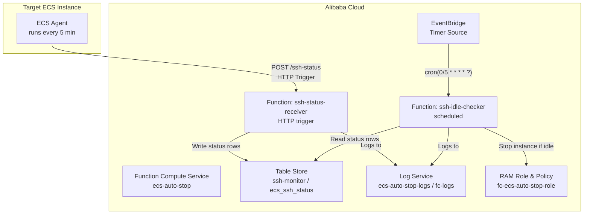
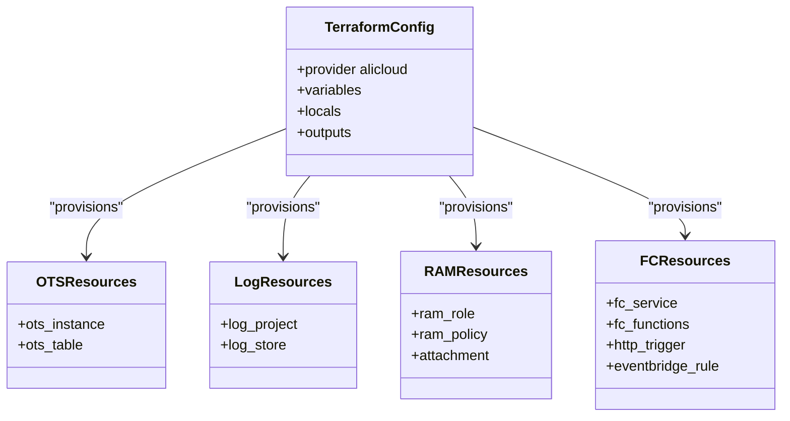
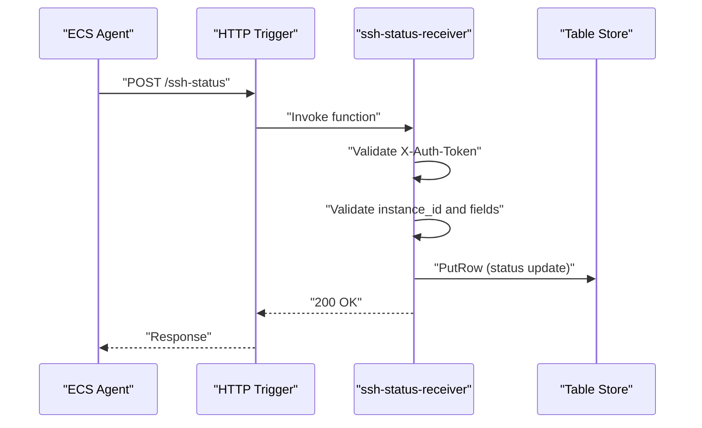
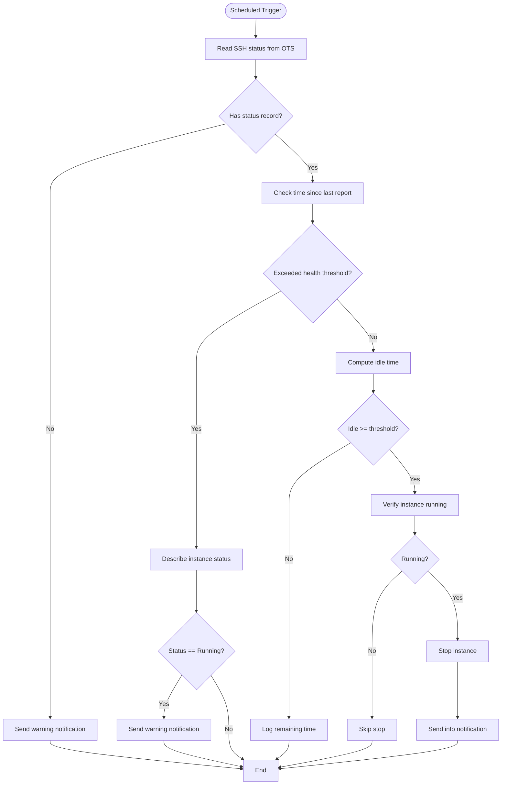
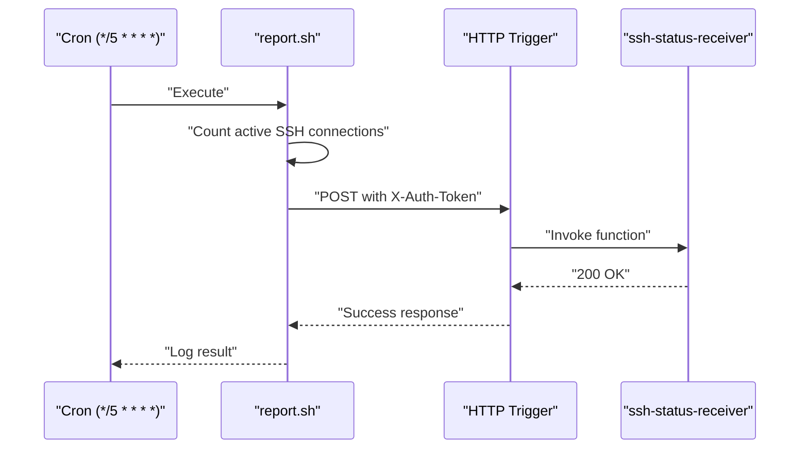
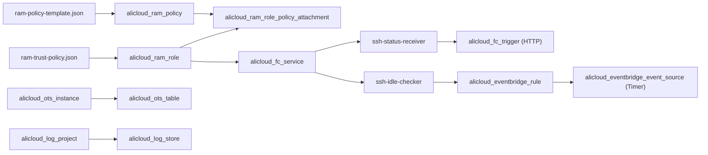

# Infrastructure Architecture

<cite>
**Referenced Files in This Document**
- [main.tf](file://infra/main.tf)
- [ram-policy-template.json](file://infra/ram-policy-template.json)
- [ram-trust-policy.json](file://infra/ram-trust-policy.json)
- [deploy.sh](file://deploy.sh)
- [destroy.sh](file://destroy.sh)
- [index.py (ssh-idle-checker)](file://functions/ssh-idle-checker/index.py)
- [index.py (ssh-status-receiver)](file://functions/ssh-status-receiver/index.py)
- [requirements.txt (ssh-idle-checker)](file://functions/ssh-idle-checker/requirements.txt)
- [requirements.txt (ssh-status-receiver)](file://functions/ssh-status-receiver/requirements.txt)
- [config.env.template](file://ecs-agent/config.env.template)
- [install.sh](file://ecs-agent/install.sh)
- [report.sh](file://ecs-agent/report.sh)
- [config.yaml.example](file://config/config.yaml.example)
- [terraform.tfvars.example](file://infra/terraform.tfvars.example)
</cite>

## Table of Contents
1. [Introduction](#introduction)
2. [Project Structure](#project-structure)
3. [Core Components](#core-components)
4. [Architecture Overview](#architecture-overview)
5. [Detailed Component Analysis](#detailed-component-analysis)
6. [Dependency Analysis](#dependency-analysis)
7. [Performance Considerations](#performance-considerations)
8. [Security Model and Least Privilege](#security-model-and-least-privilege)
9. [Scaling and High Availability](#scaling-and-high-availability)
10. [Cost Optimization Strategies](#cost-optimization-strategies)
11. [Troubleshooting Guide](#troubleshooting-guide)
12. [Conclusion](#conclusion)

## Introduction
This document describes the infrastructure architecture for ECS Auto-Stop, a serverless solution that automatically stops Alibaba Cloud ECS instances when they remain idle for a configurable period. The architecture combines Terraform-based infrastructure provisioning, Alibaba Cloud Function Compute (FC), EventBridge scheduled triggers, Table Store (OTS) for state persistence, and a lightweight ECS agent that monitors SSH activity and reports status to the backend.

## Project Structure
The repository is organized into distinct areas:
- infra: Terraform configuration and IAM policy templates
- functions: Python-based Function Compute handlers
- ecs-agent: Lightweight agent scripts deployed on target ECS instances
- config: Example configuration files for reference

```mermaid
graph TB
subgraph "Repository"
I["infra/"]
F["functions/"]
E["ecs-agent/"]
C["config/"]
end
I --> |"Terraform main configuration"| MTF["infra/main.tf"]
I --> |"Trust policy for RAM role"| TRP["infra/ram-trust-policy.json"]
I --> |"Policy template"| RPT["infra/ram-policy-template.json"]
I --> |"Variables example"| TFV["infra/terraform.tfvars.example"]
F --> |"Idle checker handler"| SIC["functions/ssh-idle-checker/index.py"]
F --> |"Status receiver handler"| SSR["functions/ssh-status-receiver/index.py"]
F --> |"Dependencies"| REQ1["functions/ssh-idle-checker/requirements.txt"]
F --> |"Dependencies"| REQ2["functions/ssh-status-receiver/requirements.txt"]
E --> |"Agent installer"| INS["ecs-agent/install.sh"]
E --> |"Reporter"| REP["ecs-agent/report.sh"]
E --> |"Config template"| CET["ecs-agent/config.env.template"]
C --> |"Example config"| CYE["config/config.yaml.example"]
```

**Diagram sources**
- [main.tf:1-305](file://infra/main.tf#L1-L305)
- [ram-policy-template.json:1-36](file://infra/ram-policy-template.json#L1-L36)
- [ram-trust-policy.json:1-15](file://infra/ram-trust-policy.json#L1-L15)
- [index.py (ssh-idle-checker):1-290](file://functions/ssh-idle-checker/index.py#L1-L290)
- [index.py (ssh-status-receiver):1-205](file://functions/ssh-status-receiver/index.py#L1-L205)
- [requirements.txt (ssh-idle-checker):1-4](file://functions/ssh-idle-checker/requirements.txt#L1-L4)
- [requirements.txt (ssh-status-receiver):1-2](file://functions/ssh-status-receiver/requirements.txt#L1-L2)
- [install.sh:1-73](file://ecs-agent/install.sh#L1-L73)
- [report.sh:1-86](file://ecs-agent/report.sh#L1-L86)
- [config.env.template:1-12](file://ecs-agent/config.env.template#L1-L12)
- [config.yaml.example:1-42](file://config/config.yaml.example#L1-L42)
- [terraform.tfvars.example:1-17](file://infra/terraform.tfvars.example#L1-L17)

**Section sources**
- [main.tf:1-305](file://infra/main.tf#L1-L305)
- [deploy.sh:1-162](file://deploy.sh#L1-L162)
- [destroy.sh:1-43](file://destroy.sh#L1-L43)

## Core Components
- Terraform-managed infrastructure:
  - Table Store instance and table for SSH status persistence
  - Log Service project and logstore for Function Compute logs
  - RAM role and policy for Function Compute service
  - Function Compute service hosting two functions
  - HTTP trigger for the status receiver
  - EventBridge scheduled rule and timer source for periodic checks
- Function Compute handlers:
  - SSH Status Receiver: validates authentication, accepts POST reports, writes to OTS
  - SSH Idle Checker: reads OTS status, verifies instance running state, stops if idle
- ECS Agent:
  - Installs on target ECS instances, runs every 5 minutes via cron
  - Counts active SSH connections and posts status to the HTTP trigger endpoint
- IAM Security:
  - RAM role with trust policy allowing Function Compute service
  - Policy template granting least-privilege access to specific resources

**Section sources**
- [main.tf:62-82](file://infra/main.tf#L62-L82)
- [main.tf:88-100](file://infra/main.tf#L88-L100)
- [main.tf:106-132](file://infra/main.tf#L106-L132)
- [main.tf:138-152](file://infra/main.tf#L138-L152)
- [main.tf:155-197](file://infra/main.tf#L155-L197)
- [main.tf:216-226](file://infra/main.tf#L216-L226)
- [main.tf:232-270](file://infra/main.tf#L232-L270)
- [index.py (ssh-idle-checker):161-290](file://functions/ssh-idle-checker/index.py#L161-L290)
- [index.py (ssh-status-receiver):110-205](file://functions/ssh-status-receiver/index.py#L110-L205)
- [install.sh:1-73](file://ecs-agent/install.sh#L1-L73)
- [report.sh:1-86](file://ecs-agent/report.sh#L1-L86)

## Architecture Overview
The system operates as a serverless pipeline with scheduled and event-driven triggers. The ECS agent periodically reports SSH activity to the HTTP-triggered Function Compute function, which persists the status in Table Store. A scheduled EventBridge rule invokes the idle checker function every 5 minutes to evaluate the persisted status and stop the instance if idle beyond the configured threshold.

**Diagram sources**
- [main.tf:257-270](file://infra/main.tf#L257-L270)
- [main.tf:232-254](file://infra/main.tf#L232-L254)
- [main.tf:216-226](file://infra/main.tf#L216-L226)
- [main.tf:155-197](file://infra/main.tf#L155-L197)
- [main.tf:106-132](file://infra/main.tf#L106-L132)
- [index.py (ssh-idle-checker):104-130](file://functions/ssh-idle-checker/index.py#L104-L130)
- [index.py (ssh-status-receiver):78-108](file://functions/ssh-status-receiver/index.py#L78-L108)

## Detailed Component Analysis

### Terraform Provisioning and IAM Security
- Provider and variables:
  - Defines Alibaba Cloud provider region and variables for target instance, auth token, and optional DingTalk webhook.
- Table Store:
  - Creates OTS instance and table with a String primary key and single-version semantics.
- Log Service:
  - Creates a log project and logstore with retention and shard configuration.
- RAM Role and Policy:
  - RAM role allows Function Compute service to assume the role.
  - Policy template grants explicit permissions scoped to the specific instance, OTS table, and log project/store.
- Function Compute:
  - Creates a service with log configuration bound to the Log Service store.
  - Deploys two functions with environment variables for OTS endpoints and credentials.
- Triggers:
  - HTTP trigger for the status receiver with anonymous auth and POST method.
  - EventBridge rule targeting the idle checker function with a cron schedule.
- Outputs:
  - Exposes HTTP endpoint, OTS identifiers, service name, RAM role ARN, and log project.

**Diagram sources**
- [main.tf:4-13](file://infra/main.tf#L4-L13)
- [main.tf:16-38](file://infra/main.tf#L16-L38)
- [main.tf:49-56](file://infra/main.tf#L49-L56)
- [main.tf:62-82](file://infra/main.tf#L62-L82)
- [main.tf:88-100](file://infra/main.tf#L88-L100)
- [main.tf:106-132](file://infra/main.tf#L106-L132)
- [main.tf:138-152](file://infra/main.tf#L138-L152)
- [main.tf:155-197](file://infra/main.tf#L155-L197)
- [main.tf:216-226](file://infra/main.tf#L216-L226)
- [main.tf:232-270](file://infra/main.tf#L232-L270)

**Section sources**
- [main.tf:4-13](file://infra/main.tf#L4-L13)
- [main.tf:16-38](file://infra/main.tf#L16-L38)
- [main.tf:49-56](file://infra/main.tf#L49-L56)
- [main.tf:62-82](file://infra/main.tf#L62-L82)
- [main.tf:88-100](file://infra/main.tf#L88-L100)
- [main.tf:106-132](file://infra/main.tf#L106-L132)
- [main.tf:138-152](file://infra/main.tf#L138-L152)
- [main.tf:155-197](file://infra/main.tf#L155-L197)
- [main.tf:216-226](file://infra/main.tf#L216-L226)
- [main.tf:232-270](file://infra/main.tf#L232-L270)

### Function Compute Handlers

#### SSH Status Receiver
- Purpose: Accepts POST requests from the ECS agent, validates authentication and instance ID, and writes status to OTS.
- Authentication: Validates X-Auth-Token header against configured token.
- Validation: Ensures required fields and authorized instance ID.
- Persistence: Uses OTS PutRow to update last report time, SSH count, and optionally last active time.

**Diagram sources**
- [main.tf:216-226](file://infra/main.tf#L216-L226)
- [index.py (ssh-status-receiver):110-205](file://functions/ssh-status-receiver/index.py#L110-L205)
- [index.py (ssh-status-receiver):78-108](file://functions/ssh-status-receiver/index.py#L78-L108)

**Section sources**
- [index.py (ssh-status-receiver):110-205](file://functions/ssh-status-receiver/index.py#L110-L205)
- [index.py (ssh-status-receiver):46-76](file://functions/ssh-status-receiver/index.py#L46-L76)
- [index.py (ssh-status-receiver):78-108](file://functions/ssh-status-receiver/index.py#L78-L108)

#### SSH Idle Checker
- Purpose: Periodically evaluates SSH status and stops the target instance if idle beyond threshold.
- Evaluation: Reads last active time and last report time from OTS; performs health check if no recent report.
- Safety: Verifies instance is running before attempting to stop.
- Notification: Sends DingTalk webhook message when actions occur.

**Diagram sources**
- [main.tf:232-270](file://infra/main.tf#L232-L270)
- [index.py (ssh-idle-checker):161-290](file://functions/ssh-idle-checker/index.py#L161-L290)
- [index.py (ssh-idle-checker):104-130](file://functions/ssh-idle-checker/index.py#L104-L130)
- [index.py (ssh-idle-checker):88-102](file://functions/ssh-idle-checker/index.py#L88-L102)

**Section sources**
- [index.py (ssh-idle-checker):161-290](file://functions/ssh-idle-checker/index.py#L161-L290)
- [index.py (ssh-idle-checker):88-102](file://functions/ssh-idle-checker/index.py#L88-L102)
- [index.py (ssh-idle-checker):132-159](file://functions/ssh-idle-checker/index.py#L132-L159)

### ECS Agent
- Installation:
  - Creates directory, copies reporter script, sets up log file, and adds a cron job to run every 5 minutes.
- Reporting:
  - Counts active SSH connections using ss/netstat/who fallbacks.
  - Posts JSON payload with instance_id, ssh_count, and timestamp to the HTTP endpoint with X-Auth-Token header.
  - Parses HTTP response and logs outcomes.

**Diagram sources**
- [install.sh:50-62](file://ecs-agent/install.sh#L50-L62)
- [report.sh:68-85](file://ecs-agent/report.sh#L68-L85)
- [main.tf:216-226](file://infra/main.tf#L216-L226)
- [index.py (ssh-status-receiver):110-205](file://functions/ssh-status-receiver/index.py#L110-L205)

**Section sources**
- [install.sh:1-73](file://ecs-agent/install.sh#L1-L73)
- [report.sh:1-86](file://ecs-agent/report.sh#L1-L86)
- [config.env.template:1-12](file://ecs-agent/config.env.template#L1-L12)

## Dependency Analysis
- Resource dependencies:
  - OTS table depends on OTS instance.
  - Function Compute service depends on RAM role attachment and log store.
  - HTTP trigger depends on function and service.
  - EventBridge rule depends on function ARN resolution.
- Cross-service dependencies:
  - Functions depend on RAM role credentials for OTS and ECS APIs.
  - Functions depend on environment variables for OTS endpoints and table names.
  - Agent depends on HTTP endpoint and auth token from Terraform outputs.
- IAM dependencies:
  - RAM role trust policy allows Function Compute service to assume role.
  - Policy template scopes permissions to specific instance, OTS table, and log resources.

**Diagram sources**
- [ram-trust-policy.json:1-15](file://infra/ram-trust-policy.json#L1-L15)
- [ram-policy-template.json:1-36](file://infra/ram-policy-template.json#L1-L36)
- [main.tf:106-132](file://infra/main.tf#L106-L132)
- [main.tf:62-82](file://infra/main.tf#L62-L82)
- [main.tf:88-100](file://infra/main.tf#L88-L100)
- [main.tf:138-152](file://infra/main.tf#L138-L152)
- [main.tf:155-197](file://infra/main.tf#L155-L197)
- [main.tf:216-226](file://infra/main.tf#L216-L226)
- [main.tf:232-270](file://infra/main.tf#L232-L270)

**Section sources**
- [main.tf:106-132](file://infra/main.tf#L106-L132)
- [main.tf:62-82](file://infra/main.tf#L62-L82)
- [main.tf:138-152](file://infra/main.tf#L138-L152)
- [main.tf:216-226](file://infra/main.tf#L216-L226)
- [main.tf:232-270](file://infra/main.tf#L232-L270)

## Performance Considerations
- Function Compute sizing:
  - ssh-status-receiver: small memory footprint suitable for HTTP-triggered ingestion.
  - ssh-idle-checker: moderate memory to accommodate ECS API calls and OTS operations.
- Execution timeouts:
  - Receiver timeout aligned with HTTP trigger constraints.
  - Idle checker timeout sufficient for ECS status checks and optional stop operations.
- OTS write strategy:
  - PutRow with condition supports both insert and update efficiently.
- EventBridge cadence:
  - 5-minute intervals balance responsiveness with cost and API limits.
- Agent polling:
  - 5-minute cron aligns with EventBridge schedule to minimize redundant reports.

[No sources needed since this section provides general guidance]

## Security Model and Least Privilege
- Trust relationship:
  - RAM role allows Function Compute service to assume the role.
- Permissions scope:
  - ECS: stop and describe only for the specific target instance.
  - OTS: read/write/update for the specific table.
  - Log Service: write logs to the configured logstore.
- Access control:
  - HTTP trigger uses anonymous auth; authentication enforced by function via X-Auth-Token header.
  - Instance ID validation restricts accepted reports to allowed list.
- Secrets management:
  - auth_token and optional DingTalk webhook are provided as variables and injected into functions.

**Section sources**
- [ram-trust-policy.json:1-15](file://infra/ram-trust-policy.json#L1-L15)
- [ram-policy-template.json:1-36](file://infra/ram-policy-template.json#L1-L36)
- [main.tf:113-126](file://infra/main.tf#L113-L126)
- [index.py (ssh-status-receiver):46-76](file://functions/ssh-status-receiver/index.py#L46-L76)
- [index.py (ssh-status-receiver):67-76](file://functions/ssh-status-receiver/index.py#L67-L76)

## Scaling and High Availability
- Function Compute:
  - Stateless functions scale automatically with concurrent invocations.
  - EventBridge can fan out to multiple targets if needed.
- OTS:
  - Capacity mode instance scales with provisioned throughput; single-table design simplifies management.
- Log Service:
  - Logstore shards auto-split to handle increased log volume.
- Agent distribution:
  - Deploy agent to multiple instances if monitoring several ECS hosts.
- Redundancy:
  - EventBridge timer source ensures periodic checks even if one invocation fails.

[No sources needed since this section provides general guidance]

## Cost Optimization Strategies
- Function Compute:
  - Use smallest practical memory sizes; keep timeouts minimal.
  - Consolidate functions where feasible.
- OTS:
  - Single-version table reduces storage overhead.
  - Capacity mode vs. pay-per-request selection depends on workload; capacity mode often cheaper for steady-state.
- Log Service:
  - Optimize retention period and shard count to balance cost and performance.
- Agent:
  - Keep cron interval reasonable to avoid unnecessary traffic.
- IAM:
  - Maintain least-privilege policies to prevent accidental over-provisioning.

[No sources needed since this section provides general guidance]

## Troubleshooting Guide
- Deployment issues:
  - Ensure Terraform and Alibaba Cloud credentials are configured; verify terraform.tfvars presence and correctness.
  - Review terraform plan output and confirm resource names.
- Function execution:
  - Check Function Compute logs in the configured log project/store.
  - Validate environment variables (OTS endpoints, table names, tokens).
- Agent failures:
  - Confirm cron job is present and logs are written to the expected location.
  - Verify HTTP endpoint URL and X-Auth-Token header in agent configuration.
- IAM permissions:
  - Confirm RAM role ARN and policy attachment; verify policy template substitution values.
- EventBridge:
  - Validate cron expression and rule/target configuration; ensure function ARN resolution.

**Section sources**
- [deploy.sh:17-50](file://deploy.sh#L17-L50)
- [deploy.sh:76-88](file://deploy.sh#L76-L88)
- [install.sh:50-62](file://ecs-agent/install.sh#L50-L62)
- [report.sh:68-85](file://ecs-agent/report.sh#L68-L85)
- [main.tf:296-304](file://infra/main.tf#L296-L304)

## Conclusion
The ECS Auto-Stop architecture leverages Alibaba Cloud’s serverless primitives to deliver a robust, scalable, and secure solution for automatic ECS instance shutdown based on SSH activity. Terraform provisions all necessary resources with least-privilege IAM policies, while Function Compute handles ingestion and periodic evaluation. The ECS agent provides lightweight, reliable reporting. Together, these components form a production-ready automation pipeline with clear observability, manageable costs, and straightforward operational procedures.