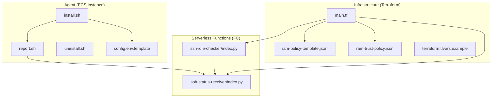
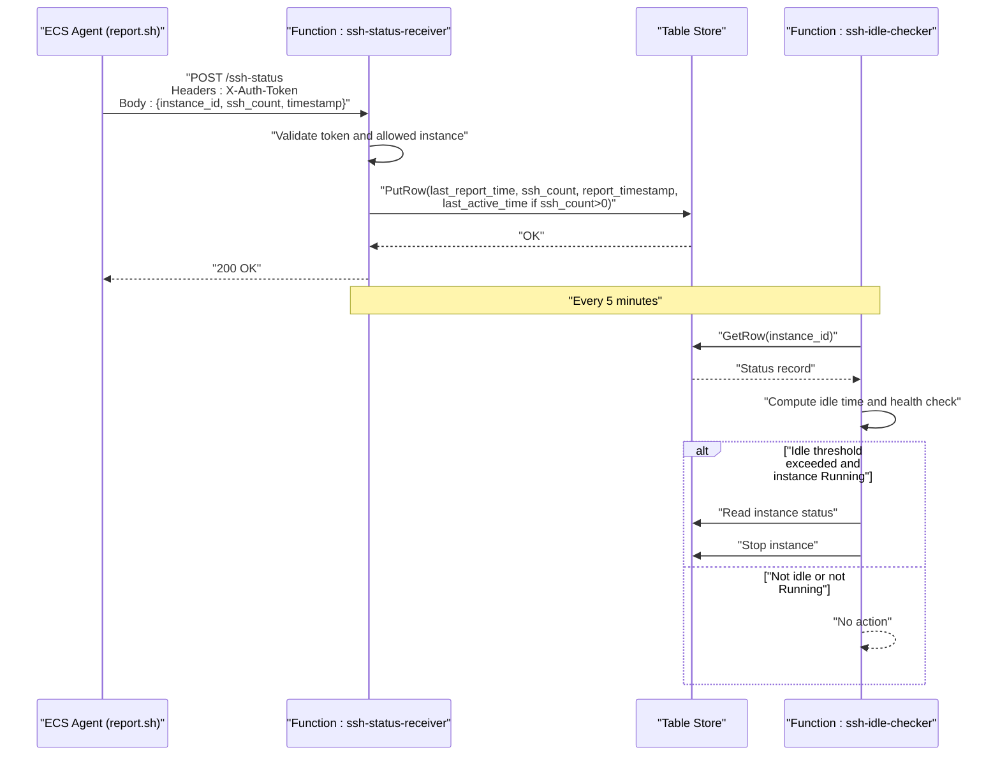
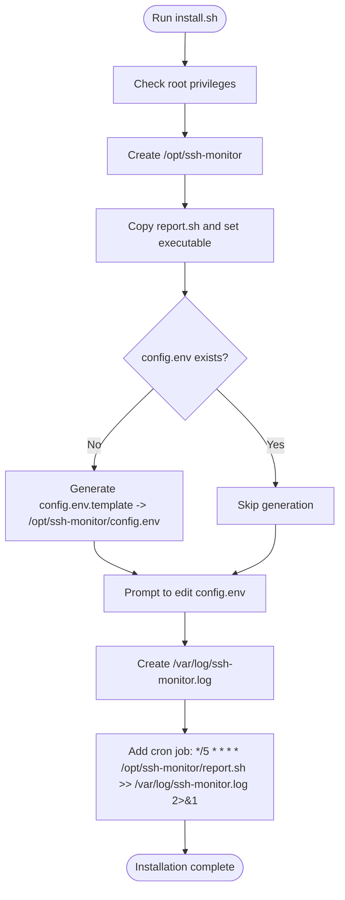
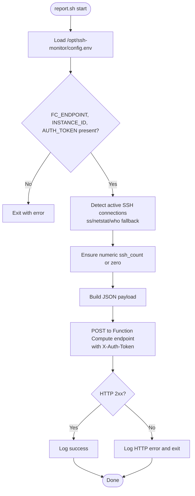
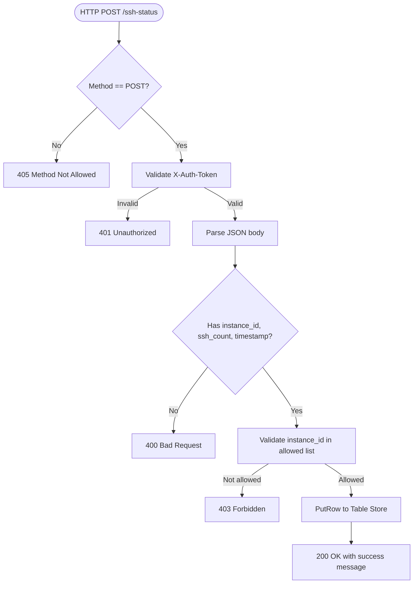
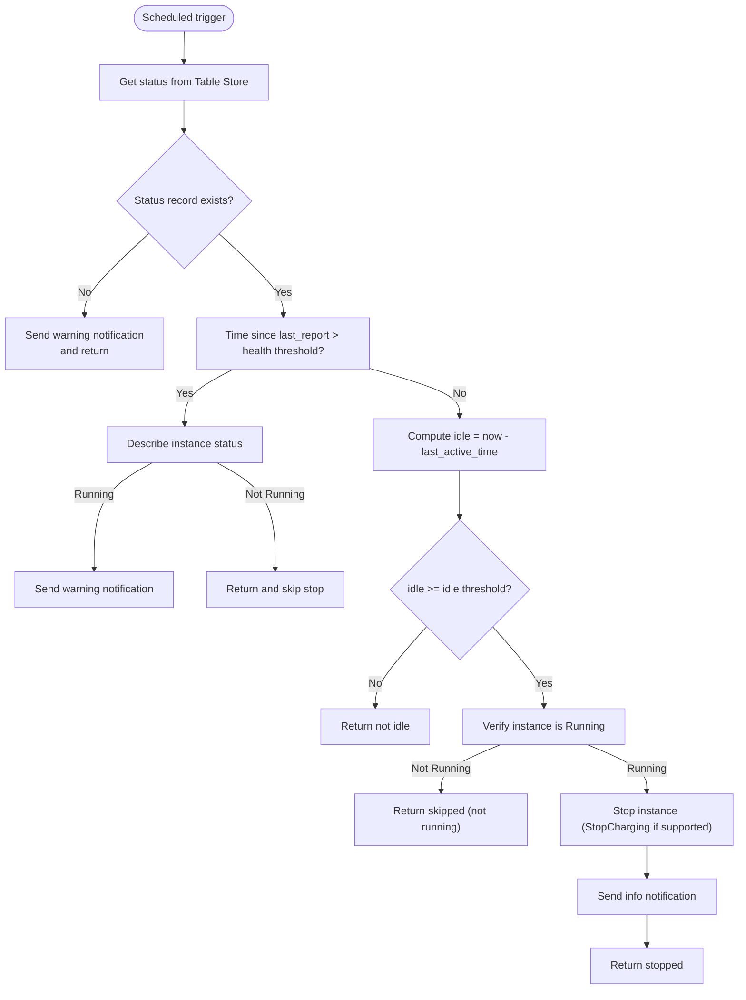
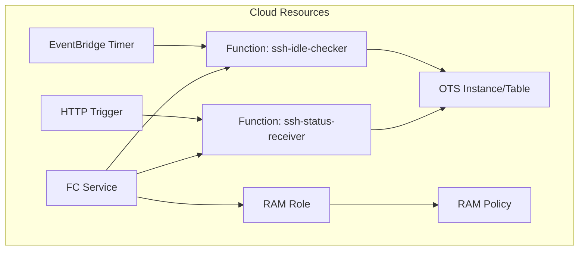
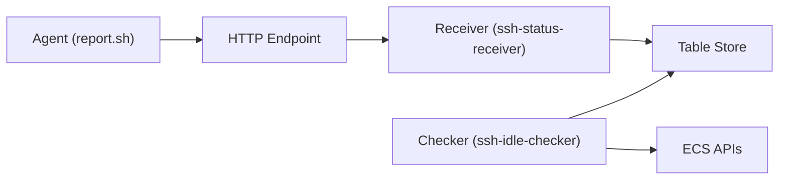

# Monitoring Agent

<cite>
**Referenced Files in This Document**
- [install.sh](file://ecs-agent/install.sh)
- [report.sh](file://ecs-agent/report.sh)
- [uninstall.sh](file://ecs-agent/uninstall.sh)
- [config.env.template](file://ecs-agent/config.env.template)
- [index.py (ssh-status-receiver)](file://functions/ssh-status-receiver/index.py)
- [index.py (ssh-idle-checker)](file://functions/ssh-idle-checker/index.py)
- [deploy.sh](file://deploy.sh)
- [destroy.sh](file://destroy.sh)
- [main.tf](file://infra/main.tf)
- [terraform.tfvars.example](file://infra/terraform.tfvars.example)
- [ram-policy-template.json](file://infra/ram-policy-template.json)
- [ram-trust-policy.json](file://infra/ram-trust-policy.json)
- [requirements.txt (ssh-status-receiver)](file://functions/ssh-status-receiver/requirements.txt)
- [requirements.txt (ssh-idle-checker)](file://functions/ssh-idle-checker/requirements.txt)
</cite>

## Table of Contents
1. [Introduction](#introduction)
2. [Project Structure](#project-structure)
3. [Core Components](#core-components)
4. [Architecture Overview](#architecture-overview)
5. [Detailed Component Analysis](#detailed-component-analysis)
6. [Dependency Analysis](#dependency-analysis)
7. [Performance Considerations](#performance-considerations)
8. [Troubleshooting Guide](#troubleshooting-guide)
9. [Conclusion](#conclusion)
10. [Appendices](#appendices)

## Introduction
This document describes the ECS Auto-Stop monitoring agent that runs on target ECS instances to detect active SSH connections and periodically report status to a serverless HTTP endpoint. It covers installation, configuration, cron-based reporting, security, troubleshooting, and uninstallation. The agent integrates with Alibaba Cloud Function Compute and Table Store to support automated idle detection and instance stopping.

## Project Structure
The repository is organized into:
- ecs-agent: The monitoring agent scripts and configuration template
- functions: Two serverless functions (receiver and checker)
- infra: Terraform infrastructure as code
- config: Example YAML configuration for reference
- Root shell scripts: deploy and destroy automation

**Diagram sources**
- [install.sh:1-73](file://ecs-agent/install.sh#L1-L73)
- [report.sh:1-86](file://ecs-agent/report.sh#L1-L86)
- [uninstall.sh:1-43](file://ecs-agent/uninstall.sh#L1-L43)
- [config.env.template:1-12](file://ecs-agent/config.env.template#L1-L12)
- [index.py (ssh-status-receiver):1-205](file://functions/ssh-status-receiver/index.py#L1-L205)
- [index.py (ssh-idle-checker):1-290](file://functions/ssh-idle-checker/index.py#L1-L290)
- [main.tf:1-305](file://infra/main.tf#L1-L305)
- [ram-policy-template.json:1-36](file://infra/ram-policy-template.json#L1-L36)
- [ram-trust-policy.json:1-15](file://infra/ram-trust-policy.json#L1-L15)
- [terraform.tfvars.example:1-17](file://infra/terraform.tfvars.example#L1-L17)

**Section sources**
- [install.sh:1-73](file://ecs-agent/install.sh#L1-L73)
- [report.sh:1-86](file://ecs-agent/report.sh#L1-L86)
- [uninstall.sh:1-43](file://ecs-agent/uninstall.sh#L1-L43)
- [config.env.template:1-12](file://ecs-agent/config.env.template#L1-L12)
- [index.py (ssh-status-receiver):1-205](file://functions/ssh-status-receiver/index.py#L1-L205)
- [index.py (ssh-idle-checker):1-290](file://functions/ssh-idle-checker/index.py#L1-L290)
- [main.tf:1-305](file://infra/main.tf#L1-L305)
- [terraform.tfvars.example:1-17](file://infra/terraform.tfvars.example#L1-L17)

## Core Components
- Agent installer: Creates installation directory, copies scripts, generates config template, sets up logging, and installs a cron job to run the reporter every 5 minutes.
- Reporter: Loads environment configuration, detects active SSH connections using system commands, builds a JSON payload, and securely posts to the Function Compute HTTP endpoint with an authentication header.
- Uninstaller: Removes the cron job, deletes the installation directory, and leaves logs for inspection.
- Serverless receiver: Validates authentication token and allowed instance IDs, parses JSON payload, and writes status to Table Store.
- Serverless checker: Periodically checks Table Store for the latest status, enforces idle thresholds, verifies instance status, and stops the instance if idle for too long.
- Infrastructure: Deploys OTS, FC service, triggers, policies, and outputs the HTTP endpoint used by the agent.

**Section sources**
- [install.sh:1-73](file://ecs-agent/install.sh#L1-L73)
- [report.sh:1-86](file://ecs-agent/report.sh#L1-L86)
- [uninstall.sh:1-43](file://ecs-agent/uninstall.sh#L1-L43)
- [index.py (ssh-status-receiver):1-205](file://functions/ssh-status-receiver/index.py#L1-L205)
- [index.py (ssh-idle-checker):1-290](file://functions/ssh-idle-checker/index.py#L1-L290)
- [main.tf:1-305](file://infra/main.tf#L1-L305)

## Architecture Overview
The agent runs on the target ECS instance and periodically posts SSH connection counts to a Function Compute HTTP endpoint. The receiver validates the request and writes the status to Table Store. A scheduled checker reads the status, evaluates idle thresholds, and stops the instance if appropriate.

**Diagram sources**
- [report.sh:69-74](file://ecs-agent/report.sh#L69-L74)
- [index.py (ssh-status-receiver):110-205](file://functions/ssh-status-receiver/index.py#L110-L205)
- [index.py (ssh-idle-checker):161-290](file://functions/ssh-idle-checker/index.py#L161-L290)
- [main.tf:216-270](file://infra/main.tf#L216-L270)

## Detailed Component Analysis

### Agent Installation and Cron Job
- Installation steps:
  - Creates installation directory and copies the reporter script.
  - Generates a config template if none exists and instructs the user to edit it.
  - Creates and secures a log file.
  - Adds a cron job to run the reporter every 5 minutes, marking entries for easy removal.
- Post-installation guidance:
  - Edit the generated config file with the Function Compute endpoint, instance ID, and authentication token.
  - Manually test the reporter and monitor logs.

**Diagram sources**
- [install.sh:15-62](file://ecs-agent/install.sh#L15-L62)

**Section sources**
- [install.sh:1-73](file://ecs-agent/install.sh#L1-L73)

### Agent Reporting Workflow
- Configuration loading:
  - Loads environment variables from the config file.
  - Validates presence of endpoint, instance ID, and token.
- SSH connection detection:
  - Prefers the `ss` command; falls back to `netstat`; last resort uses `who`.
  - Ensures numeric count or defaults to zero.
- Payload construction:
  - Builds JSON with instance ID, SSH count, and timestamp.
- Secure HTTP reporting:
  - Sends POST with Content-Type and X-Auth-Token header.
  - Parses HTTP status and logs success or failure.

**Diagram sources**
- [report.sh:17-74](file://ecs-agent/report.sh#L17-L74)

**Section sources**
- [report.sh:1-86](file://ecs-agent/report.sh#L1-L86)

### Configuration Management
- Environment variables:
  - FC_ENDPOINT: HTTP endpoint URL for the receiver function.
  - INSTANCE_ID: Target ECS instance identifier.
  - AUTH_TOKEN: Shared secret used for request authentication.
- Template location and generation:
  - Template file path: [config.env.template:1-12](file://ecs-agent/config.env.template#L1-L12)
  - Deploy script generates the agent config file using Terraform outputs and variables.

**Section sources**
- [config.env.template:1-12](file://ecs-agent/config.env.template#L1-L12)
- [deploy.sh:90-120](file://deploy.sh#L90-L120)

### Serverless Receiver Function
- Responsibilities:
  - Validate HTTP method (only POST).
  - Authenticate using X-Auth-Token against environment-configured token.
  - Validate instance ID against allowed list.
  - Parse JSON payload and write/update status in Table Store.
- Behavior:
  - Updates last_report_time and ssh_count on every report.
  - Updates last_active_time only when ssh_count > 0.
  - Returns structured JSON on success.

**Diagram sources**
- [index.py (ssh-status-receiver):110-205](file://functions/ssh-status-receiver/index.py#L110-L205)

**Section sources**
- [index.py (ssh-status-receiver):1-205](file://functions/ssh-status-receiver/index.py#L1-L205)

### Serverless Idle Checker Function
- Triggers:
  - Scheduled via EventBridge every 5 minutes.
- Logic:
  - Reads latest status from Table Store.
  - Performs health check: alerts if no recent report while instance is running.
  - Computes idle time and stops the instance if idle threshold exceeded and instance is running.
  - Sends notifications via DingTalk webhook if configured.

**Diagram sources**
- [index.py (ssh-idle-checker):161-290](file://functions/ssh-idle-checker/index.py#L161-L290)

**Section sources**
- [index.py (ssh-idle-checker):1-290](file://functions/ssh-idle-checker/index.py#L1-L290)

### Infrastructure and Security Model
- Resources deployed:
  - OTS instance and table for storing SSH status.
  - Function Compute service hosting two functions.
  - HTTP trigger for the receiver and EventBridge scheduled trigger for the checker.
  - RAM role with least privilege policy attached to the service.
- Security:
  - RAM trust policy allows Function Compute to assume the role.
  - RAM policy grants minimal permissions: describe instance status, stop instance, OTS read/write, and log posting.
  - Receiver validates X-Auth-Token and allowed instance IDs.

**Diagram sources**
- [main.tf:62-197](file://infra/main.tf#L62-L197)
- [ram-policy-template.json:1-36](file://infra/ram-policy-template.json#L1-L36)
- [ram-trust-policy.json:1-15](file://infra/ram-trust-policy.json#L1-L15)

**Section sources**
- [main.tf:1-305](file://infra/main.tf#L1-L305)
- [ram-policy-template.json:1-36](file://infra/ram-policy-template.json#L1-L36)
- [ram-trust-policy.json:1-15](file://infra/ram-trust-policy.json#L1-L15)

## Dependency Analysis
- Agent-to-Serverless:
  - The agent depends on the HTTP endpoint URL and shared authentication token.
  - The receiver depends on the token and allowed instance list.
- Serverless-to-External Services:
  - Receiver and checker depend on OTS for status persistence.
  - Checker depends on ECS APIs to verify instance status and stop instances.
- Permissions:
  - RAM policy restricts actions to the target instance and OTS resources.

**Diagram sources**
- [report.sh:69-74](file://ecs-agent/report.sh#L69-L74)
- [index.py (ssh-status-receiver):110-205](file://functions/ssh-status-receiver/index.py#L110-L205)
- [index.py (ssh-idle-checker):161-290](file://functions/ssh-idle-checker/index.py#L161-L290)

**Section sources**
- [report.sh:1-86](file://ecs-agent/report.sh#L1-L86)
- [index.py (ssh-status-receiver):1-205](file://functions/ssh-status-receiver/index.py#L1-L205)
- [index.py (ssh-idle-checker):1-290](file://functions/ssh-idle-checker/index.py#L1-L290)

## Performance Considerations
- Reporting cadence: The agent runs every 5 minutes by default, balancing accuracy and overhead.
- Command selection: Uses the most efficient method (`ss`) to detect SSH connections; falls back gracefully.
- Network timeouts: The agent sets connect and total request timeouts when posting to the endpoint.
- Function compute scaling: The checker runs on schedule; ensure sufficient memory/timeouts for your workload.

[No sources needed since this section provides general guidance]

## Troubleshooting Guide
Common issues and resolutions:
- Missing or invalid configuration:
  - Ensure the config file exists and contains the endpoint, instance ID, and token.
  - Regenerate the agent config using the deploy script outputs.
- Authentication failures:
  - Confirm the X-Auth-Token header matches the environment variable configured in the receiver.
- No reports received:
  - Verify cron job is installed and running.
  - Check the agent log file for errors.
  - Confirm the receiver is reachable and not rate-limited.
- Instance not stopping:
  - Verify the checker’s idle threshold and health check thresholds.
  - Ensure the RAM role has permission to stop the instance.
- Manual testing:
  - Run the reporter script manually to validate connectivity and payload.
  - Inspect Table Store records to confirm updates.

Operational tips:
- Inspect logs:
  - Agent logs: [install.sh:47-48](file://ecs-agent/install.sh#L47-L48), [report.sh:56-85](file://ecs-agent/report.sh#L56-L85)
  - Function Compute logs: configured under the FC service log store.
- Validate environment:
  - Confirm environment variables in the receiver and checker functions.
- Verify endpoints:
  - Use the HTTP endpoint output from Terraform.

**Section sources**
- [install.sh:30-43](file://ecs-agent/install.sh#L30-L43)
- [report.sh:18-33](file://ecs-agent/report.sh#L18-L33)
- [index.py (ssh-status-receiver):46-64](file://functions/ssh-status-receiver/index.py#L46-L64)
- [index.py (ssh-idle-checker):169-176](file://functions/ssh-idle-checker/index.py#L169-L176)
- [main.tf:143-151](file://infra/main.tf#L143-L151)

## Conclusion
The ECS Auto-Stop monitoring agent provides a lightweight, secure mechanism to track SSH activity and automatically stop idle instances. By combining a simple agent with serverless functions and OTS, the solution offers low maintenance, scalable monitoring, and robust security through role-based permissions and token-based authentication.

[No sources needed since this section summarizes without analyzing specific files]

## Appendices

### Installation Steps
- Prepare the agent configuration:
  - Use the deploy script to generate the agent config file with the correct endpoint, instance ID, and token.
- Transfer and install:
  - Copy the agent directory to the target ECS instance and run the installer as root.
- Verify:
  - Manually run the reporter script and check the log file for success messages.

**Section sources**
- [deploy.sh:90-120](file://deploy.sh#L90-L120)
- [install.sh:1-73](file://ecs-agent/install.sh#L1-L73)
- [report.sh:1-86](file://ecs-agent/report.sh#L1-L86)

### Uninstallation and Cleanup
- Uninstall the agent:
  - Run the uninstaller as root to remove the cron job, agent directory, and keep logs for reference.
- Clean up cloud resources:
  - Use the destroy script to remove all cloud resources created by Terraform.
  - Ensure the agent is uninstalled from the ECS instance before destroying resources.

**Section sources**
- [uninstall.sh:1-43](file://ecs-agent/uninstall.sh#L1-L43)
- [destroy.sh:1-43](file://destroy.sh#L1-L43)

### Configuration Reference
- Environment variables for the agent:
  - FC_ENDPOINT: HTTP endpoint URL for the receiver.
  - INSTANCE_ID: Target ECS instance ID.
  - AUTH_TOKEN: Shared secret used for authentication.
- Environment variables for the receiver:
  - AUTH_TOKEN: Same shared secret.
  - ALLOWED_INSTANCE_IDS: Comma-separated list of allowed instance IDs.
- Environment variables for the checker:
  - TARGET_INSTANCE_ID: The instance to monitor.
  - REGION_ID: Alibaba Cloud region.
  - DINGTALK_WEBHOOK: Optional webhook URL for notifications.

**Section sources**
- [config.env.template:1-12](file://ecs-agent/config.env.template#L1-L12)
- [index.py (ssh-status-receiver):46-75](file://functions/ssh-status-receiver/index.py#L46-L75)
- [index.py (ssh-idle-checker):169-196](file://functions/ssh-idle-checker/index.py#L169-L196)

### Security Notes
- Token-based authentication:
  - The agent sends X-Auth-Token with each report; the receiver validates it.
- Least privilege:
  - RAM policy limits actions to the target instance and OTS resources.
- Trust relationship:
  - Function Compute assumes a role with a trust policy granting access.

**Section sources**
- [index.py (ssh-status-receiver):46-64](file://functions/ssh-status-receiver/index.py#L46-L64)
- [ram-policy-template.json:1-36](file://infra/ram-policy-template.json#L1-L36)
- [ram-trust-policy.json:1-15](file://infra/ram-trust-policy.json#L1-L15)