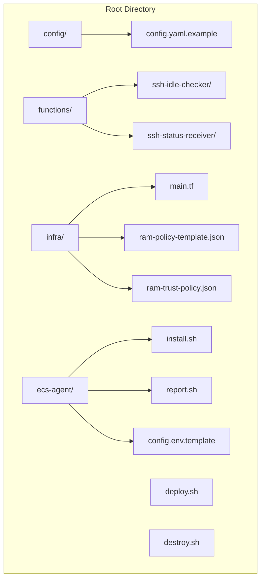
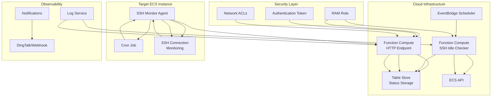
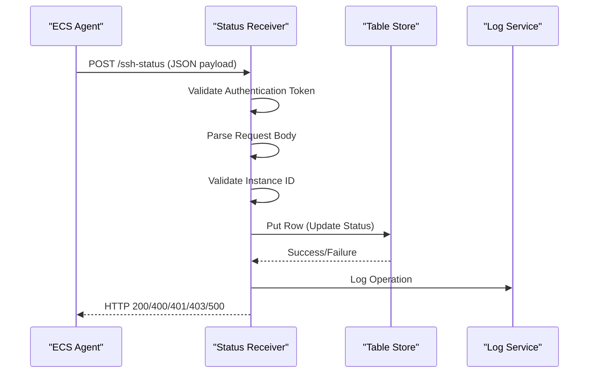
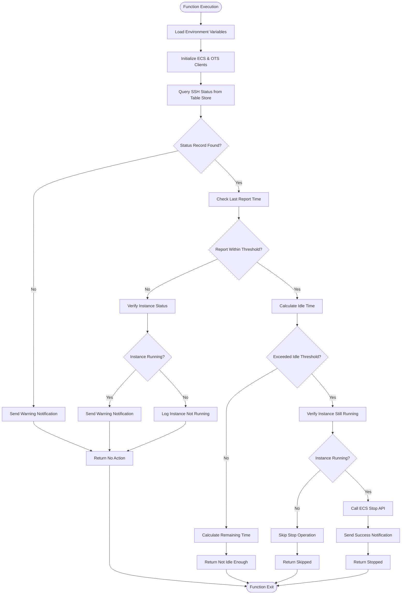
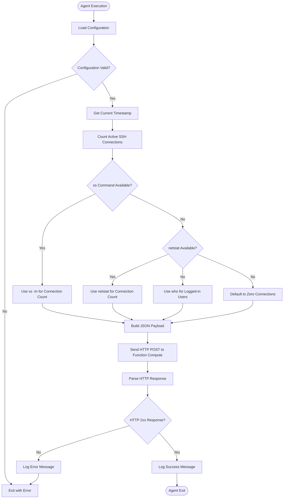
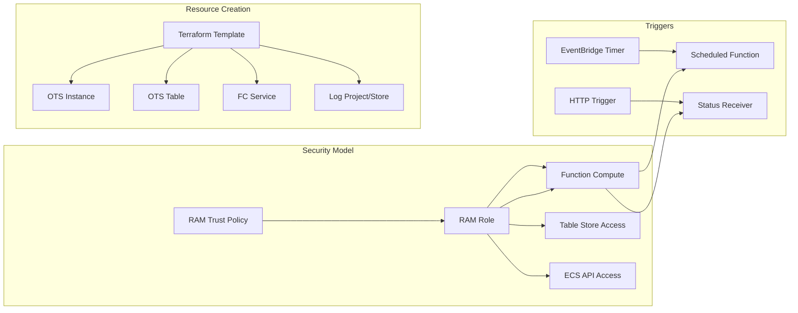
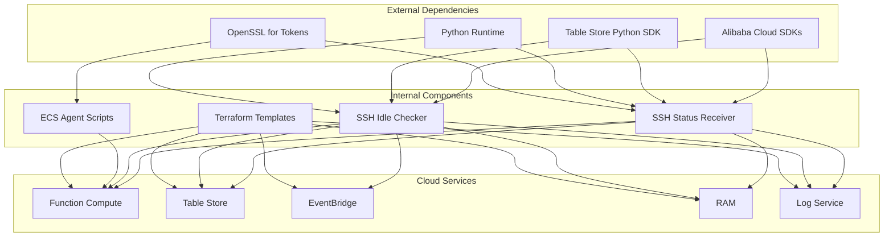

# Project Overview

<cite>
**Referenced Files in This Document**
- [config.yaml.example](file://config/config.yaml.example)
- [index.py (ssh-idle-checker)](file://functions/ssh-idle-checker/index.py)
- [index.py (ssh-status-receiver)](file://functions/ssh-status-receiver/index.py)
- [requirements.txt (ssh-idle-checker)](file://functions/ssh-idle-checker/requirements.txt)
- [requirements.txt (ssh-status-receiver)](file://functions/ssh-status-receiver/requirements.txt)
- [main.tf](file://infra/main.tf)
- [ram-policy-template.json](file://infra/ram-policy-template.json)
- [ram-trust-policy.json](file://infra/ram-trust-policy.json)
- [install.sh (ecs-agent)](file://ecs-agent/install.sh)
- [report.sh (ecs-agent)](file://ecs-agent/report.sh)
- [config.env.template (ecs-agent)](file://ecs-agent/config.env.template)
- [deploy.sh](file://deploy.sh)
- [destroy.sh](file://destroy.sh)
</cite>

## Table of Contents
1. [Introduction](#introduction)
2. [Project Structure](#project-structure)
3. [Core Components](#core-components)
4. [Architecture Overview](#architecture-overview)
5. [Detailed Component Analysis](#detailed-component-analysis)
6. [Dependency Analysis](#dependency-analysis)
7. [Performance Considerations](#performance-considerations)
8. [Troubleshooting Guide](#troubleshooting-guide)
9. [Conclusion](#conclusion)
10. [Appendices](#appendices)

## Introduction
ECS Auto-Stop is an automated Alibaba Cloud ECS instance management system designed to optimize costs and improve resource efficiency by automatically stopping idle instances. The solution combines serverless functions with an agent-based monitoring approach to detect SSH connection activity and enforce lifecycle policies.

Key benefits include:
- Cost optimization through automatic instance shutdown during idle periods
- Enhanced resource efficiency by preventing unnecessary compute charges
- Automated monitoring with minimal operational overhead
- Flexible configuration for various use cases and thresholds

The system operates on a simple principle: monitor SSH connections to ECS instances and stop them when no active connections are detected for a configurable period, while maintaining robust health checks and alerting capabilities.

## Project Structure
The project follows a modular architecture organized by functional areas:

**Diagram sources**
- [main.tf:1-305](file://infra/main.tf#L1-L305)
- [deploy.sh:1-162](file://deploy.sh#L1-L162)

The structure separates concerns across four main areas:
- Infrastructure provisioning (Terraform)
- Serverless functions (Function Compute)
- Monitoring agent (ECS-side scripts)
- Configuration management

**Section sources**
- [main.tf:1-305](file://infra/main.tf#L1-L305)
- [deploy.sh:1-162](file://deploy.sh#L1-L162)

## Core Components
The system consists of five primary components working together to achieve automated instance management:

### Serverless Functions
Two Python-based functions deployed on Alibaba Cloud Function Compute:
- **SSH Status Receiver**: HTTP-triggered function that accepts SSH connection reports from monitored instances
- **SSH Idle Checker**: Scheduled function that periodically evaluates instance activity and triggers shutdown when idle thresholds are met

### Monitoring Agent
Agent scripts deployed on target ECS instances that:
- Monitor active SSH connections using system commands
- Periodically report connection statistics to the status receiver
- Maintain local logging and configuration management

### Infrastructure Layer
Terraform-managed resources including:
- Table Store for persistent status storage
- RAM roles and policies for least-privilege access
- EventBridge scheduled triggers for periodic checks
- Log Service for centralized logging

### Configuration Management
Centralized configuration through YAML and environment variables controlling:
- Instance identification and targeting
- Thresholds for idle detection and health monitoring
- Security tokens and authentication
- Notification preferences

**Section sources**
- [index.py (ssh-idle-checker):1-290](file://functions/ssh-idle-checker/index.py#L1-L290)
- [index.py (ssh-status-receiver):1-205](file://functions/ssh-status-receiver/index.py#L1-L205)
- [install.sh (ecs-agent):1-73](file://ecs-agent/install.sh#L1-L73)
- [report.sh (ecs-agent):1-86](file://ecs-agent/report.sh#L1-L86)

## Architecture Overview
The system implements a distributed monitoring architecture combining serverless computing with edge-side agents:

**Diagram sources**
- [main.tf:138-197](file://infra/main.tf#L138-L197)
- [index.py (ssh-idle-checker):161-290](file://functions/ssh-idle-checker/index.py#L161-L290)
- [index.py (ssh-status-receiver):110-205](file://functions/ssh-status-receiver/index.py#L110-L205)

The architecture ensures:
- **Serverless scalability**: Functions scale automatically with workload
- **Edge intelligence**: Local monitoring reduces cloud dependency
- **Persistent state**: Table Store maintains historical connection data
- **Security isolation**: Least-privilege RAM policies limit access scope

## Detailed Component Analysis

### SSH Status Receiver Function
The HTTP-triggered function serves as the ingestion point for SSH connection data:

**Diagram sources**
- [index.py (ssh-status-receiver):110-205](file://functions/ssh-status-receiver/index.py#L110-L205)

Key features include:
- **Authentication validation** using configurable tokens
- **Instance ID verification** against allowed list
- **Atomic status updates** with Table Store
- **Comprehensive error handling** with structured responses

**Section sources**
- [index.py (ssh-status-receiver):46-108](file://functions/ssh-status-receiver/index.py#L46-L108)
- [index.py (ssh-status-receiver):110-205](file://functions/ssh-status-receiver/index.py#L110-L205)

### SSH Idle Checker Function
The scheduled function performs periodic evaluation of instance activity:

**Diagram sources**
- [index.py (ssh-idle-checker):161-290](file://functions/ssh-idle-checker/index.py#L161-L290)

Operational logic includes:
- **Health monitoring** to detect agent failures
- **Idle detection** using configurable thresholds
- **Safety checks** to prevent stopping non-running instances
- **Comprehensive logging** for audit trails

**Section sources**
- [index.py (ssh-idle-checker):71-102](file://functions/ssh-idle-checker/index.py#L71-L102)
- [index.py (ssh-idle-checker):161-290](file://functions/ssh-idle-checker/index.py#L161-L290)

### ECS Monitoring Agent
The agent script deployed on target instances provides continuous SSH connection monitoring:

**Diagram sources**
- [report.sh:18-86](file://ecs-agent/report.sh#L18-L86)

Implementation features:
- **Multi-method connection detection** for reliability
- **Cron-based scheduling** for periodic reporting
- **Structured logging** for troubleshooting
- **Authentication enforcement** via token headers

**Section sources**
- [report.sh:18-86](file://ecs-agent/report.sh#L18-L86)
- [install.sh (ecs-agent):15-73](file://ecs-agent/install.sh#L15-L73)

### Infrastructure Provisioning
Terraform manages all cloud resources with security-first design:

**Diagram sources**
- [main.tf:106-132](file://infra/main.tf#L106-L132)
- [main.tf:138-197](file://infra/main.tf#L138-L197)
- [ram-policy-template.json:1-36](file://infra/ram-policy-template.json#L1-L36)

Security and compliance features:
- **Least privilege access** through targeted RAM policies
- **Service role delegation** for secure credential management
- **Network isolation** through VPC and security groups
- **Audit logging** through Log Service integration

**Section sources**
- [main.tf:106-132](file://infra/main.tf#L106-L132)
- [ram-policy-template.json:1-36](file://infra/ram-policy-template.json#L1-L36)
- [ram-trust-policy.json:1-15](file://infra/ram-trust-policy.json#L1-L15)

## Dependency Analysis
The system exhibits loose coupling with clear separation of concerns:

**Diagram sources**
- [requirements.txt (ssh-idle-checker):1-4](file://functions/ssh-idle-checker/requirements.txt#L1-L4)
- [requirements.txt (ssh-status-receiver):1-2](file://functions/ssh-status-receiver/requirements.txt#L1-L2)
- [main.tf:138-197](file://infra/main.tf#L138-L197)

Key dependency relationships:
- **Function dependencies**: Both functions require Alibaba Cloud SDKs and Table Store client
- **Runtime requirements**: Python 3.9 runtime for serverless functions
- **Infrastructure dependencies**: Terraform manages all cloud resource creation
- **Security dependencies**: RAM policies define precise access permissions

**Section sources**
- [requirements.txt (ssh-idle-checker):1-4](file://functions/ssh-idle-checker/requirements.txt#L1-L4)
- [requirements.txt (ssh-status-receiver):1-2](file://functions/ssh-status-receiver/requirements.txt#L1-L2)
- [main.tf:138-197](file://infra/main.tf#L138-L197)

## Performance Considerations
The system is designed for optimal performance and cost efficiency:

### Scalability Characteristics
- **Serverless scaling**: Functions automatically scale with workload
- **Minimal cold start impact**: Optimized runtime configurations
- **Efficient polling**: 5-minute intervals balance responsiveness with cost
- **Connection counting**: Lightweight system command usage

### Cost Optimization Features
- **Pay-per-execution**: Functions only consume resources during execution
- **Stop charging mode**: Instances continue to incur minimal storage costs when stopped
- **Efficient monitoring**: Minimal bandwidth usage for status reporting
- **Resource pooling**: Shared infrastructure across multiple instances

### Operational Efficiency
- **Parallel processing**: Independent instance monitoring reduces coordination overhead
- **Graceful degradation**: Health checks detect and report agent failures
- **Configurable thresholds**: Adjustable idle times for different use cases
- **Centralized logging**: Unified observability across all components

## Troubleshooting Guide

### Common Issues and Solutions

#### Function Execution Failures
**Symptoms**: Functions fail with authentication or permission errors
**Causes**: Incorrect RAM role configuration or missing permissions
**Solutions**:
- Verify RAM policy attachment to service role
- Check function environment variables are properly set
- Confirm security token matches between agent and function

#### Agent Reporting Issues
**Symptoms**: Status receiver returns 401 Unauthorized or 403 Forbidden
**Causes**: Authentication token mismatch or invalid instance ID
**Solutions**:
- Verify AUTH_TOKEN matches between agent and function configuration
- Ensure INSTANCE_ID matches the target ECS instance
- Check network connectivity to Function Compute endpoint

#### Connection Detection Problems
**Symptoms**: SSH count always shows zero despite active connections
**Causes**: Missing system commands or insufficient privileges
**Solutions**:
- Install required system packages (ss/netstat)
- Verify agent has sufficient privileges for system queries
- Check firewall rules blocking localhost connections

#### Idle Detection Delays
**Symptoms**: Instances remain running longer than expected
**Causes**: Function timeout or scheduling delays
**Solutions**:
- Increase function timeout values if needed
- Verify EventBridge schedule configuration
- Check for function execution limits or throttling

**Section sources**
- [index.py (ssh-status-receiver):140-180](file://functions/ssh-status-receiver/index.py#L140-L180)
- [report.sh:29-33](file://ecs-agent/report.sh#L29-L33)
- [index.py (ssh-idle-checker):173-176](file://functions/ssh-idle-checker/index.py#L173-L176)

## Conclusion
ECS Auto-Stop provides a robust, cost-effective solution for automated ECS instance management through intelligent monitoring and lifecycle automation. The system's architecture balances security, scalability, and operational simplicity while delivering significant cost savings through intelligent resource optimization.

Key strengths include:
- **Proven technology stack** leveraging Alibaba Cloud's managed services
- **Comprehensive monitoring** with both edge-side and cloud-side visibility
- **Flexible configuration** supporting diverse deployment scenarios
- **Strong security model** with least-privilege access controls

The solution is particularly valuable for organizations seeking to optimize cloud costs while maintaining operational control over their ECS resources.

## Appendices

### Technology Stack Summary
- **Serverless Platform**: Alibaba Cloud Function Compute (Python 3.9)
- **Data Storage**: Table Store for persistent status tracking
- **Event Scheduling**: EventBridge with cron-based triggers
- **Security**: RAM roles with scoped permissions, authentication tokens
- **Infrastructure**: Terraform for declarative resource management
- **Monitoring**: Centralized logging through Log Service

### Configuration Reference
Primary configuration parameters include:
- **Idle thresholds**: Configurable idle time before instance stop
- **Health checks**: Monitoring agent reporting frequency
- **Authentication**: Shared secret tokens for secure communication
- **Instance targeting**: Specific ECS instance identification
- **Notification settings**: Optional DingTalk/webhook alerts

### Deployment Prerequisites
- Alibaba Cloud account with appropriate permissions
- Terraform installed locally
- SSH access to target ECS instances
- Network connectivity to Alibaba Cloud services
- Basic understanding of cloud security and IAM concepts