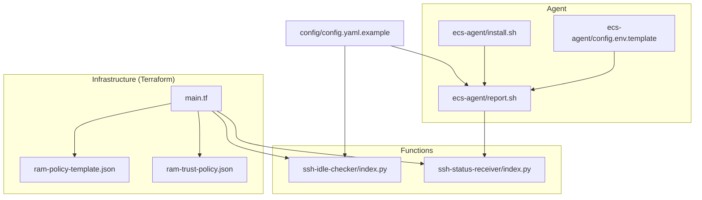
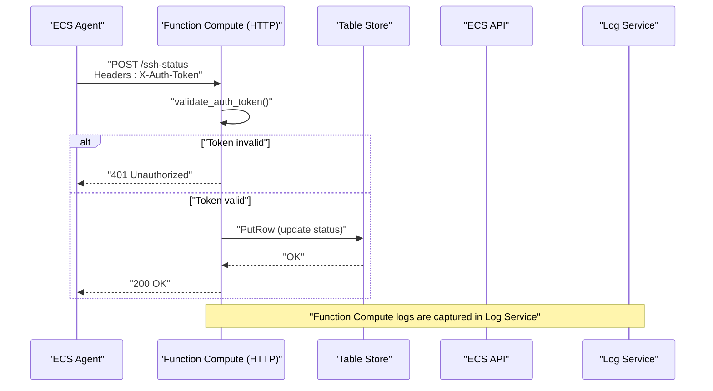
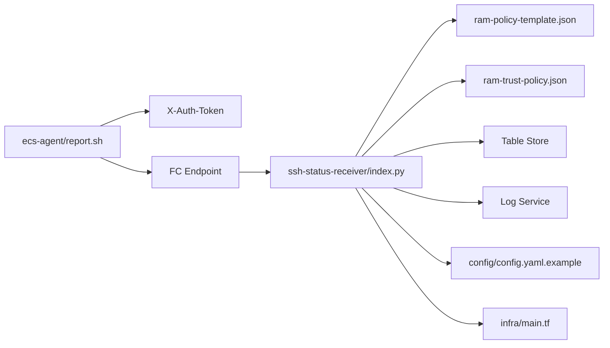

# Security and Access Control

<cite>
**Referenced Files in This Document**
- [config.yaml.example](file://config/config.yaml.example)
- [ram-policy-template.json](file://infra/ram-policy-template.json)
- [ram-trust-policy.json](file://infra/ram-trust-policy.json)
- [main.tf](file://infra/main.tf)
- [index.py (ssh-idle-checker)](file://functions/ssh-idle-checker/index.py)
- [index.py (ssh-status-receiver)](file://functions/ssh-status-receiver/index.py)
- [report.sh](file://ecs-agent/report.sh)
- [install.sh](file://ecs-agent/install.sh)
- [config.env.template](file://ecs-agent/config.env.template)
- [deploy.sh](file://deploy.sh)
- [destroy.sh](file://destroy.sh)
- [requirements.txt (ssh-idle-checker)](file://functions/ssh-idle-checker/requirements.txt)
- [requirements.txt (ssh-status-receiver)](file://functions/ssh-status-receiver/requirements.txt)
</cite>

## Table of Contents
1. [Introduction](#introduction)
2. [Project Structure](#project-structure)
3. [Core Components](#core-components)
4. [Architecture Overview](#architecture-overview)
5. [Detailed Component Analysis](#detailed-component-analysis)
6. [Dependency Analysis](#dependency-analysis)
7. [Performance Considerations](#performance-considerations)
8. [Troubleshooting Guide](#troubleshooting-guide)
9. [Conclusion](#conclusion)
10. [Appendices](#appendices)

## Introduction
This document provides comprehensive security and access control guidance for ECS Auto-Stop. It covers authentication mechanisms for agent-to-server communication, IAM policy configuration with least privilege, trust relationship setup, token management, credential storage, secure communication channels, authorization patterns for Function Compute access to ECS resources and Table Store data, network security considerations, audit logging, compliance, vulnerability assessment, incident response, and monitoring recommendations.

## Project Structure
The repository is organized into modular components:
- Infrastructure (Terraform) defines cloud resources, roles, policies, triggers, and outputs.
- Functions implement the business logic for receiving SSH status and checking idle instances.
- ECS Agent runs on target instances to collect SSH activity and report to Function Compute.
- Configuration templates define environment variables and tokens.

**Diagram sources**
- [main.tf:1-305](file://infra/main.tf#L1-L305)
- [ram-policy-template.json:1-36](file://infra/ram-policy-template.json#L1-L36)
- [ram-trust-policy.json:1-15](file://infra/ram-trust-policy.json#L1-L15)
- [index.py (ssh-idle-checker):1-290](file://functions/ssh-idle-checker/index.py#L1-L290)
- [index.py (ssh-status-receiver):1-205](file://functions/ssh-status-receiver/index.py#L1-L205)
- [report.sh:1-86](file://ecs-agent/report.sh#L1-L86)
- [install.sh:1-73](file://ecs-agent/install.sh#L1-L73)
- [config.env.template:1-12](file://ecs-agent/config.env.template#L1-L12)
- [config.yaml.example:1-42](file://config/config.yaml.example#L1-L42)

**Section sources**
- [main.tf:1-305](file://infra/main.tf#L1-L305)
- [index.py (ssh-idle-checker):1-290](file://functions/ssh-idle-checker/index.py#L1-L290)
- [index.py (ssh-status-receiver):1-205](file://functions/ssh-status-receiver/index.py#L1-L205)
- [report.sh:1-86](file://ecs-agent/report.sh#L1-L86)
- [install.sh:1-73](file://ecs-agent/install.sh#L1-L73)
- [config.env.template:1-12](file://ecs-agent/config.env.template#L1-L12)
- [config.yaml.example:1-42](file://config/config.yaml.example#L1-L42)

## Core Components
- Function Compute HTTP endpoint protected by a shared secret token.
- ECS Agent authenticates with Function Compute using a token header.
- Function Compute validates the token and optionally restricts allowed instance IDs.
- RAM role and policy grant minimal permissions to Function Compute for ECS and Table Store.
- Trust policy allows Function Compute service to assume the role.
- Logging via Log Service for auditability.

Key security-relevant elements:
- Token-based authentication for agent-server communication.
- Least-privilege RAM policy scoped to specific resources.
- Trust relationship enabling Function Compute to act on behalf of the account.
- Environment variables for credentials and configuration.
- Secure communication via HTTPS endpoints.

**Section sources**
- [index.py (ssh-status-receiver):46-65](file://functions/ssh-status-receiver/index.py#L46-L65)
- [report.sh:69-74](file://ecs-agent/report.sh#L69-L74)
- [ram-policy-template.json:1-36](file://infra/ram-policy-template.json#L1-L36)
- [ram-trust-policy.json:1-15](file://infra/ram-trust-policy.json#L1-L15)
- [main.tf:106-132](file://infra/main.tf#L106-L132)
- [main.tf:216-226](file://infra/main.tf#L216-L226)
- [config.yaml.example:23-27](file://config/config.yaml.example#L23-L27)

## Architecture Overview
The system comprises:
- ECS Agent on target instances periodically reports SSH activity to Function Compute.
- Function Compute receives reports, validates authentication, and writes to Table Store.
- Function Compute periodically checks instance status and stops idle instances.
- RAM role and policy govern access to ECS and Table Store.
- Log Service captures Function Compute logs for auditing.

**Diagram sources**
- [report.sh:69-74](file://ecs-agent/report.sh#L69-L74)
- [index.py (ssh-status-receiver):46-65](file://functions/ssh-status-receiver/index.py#L46-L65)
- [index.py (ssh-status-receiver):110-196](file://functions/ssh-status-receiver/index.py#L110-L196)
- [main.tf:216-226](file://infra/main.tf#L216-L226)

## Detailed Component Analysis

### Authentication Mechanisms
- Shared secret token:
  - Generated securely and stored in configuration.
  - Agent sends token in the X-Auth-Token header.
  - Function validates the token against the configured value.
  - Optional: restrict allowed instance IDs via environment variable.

Best practices:
- Rotate tokens regularly.
- Store tokens securely (environment variables, secret managers).
- Enforce HTTPS endpoints to prevent token interception.
- Limit token scope to specific endpoints and methods.

**Section sources**
- [config.yaml.example:23-27](file://config/config.yaml.example#L23-L27)
- [report.sh:71](file://ecs-agent/report.sh#L71)
- [index.py (ssh-status-receiver):46-65](file://functions/ssh-status-receiver/index.py#L46-L65)
- [index.py (ssh-status-receiver):67-76](file://functions/ssh-status-receiver/index.py#L67-L76)
- [main.tf:216-226](file://infra/main.tf#L216-L226)

### IAM Policy Configuration and Least Privilege
- RAM role enables Function Compute to act on behalf of the account.
- Policy grants:
  - ECS: stop specific instance and describe its status.
  - Table Store: read/write/update rows for the monitoring table.
  - Log Service: post logs to the configured log store.
- Policy is templated with region, account, instance, and table identifiers.

Recommendations:
- Use the smallest possible scope for each action.
- Parameterize resource ARNs with variables to enforce scoping.
- Avoid wildcard actions or resources.
- Regularly review and prune permissions.

**Section sources**
- [ram-policy-template.json:1-36](file://infra/ram-policy-template.json#L1-L36)
- [ram-trust-policy.json:1-15](file://infra/ram-trust-policy.json#L1-L15)
- [main.tf:106-132](file://infra/main.tf#L106-L132)
- [main.tf:113-126](file://infra/main.tf#L113-L126)

### Trust Relationship Setup
- Trust policy allows Function Compute service to assume the role.
- Ensures Function Compute executes with the least-privilege role.

**Section sources**
- [ram-trust-policy.json:1-15](file://infra/ram-trust-policy.json#L1-L15)
- [main.tf:106-111](file://infra/main.tf#L106-L111)

### Token Management and Credential Storage
- Tokens are configured via Terraform variables and injected into Function Compute environment.
- Agent configuration includes token and endpoint.
- Credentials for Function Compute are provided by the platform via the role.

Guidelines:
- Treat tokens as secrets; never hardcode in public repositories.
- Use secret managers for rotation and access control.
- Restrict access to configuration files and environment variables.
- Ensure logs do not capture tokens.

**Section sources**
- [main.tf:27-31](file://infra/main.tf#L27-L31)
- [main.tf:167-173](file://infra/main.tf#L167-L173)
- [config.env.template:10-11](file://ecs-agent/config.env.template#L10-L11)
- [deploy.sh:96-116](file://deploy.sh#L96-L116)

### Secure Communication Channels
- Function Compute HTTP endpoint is exposed via Alibaba Cloud’s managed HTTPS.
- Agent uses HTTPS to POST to the endpoint.
- Recommendations:
  - Enforce TLS 1.2+.
  - Use short-lived tokens and frequent rotation.
  - Consider VPC endpoints or private links for internal-only traffic.

**Section sources**
- [report.sh:69](file://ecs-agent/report.sh#L69)
- [main.tf:216-226](file://infra/main.tf#L216-L226)

### Authorization Patterns for Function Access
- Function Compute assumes a RAM role with explicit permissions.
- Token-based authorization protects the HTTP trigger.
- Optional instance allow-list reduces blast radius.

**Section sources**
- [main.tf:106-132](file://infra/main.tf#L106-L132)
- [index.py (ssh-status-receiver):67-76](file://functions/ssh-status-receiver/index.py#L67-L76)

### Table Store Data Access Controls
- Function Compute writes SSH status records keyed by instance ID.
- Policy limits access to the specific OTS instance/table.
- Recommendations:
  - Enable server-side encryption.
  - Audit access via Log Service.
  - Back up and encrypt sensitive data.

**Section sources**
- [ram-policy-template.json:17-25](file://infra/ram-policy-template.json#L17-L25)
- [index.py (ssh-idle-checker):104-130](file://functions/ssh-idle-checker/index.py#L104-L130)
- [index.py (ssh-status-receiver):78-108](file://functions/ssh-status-receiver/index.py#L78-L108)

### Network Security Considerations
- Function Compute HTTP trigger is configured as anonymous with token protection.
- Recommendation:
  - Consider restricting IP ranges or using VPC endpoints.
  - Ensure outbound connectivity is limited to necessary endpoints.

**Section sources**
- [main.tf:216-226](file://infra/main.tf#L216-L226)

### Security Audit Logging and Compliance
- Function Compute logs are routed to Log Service.
- Recommendations:
  - Retain logs per compliance requirements.
  - Ship logs to SIEM for correlation.
  - Include audit trails for ECS stop operations.

**Section sources**
- [main.tf:143-146](file://infra/main.tf#L143-L146)
- [index.py (ssh-idle-checker):132-159](file://functions/ssh-idle-checker/index.py#L132-L159)
- [index.py (ssh-status-receiver):132-159](file://functions/ssh-status-receiver/index.py#L132-L159)

### Vulnerability Assessment Guidelines
- Static analysis:
  - Scan Python code for vulnerabilities.
  - Review dependencies for known CVEs.
- Runtime assessment:
  - Validate token handling and input sanitization.
  - Confirm environment variable usage and secrets management.
- Infrastructure:
  - Review Terraform templates for hardcoded values.
  - Validate trust and policy documents.

**Section sources**
- [requirements.txt (ssh-idle-checker):1-4](file://functions/ssh-idle-checker/requirements.txt#L1-L4)
- [requirements.txt (ssh-status-receiver):1-2](file://functions/ssh-status-receiver/requirements.txt#L1-L2)
- [index.py (ssh-idle-checker):161-290](file://functions/ssh-idle-checker/index.py#L161-L290)
- [index.py (ssh-status-receiver):110-205](file://functions/ssh-status-receiver/index.py#L110-L205)

### Incident Response Procedures
- Immediate actions:
  - Revoke compromised tokens.
  - Rotate credentials.
  - Inspect Function Compute logs for anomalies.
- Forensics:
  - Correlate logs across services.
  - Review Table Store entries for tampering.
- Recovery:
  - Restore from backups if necessary.
  - Re-deploy with hardened configurations.

[No sources needed since this section provides general guidance]

### Security Monitoring Recommendations
- Real-time alerts:
  - Monitor Function Compute invocation failures.
  - Alert on repeated 401/403 responses.
- Behavioral analytics:
  - Detect unusual stop patterns.
  - Track agent downtime via health checks.
- Continuous compliance:
  - Periodic policy reviews.
  - Dependency updates and patching.

[No sources needed since this section provides general guidance]

## Dependency Analysis

**Diagram sources**
- [report.sh:69-74](file://ecs-agent/report.sh#L69-L74)
- [index.py (ssh-status-receiver):46-65](file://functions/ssh-status-receiver/index.py#L46-L65)
- [ram-policy-template.json:1-36](file://infra/ram-policy-template.json#L1-L36)
- [ram-trust-policy.json:1-15](file://infra/ram-trust-policy.json#L1-L15)
- [config.yaml.example:1-42](file://config/config.yaml.example#L1-L42)
- [main.tf:1-305](file://infra/main.tf#L1-L305)

**Section sources**
- [report.sh:1-86](file://ecs-agent/report.sh#L1-L86)
- [index.py (ssh-status-receiver):1-205](file://functions/ssh-status-receiver/index.py#L1-L205)
- [ram-policy-template.json:1-36](file://infra/ram-policy-template.json#L1-L36)
- [ram-trust-policy.json:1-15](file://infra/ram-trust-policy.json#L1-L15)
- [config.yaml.example:1-42](file://config/config.yaml.example#L1-L42)
- [main.tf:1-305](file://infra/main.tf#L1-L305)

## Performance Considerations
- Function timeouts and memory sizing are configured for reliability.
- Agent runs on a tight schedule; ensure endpoints are responsive.
- Avoid excessive logging to reduce overhead.

[No sources needed since this section provides general guidance]

## Troubleshooting Guide
Common issues and resolutions:
- Authentication failures:
  - Verify X-Auth-Token header matches the configured token.
  - Confirm token is present in Function Compute environment variables.
- Endpoint misconfiguration:
  - Ensure FC_ENDPOINT points to the correct Function Compute proxy URL.
- Instance not stopping:
  - Check ECS instance status before stop.
  - Validate RAM role permissions for stop action.
- Logs not appearing:
  - Confirm Log Service project/store configuration.
  - Check Function Compute log routing settings.

**Section sources**
- [report.sh:69-74](file://ecs-agent/report.sh#L69-L74)
- [index.py (ssh-status-receiver):140-147](file://functions/ssh-status-receiver/index.py#L140-L147)
- [index.py (ssh-idle-checker):240-251](file://functions/ssh-idle-checker/index.py#L240-L251)
- [main.tf:143-146](file://infra/main.tf#L143-L146)

## Conclusion
ECS Auto-Stop employs token-based authentication, least-privilege IAM policies, and secure communication to protect automated instance lifecycle operations. By following the outlined best practices—secure token management, strict authorization, robust logging, and continuous monitoring—you can maintain a secure and compliant deployment.

[No sources needed since this section summarizes without analyzing specific files]

## Appendices

### Appendix A: Deployment and Cleanup Scripts
- Deployment script orchestrates Terraform initialization, planning, applying, and generating agent configuration.
- Cleanup script safely destroys resources with confirmation prompts.

**Section sources**
- [deploy.sh:1-162](file://deploy.sh#L1-L162)
- [destroy.sh:1-43](file://destroy.sh#L1-L43)

### Appendix B: Agent Installation and Configuration
- Installation script sets up the agent directory, copies scripts, creates logs, and schedules cron jobs.
- Configuration template defines endpoint, instance ID, and token.

**Section sources**
- [install.sh:1-73](file://ecs-agent/install.sh#L1-L73)
- [config.env.template:1-12](file://ecs-agent/config.env.template#L1-L12)