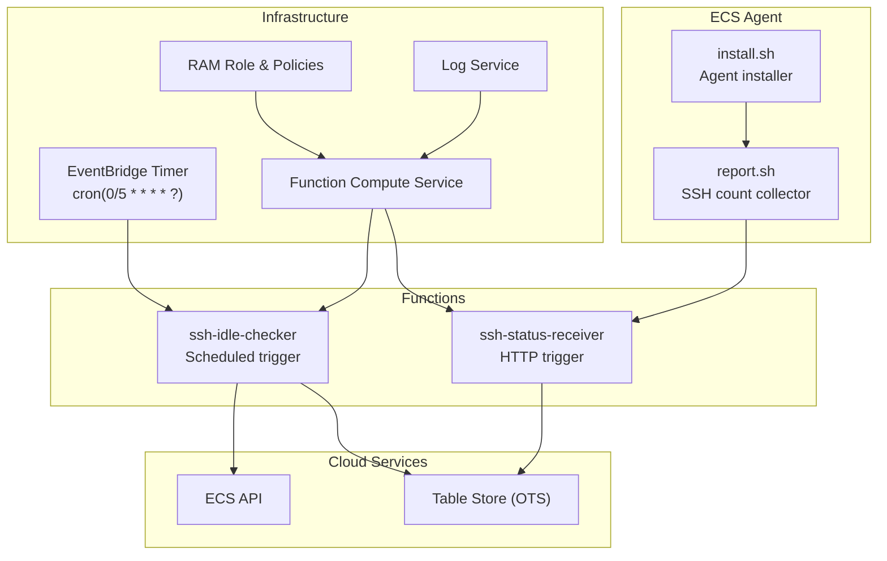
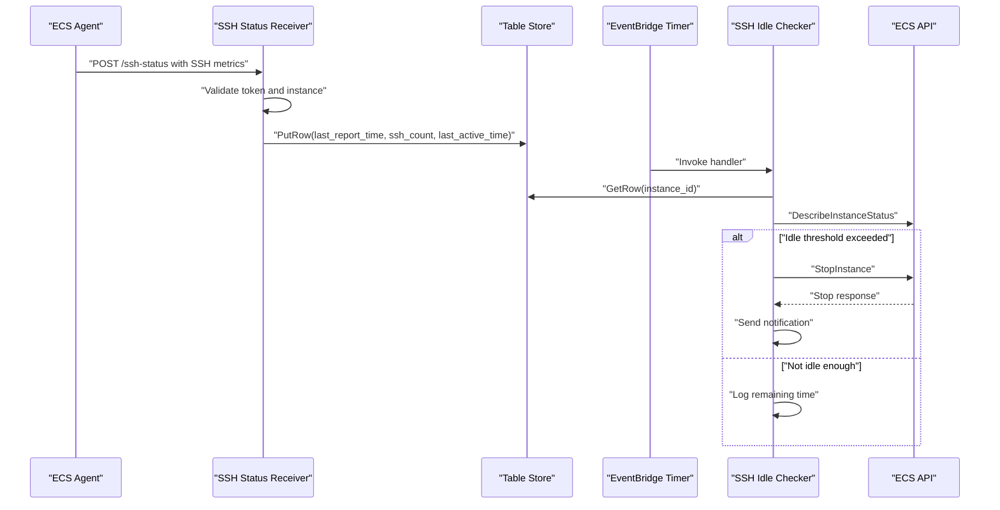
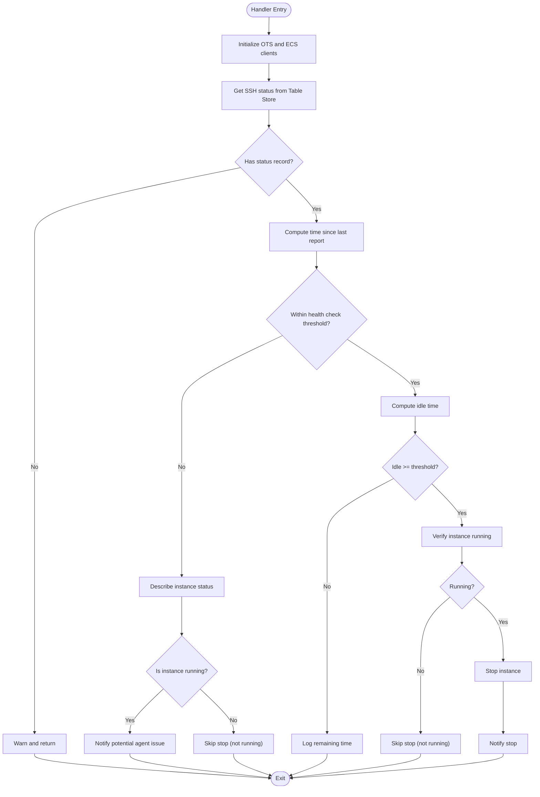
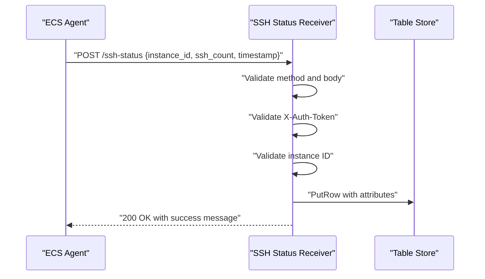
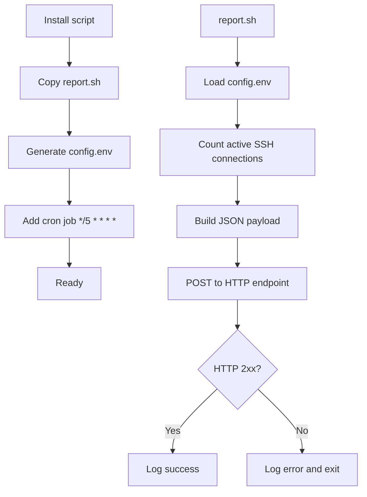
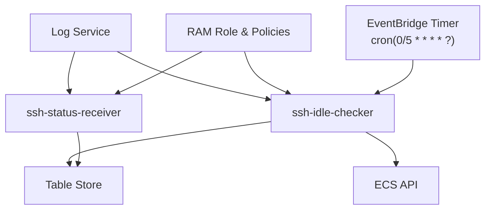
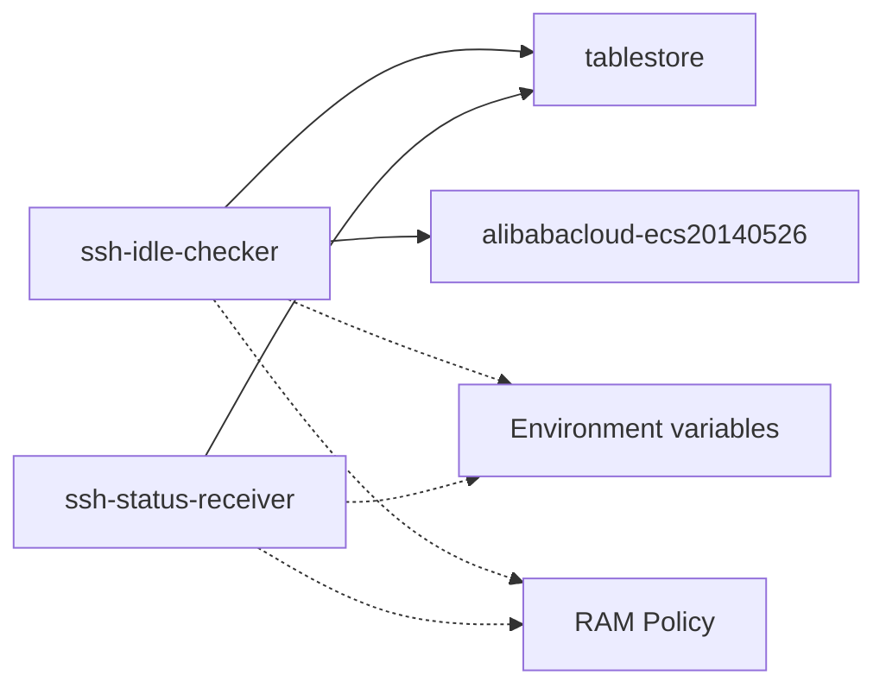

# SSH Idle Checker Function

<cite>
**Referenced Files in This Document**
- [index.py](file://functions/ssh-idle-checker/index.py)
- [requirements.txt](file://functions/ssh-idle-checker/requirements.txt)
- [index.py](file://functions/ssh-status-receiver/index.py)
- [config.yaml.example](file://config/config.yaml.example)
- [main.tf](file://infra/main.tf)
- [ram-policy-template.json](file://infra/ram-policy-template.json)
- [ram-trust-policy.json](file://infra/ram-trust-policy.json)
- [report.sh](file://ecs-agent/report.sh)
- [install.sh](file://ecs-agent/install.sh)
- [config.env.template](file://ecs-agent/config.env.template)
- [deploy.sh](file://deploy.sh)
- [destroy.sh](file://destroy.sh)
</cite>

## Table of Contents
1. [Introduction](#introduction)
2. [Project Structure](#project-structure)
3. [Core Components](#core-components)
4. [Architecture Overview](#architecture-overview)
5. [Detailed Component Analysis](#detailed-component-analysis)
6. [Dependency Analysis](#dependency-analysis)
7. [Performance Considerations](#performance-considerations)
8. [Troubleshooting Guide](#troubleshooting-guide)
9. [Conclusion](#conclusion)
10. [Appendices](#appendices)

## Introduction
This document describes the SSH Idle Checker function that periodically evaluates ECS instance SSH connection activity and safely stops idle instances to reduce costs. It explains the scheduled trigger mechanism, threshold-based decision logic, ECS API integration for stop operations, safety validations, rate limiting considerations, error handling, idle time calculation, configuration parameters, and Table Store integration for status tracking. It also provides examples of decision-making, logging patterns, and operational procedures for maintenance and troubleshooting.

## Project Structure
The repository is organized into modular components:
- Functions: Two serverless functions implement the monitoring pipeline.
- Infrastructure: Terraform definitions provision cloud resources and triggers.
- ECS Agent: A lightweight agent runs on target instances to collect SSH activity and report to the backend.
- Configuration: Example configuration files define defaults and environment variables.

**Diagram sources**
- [main.tf:228-270](file://infra/main.tf#L228-L270)
- [index.py:161-290](file://functions/ssh-idle-checker/index.py#L161-L290)
- [index.py:110-205](file://functions/ssh-status-receiver/index.py#L110-L205)
- [report.sh:1-86](file://ecs-agent/report.sh#L1-L86)

**Section sources**
- [main.tf:1-305](file://infra/main.tf#L1-L305)
- [index.py:1-290](file://functions/ssh-idle-checker/index.py#L1-L290)
- [index.py:1-205](file://functions/ssh-status-receiver/index.py#L1-L205)
- [report.sh:1-86](file://ecs-agent/report.sh#L1-L86)

## Core Components
- SSH Idle Checker (scheduled): Evaluates SSH activity stored in Table Store and stops idle instances via ECS API.
- SSH Status Receiver (HTTP): Validates and persists SSH activity reports from agents.
- ECS Agent: Monitors active SSH connections and posts periodic reports.
- Infrastructure: EventBridge timer, Function Compute functions, RAM roles, and Table Store table.

Key responsibilities:
- Scheduled evaluation of SSH activity every five minutes.
- Threshold-based decisions for idle time and health checks.
- Safe instance state verification before stopping.
- Robust error handling and notifications.

**Section sources**
- [index.py:161-290](file://functions/ssh-idle-checker/index.py#L161-L290)
- [index.py:110-205](file://functions/ssh-status-receiver/index.py#L110-L205)
- [report.sh:1-86](file://ecs-agent/report.sh#L1-L86)
- [main.tf:228-270](file://infra/main.tf#L228-L270)

## Architecture Overview
The system operates as follows:
- The ECS agent runs on the target instance every five minutes, counting active SSH connections and posting a report to the HTTP-triggered receiver.
- The receiver validates the request, authenticates via a shared token, and writes the latest SSH metrics to Table Store.
- A scheduled EventBridge timer triggers the idle checker every five minutes.
- The idle checker reads the latest metrics from Table Store, applies thresholds, verifies instance status, and stops the instance if idle beyond the configured threshold.

**Diagram sources**
- [report.sh:68-86](file://ecs-agent/report.sh#L68-L86)
- [index.py:110-205](file://functions/ssh-status-receiver/index.py#L110-L205)
- [index.py:104-129](file://functions/ssh-idle-checker/index.py#L104-L129)
- [index.py:71-86](file://functions/ssh-idle-checker/index.py#L71-L86)
- [index.py:88-102](file://functions/ssh-idle-checker/index.py#L88-L102)
- [main.tf:256-270](file://infra/main.tf#L256-L270)

## Detailed Component Analysis

### SSH Idle Checker (Scheduled)
Responsibilities:
- Initialize clients for Table Store and ECS using Function Compute service role credentials.
- Retrieve SSH status for the target instance from Table Store.
- Apply health check to detect missing reports.
- Calculate idle time and decide whether to stop the instance.
- Verify instance state before stopping and handle errors gracefully.
- Send notifications via DingTalk webhook when configured.

Decision logic:
- If no status record exists, warn and return without action.
- If no report received within the health check threshold, notify and return.
- Otherwise, compute idle time as current time minus last active time.
- If idle time exceeds the configured threshold, verify instance is running and stop it.
- Log remaining time if not yet idle enough.

Safety validations:
- Verify instance is running before attempting to stop.
- Validate environment variables for OTS endpoints and instance names.
- Catch exceptions during ECS API calls and logging.

Thresholds and scheduling:
- Idle threshold: one hour by default.
- Health check threshold: ten minutes by default.
- Schedule: cron expression every five minutes.

**Diagram sources**
- [index.py:161-290](file://functions/ssh-idle-checker/index.py#L161-L290)
- [index.py:104-129](file://functions/ssh-idle-checker/index.py#L104-L129)
- [index.py:71-86](file://functions/ssh-idle-checker/index.py#L71-L86)
- [index.py:88-102](file://functions/ssh-idle-checker/index.py#L88-L102)

**Section sources**
- [index.py:161-290](file://functions/ssh-idle-checker/index.py#L161-L290)
- [index.py:27-51](file://functions/ssh-idle-checker/index.py#L27-L51)
- [index.py:104-129](file://functions/ssh-idle-checker/index.py#L104-L129)
- [index.py:71-86](file://functions/ssh-idle-checker/index.py#L71-L86)
- [index.py:88-102](file://functions/ssh-idle-checker/index.py#L88-L102)

### SSH Status Receiver (HTTP)
Responsibilities:
- Validate HTTP method and request body.
- Authenticate via shared token header.
- Validate instance ID against an allowed list.
- Update Table Store with latest SSH metrics, including last active time when connections exist.

Security:
- Enforces X-Auth-Token header matching a configured secret.
- Optionally restricts allowed instance IDs.

Table Store updates:
- Writes last_report_time, ssh_count, and optionally last_active_time.
- Uses conditional PutRow to support insert/update semantics.

**Diagram sources**
- [index.py:110-205](file://functions/ssh-status-receiver/index.py#L110-L205)
- [index.py:78-108](file://functions/ssh-status-receiver/index.py#L78-L108)

**Section sources**
- [index.py:110-205](file://functions/ssh-status-receiver/index.py#L110-L205)
- [index.py:78-108](file://functions/ssh-status-receiver/index.py#L78-L108)

### ECS Agent
Responsibilities:
- Count active SSH connections using ss/netstat/who fallbacks.
- Post JSON payload containing instance_id, ssh_count, and timestamp to the HTTP endpoint.
- Retry on failure with HTTP status logging.

Installation:
- Creates directory, copies scripts, generates config.env, and sets up a cron job to run every five minutes.

**Diagram sources**
- [install.sh:50-62](file://ecs-agent/install.sh#L50-L62)
- [report.sh:68-86](file://ecs-agent/report.sh#L68-L86)

**Section sources**
- [install.sh:1-73](file://ecs-agent/install.sh#L1-L73)
- [report.sh:1-86](file://ecs-agent/report.sh#L1-L86)

### Infrastructure and Triggers
- EventBridge Timer: cron expression every five minutes.
- RAM Role and Policies: grants minimal permissions for ECS stop/describe and OTS operations.
- Function Compute: two functions with environment variables for credentials and configuration.
- Log Service: Function Compute logs are routed to a dedicated log store.

**Diagram sources**
- [main.tf:256-270](file://infra/main.tf#L256-L270)
- [main.tf:106-132](file://infra/main.tf#L106-L132)
- [main.tf:176-197](file://infra/main.tf#L176-L197)
- [main.tf:154-174](file://infra/main.tf#L154-L174)

**Section sources**
- [main.tf:228-270](file://infra/main.tf#L228-L270)
- [main.tf:106-132](file://infra/main.tf#L106-L132)
- [main.tf:176-197](file://infra/main.tf#L176-L197)
- [main.tf:154-174](file://infra/main.tf#L154-L174)

## Dependency Analysis
- Function dependencies:
  - SSH Idle Checker imports Table Store and ECS SDKs.
  - SSH Status Receiver imports Table Store SDK.
- Environment variables:
  - OTS_ENDPOINT, OTS_INSTANCE_NAME, OTS_TABLE_NAME for Table Store.
  - TARGET_INSTANCE_ID, REGION_ID for ECS.
  - DINGTALK_WEBHOOK for notifications.
  - AUTH_TOKEN for receiver authentication.
- IAM permissions:
  - Allow stopping and describing the specific instance.
  - Allow OTS get/put/update on the specific table.
  - Allow logging to the configured log store.

**Diagram sources**
- [requirements.txt:1-4](file://functions/ssh-idle-checker/requirements.txt#L1-L4)
- [index.py:14-22](file://functions/ssh-idle-checker/index.py#L14-L22)
- [index.py:14-17](file://functions/ssh-status-receiver/index.py#L14-L17)
- [ram-policy-template.json:1-36](file://infra/ram-policy-template.json#L1-L36)

**Section sources**
- [requirements.txt:1-4](file://functions/ssh-idle-checker/requirements.txt#L1-L4)
- [ram-policy-template.json:1-36](file://infra/ram-policy-template.json#L1-L36)

## Performance Considerations
- Rate limiting:
  - The scheduler runs every five minutes, balancing cost and responsiveness.
  - The agent collects SSH counts every five minutes, minimizing overhead.
- Network latency:
  - HTTP POST from agent to receiver and ECS API calls introduce latency; timeouts are configured in the agent.
- Storage efficiency:
  - Table Store table stores only the latest metrics per instance, avoiding historical growth.
- Function timeouts:
  - Idle checker has a 60-second timeout; receiver has a 30-second timeout.

[No sources needed since this section provides general guidance]

## Troubleshooting Guide
Common scenarios and resolutions:
- No status record found:
  - Indicates the agent is not installed or not reporting.
  - Action: Install agent, verify configuration, and check logs.
- Instance not running but still monitored:
  - The checker skips stop operations if the instance is not running.
  - Action: Investigate instance lifecycle events.
- Agent not sending reports:
  - Check authentication token and endpoint URL.
  - Action: Regenerate and redeploy agent configuration.
- Stop operation fails:
  - Verify ECS permissions and instance state.
  - Action: Retry after verifying instance status.

Operational procedures:
- Verify agent installation and cron job.
- Confirm environment variables in Function Compute functions.
- Review Function Compute logs in the configured log store.
- Validate RAM role policies and trust relationship.

**Section sources**
- [index.py:186-198](file://functions/ssh-idle-checker/index.py#L186-L198)
- [index.py:213-229](file://functions/ssh-idle-checker/index.py#L213-L229)
- [index.py:243-251](file://functions/ssh-idle-checker/index.py#L243-L251)
- [index.py:141-147](file://functions/ssh-status-receiver/index.py#L141-L147)
- [report.sh:29-33](file://ecs-agent/report.sh#L29-L33)
- [report.sh:68-86](file://ecs-agent/report.sh#L68-L86)

## Conclusion
The SSH Idle Checker function provides a robust, threshold-based mechanism to identify and stop idle ECS instances. It integrates securely with Table Store for status tracking and with ECS APIs for safe instance management. The system’s design emphasizes safety validations, clear logging, and configurable thresholds, enabling efficient cost optimization while maintaining operational reliability.

[No sources needed since this section summarizes without analyzing specific files]

## Appendices

### Configuration Parameters
- Thresholds:
  - Idle threshold seconds: default one hour.
  - Health check threshold seconds: default ten minutes.
  - Check interval cron: default every five minutes.
- Environment variables:
  - OTS_ENDPOINT, OTS_INSTANCE_NAME, OTS_TABLE_NAME.
  - TARGET_INSTANCE_ID, REGION_ID.
  - DINGTALK_WEBHOOK (optional).
  - AUTH_TOKEN (receiver).
  - ALLOWED_INSTANCE_IDS (receiver).

**Section sources**
- [config.yaml.example:35-42](file://config/config.yaml.example#L35-L42)
- [index.py:27-29](file://functions/ssh-idle-checker/index.py#L27-L29)
- [index.py:169-175](file://functions/ssh-idle-checker/index.py#L169-L175)
- [index.py:46-64](file://functions/ssh-status-receiver/index.py#L46-L64)

### Decision-Making Examples
- Case 1: No status record.
  - Outcome: Warning notification and no stop action.
- Case 2: No recent report (health check threshold exceeded).
  - Outcome: Alert notification and no stop action.
- Case 3: Idle time exceeds threshold and instance is running.
  - Outcome: Stop instance and notify.
- Case 4: Idle time below threshold.
  - Outcome: Log remaining time until stop.

**Section sources**
- [index.py:186-198](file://functions/ssh-idle-checker/index.py#L186-L198)
- [index.py:209-229](file://functions/ssh-idle-checker/index.py#L209-L229)
- [index.py:235-277](file://functions/ssh-idle-checker/index.py#L235-L277)
- [index.py:278-289](file://functions/ssh-idle-checker/index.py#L278-L289)

### Logging Patterns
- Info logs:
  - Start of checker execution, idle time calculations, successful stop actions.
- Warning logs:
  - Missing status records, potential agent issues, non-running instances.
- Error logs:
  - ECS API failures, Table Store errors, invalid requests.

**Section sources**
- [index.py:167-168](file://functions/ssh-idle-checker/index.py#L167-L168)
- [index.py:204-205](file://functions/ssh-idle-checker/index.py#L204-L205)
- [index.py:237-238](file://functions/ssh-idle-checker/index.py#L237-L238)
- [index.py:118-119](file://functions/ssh-idle-checker/index.py#L118-L119)
- [index.py:84-85](file://functions/ssh-idle-checker/index.py#L84-L85)

### Operational Procedures
- Deploy infrastructure:
  - Use Terraform to provision resources and generate outputs.
- Install agent:
  - Copy agent files to target instance and run installer.
- Verify configuration:
  - Ensure environment variables and tokens match between agent and functions.
- Monitor and maintain:
  - Review logs, adjust thresholds, and validate IAM permissions.

**Section sources**
- [deploy.sh:123-162](file://deploy.sh#L123-L162)
- [install.sh:30-43](file://ecs-agent/install.sh#L30-L43)
- [config.env.template:1-12](file://ecs-agent/config.env.template#L1-L12)
- [main.tf:106-132](file://infra/main.tf#L106-L132)