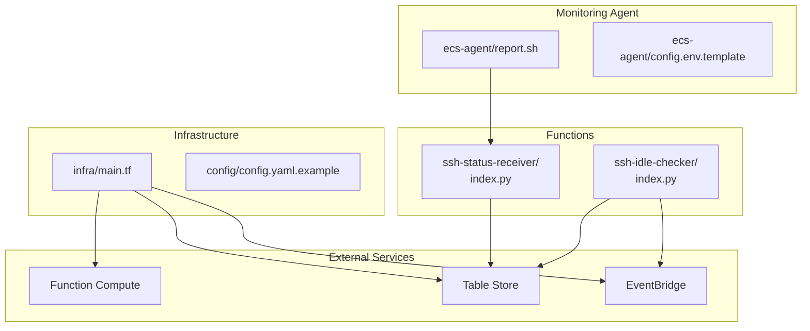
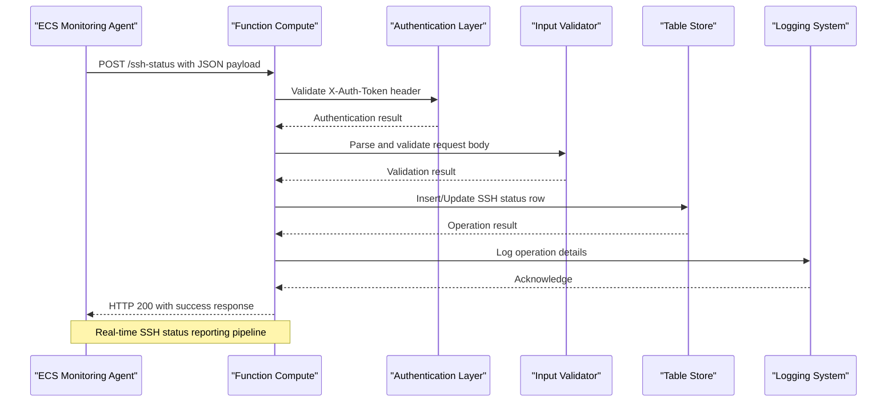
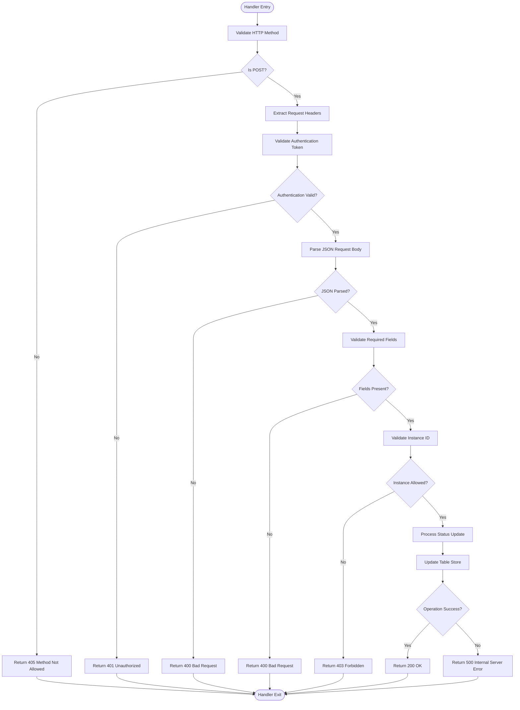
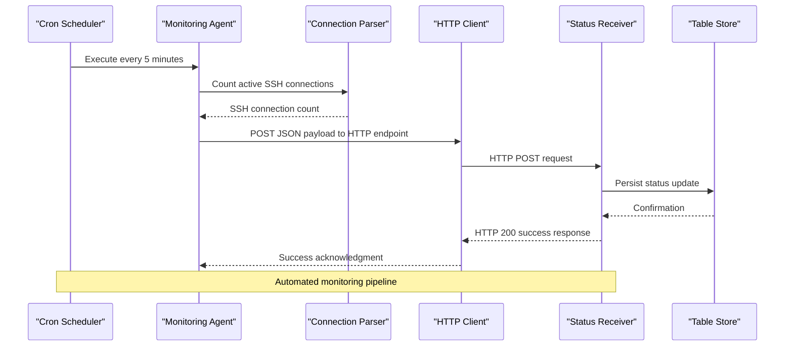
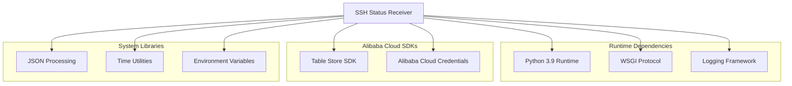

# SSH Status Receiver Function

<cite>
**Referenced Files in This Document**
- [index.py](file://functions/ssh-status-receiver/index.py)
- [requirements.txt](file://functions/ssh-status-receiver/requirements.txt)
- [report.sh](file://ecs-agent/report.sh)
- [config.env.template](file://ecs-agent/config.env.template)
- [main.tf](file://infra/main.tf)
- [config.yaml.example](file://config/config.yaml.example)
</cite>

## Table of Contents
1. [Introduction](#introduction)
2. [Project Structure](#project-structure)
3. [Core Components](#core-components)
4. [Architecture Overview](#architecture-overview)
5. [Detailed Component Analysis](#detailed-component-analysis)
6. [Dependency Analysis](#dependency-analysis)
7. [Performance Considerations](#performance-considerations)
8. [Troubleshooting Guide](#troubleshooting-guide)
9. [Conclusion](#conclusion)
10. [Appendices](#appendices)

## Introduction
The SSH Status Receiver Function is a serverless HTTP-triggered endpoint that receives SSH connection status data from ECS instances and persists it to Alibaba Cloud Table Store. It serves as the ingestion point for the ECS Auto-Stop automation system, enabling real-time monitoring of SSH activity to prevent unnecessary resource consumption.

The function implements robust security validation, input sanitization, and comprehensive error handling while maintaining minimal latency for production workloads. It integrates seamlessly with the monitoring agent deployed on ECS instances and the idle checker function that performs automated instance termination decisions.

## Project Structure
The SSH Status Receiver resides within the functions/ssh-status-receiver directory alongside its dependencies and deployment configuration. The project follows a modular architecture with clear separation between the receiver function, the monitoring agent, and infrastructure provisioning.



**Diagram sources**
- [index.py:1-205](file://functions/ssh-status-receiver/index.py#L1-L205)
- [main.tf:1-305](file://infra/main.tf#L1-L305)

**Section sources**
- [index.py:1-205](file://functions/ssh-status-receiver/index.py#L1-L205)
- [main.tf:1-305](file://infra/main.tf#L1-L305)

## Core Components
The SSH Status Receiver consists of several key components that work together to provide secure, reliable SSH status ingestion:

### HTTP Handler Implementation
The function implements a WSGI-compatible handler that processes HTTP requests through the Function Compute runtime. The handler validates request methods, extracts headers, parses JSON payloads, and manages response formatting.

### Authentication Layer
A multi-layered authentication system validates incoming requests using configurable tokens and instance whitelisting. The system supports optional authentication bypass for development environments while maintaining strict security controls in production.

### Data Validation Pipeline
Comprehensive input validation ensures data integrity by verifying required fields, type constraints, and business logic compliance. The validator enforces numeric ranges and format requirements for all incoming parameters.

### Table Store Integration
Direct integration with Alibaba Cloud Table Store provides persistent storage for SSH status metrics. The implementation uses atomic row operations to ensure data consistency and handles connection lifecycle management efficiently.

**Section sources**
- [index.py:110-205](file://functions/ssh-status-receiver/index.py#L110-L205)
- [index.py:46-76](file://functions/ssh-status-receiver/index.py#L46-L76)
- [index.py:78-108](file://functions/ssh-status-receiver/index.py#L78-L108)

## Architecture Overview
The SSH Status Receiver operates within a distributed architecture that spans multiple Alibaba Cloud services and components:



**Diagram sources**
- [index.py:110-205](file://functions/ssh-status-receiver/index.py#L110-L205)
- [report.sh:69-74](file://ecs-agent/report.sh#L69-L74)

The architecture ensures low-latency processing with automatic scaling capabilities, fault tolerance through retry mechanisms, and comprehensive observability through structured logging and metrics collection.

**Section sources**
- [index.py:110-205](file://functions/ssh-status-receiver/index.py#L110-L205)
- [main.tf:216-226](file://infra/main.tf#L216-L226)

## Detailed Component Analysis

### HTTP Handler Implementation
The WSGI handler processes incoming requests through a structured flow that prioritizes security and reliability:



**Diagram sources**
- [index.py:110-205](file://functions/ssh-status-receiver/index.py#L110-L205)

**Section sources**
- [index.py:110-205](file://functions/ssh-status-receiver/index.py#L110-L205)

### Authentication Mechanism
The authentication system implements a two-tier validation approach:

#### Token-Based Authentication
The function validates the X-Auth-Token header against a configurable environment variable. The implementation supports case-insensitive header matching and provides detailed logging for security events.

#### Instance Whitelisting
Optional instance ID validation restricts reporting to authorized ECS instances only. This adds an additional layer of security by preventing unauthorized instances from submitting status reports.

**Section sources**
- [index.py:46-76](file://functions/ssh-status-receiver/index.py#L46-L76)

### Input Validation Process
The validation pipeline ensures data integrity through multiple verification stages:

#### Field Presence Validation
Required fields (instance_id, ssh_count, timestamp) must be present in the request body. Missing fields result in immediate rejection with appropriate error codes.

#### Type and Range Validation
Numeric fields undergo type conversion and range validation. SSH count must be a non-negative integer, and timestamps must represent valid Unix epoch values.

#### Business Logic Validation
The system validates that SSH counts are reasonable and timestamps are within acceptable ranges to prevent data corruption and maintain analytical integrity.

**Section sources**
- [index.py:161-181](file://functions/ssh-status-receiver/index.py#L161-L181)

### Table Store Integration
The function maintains a dedicated table structure optimized for SSH status monitoring:

#### Table Schema Design
The Table Store table uses instance_id as the primary key with attributes for tracking SSH connection states, timing metrics, and operational metadata.

#### Atomic Operations
Status updates use atomic row operations to ensure consistency during concurrent access patterns typical of high-frequency reporting scenarios.

#### Error Handling and Retry
Robust error handling captures connection failures, network timeouts, and service unavailability with appropriate logging and graceful degradation.

**Section sources**
- [index.py:78-108](file://functions/ssh-status-receiver/index.py#L78-L108)

### Monitoring Agent Integration
The receiver integrates seamlessly with the ECS monitoring agent through a standardized reporting protocol:



**Diagram sources**
- [report.sh:69-74](file://ecs-agent/report.sh#L69-L74)
- [index.py:110-205](file://functions/ssh-status-receiver/index.py#L110-L205)

**Section sources**
- [report.sh:1-86](file://ecs-agent/report.sh#L1-L86)
- [config.env.template:1-12](file://ecs-agent/config.env.template#L1-L12)

## Dependency Analysis
The SSH Status Receiver has minimal external dependencies focused on core functionality:



**Diagram sources**
- [requirements.txt:1-2](file://functions/ssh-status-receiver/requirements.txt#L1-L2)
- [index.py:9-17](file://functions/ssh-status-receiver/index.py#L9-L17)

**Section sources**
- [requirements.txt:1-2](file://functions/ssh-status-receiver/requirements.txt#L1-L2)
- [index.py:9-17](file://functions/ssh-status-receiver/index.py#L9-L17)

## Performance Considerations
The function is optimized for high-throughput, low-latency operation:

### Memory and CPU Efficiency
- Runtime memory allocation: 128MB base with dynamic scaling
- CPU utilization: Minimal processing overhead for JSON parsing and validation
- Cold start optimization: Lightweight initialization with cached client connections

### Network Optimization
- Direct Table Store integration eliminates intermediate processing layers
- Efficient JSON serialization minimizes bandwidth usage
- Connection pooling reduces latency for database operations

### Scalability Features
- Automatic scaling through Function Compute platform
- Stateless design enables horizontal scaling
- Optimized Table Store operations handle concurrent writes efficiently

## Troubleshooting Guide

### Common Error Scenarios

#### Authentication Failures
- **401 Unauthorized**: Missing or invalid X-Auth-Token header
- **403 Forbidden**: Instance ID not in allowed list
- **405 Method Not Allowed**: Non-POST HTTP method used

#### Input Validation Errors
- **400 Bad Request**: Invalid JSON payload or missing required fields
- **Field Validation Issues**: Non-numeric values or out-of-range timestamps

#### System Errors
- **500 Internal Server Error**: Table Store connectivity or processing failures

#### Monitoring and Debugging
The function implements comprehensive logging for all operational phases, enabling detailed troubleshooting through Function Compute logs and Table Store audit trails.

**Section sources**
- [index.py:125-204](file://functions/ssh-status-receiver/index.py#L125-L204)

## Conclusion
The SSH Status Receiver Function provides a robust, secure, and scalable solution for monitoring SSH connection status in Alibaba Cloud ECS environments. Its modular design, comprehensive validation, and efficient Table Store integration make it an essential component of the ECS Auto-Stop automation system.

The function's security-first approach, with multi-layered authentication and input validation, ensures reliable operation in production environments while maintaining simplicity for deployment and maintenance. The seamless integration with the monitoring agent and idle checker functions creates a complete automation pipeline for cost-effective ECS resource management.

## Appendices

### Environment Configuration
The function requires several environment variables for proper operation:

- **OTS_ENDPOINT**: Table Store service endpoint URL
- **OTS_INSTANCE_NAME**: Table Store instance identifier
- **OTS_TABLE_NAME**: Target table for status storage
- **AUTH_TOKEN**: Shared secret for request authentication
- **ALLOWED_INSTANCE_IDS**: Comma-separated list of authorized instance IDs

### Request/Response Examples

#### Successful Request
**Request:**
```
POST /ssh-status HTTP/1.1
Host: your-function-endpoint
Content-Type: application/json
X-Auth-Token: your-secret-token

{
    "instance_id": "i-1234567890abcdef0",
    "ssh_count": 2,
    "timestamp": 1640995200
}
```

**Response:**
```
HTTP/1.1 200 OK
Content-Type: application/json

{
    "success": true,
    "message": "Status updated successfully",
    "instance_id": "i-1234567890abcdef0",
    "ssh_count": 2
}
```

#### Error Response Example
**Request:**
```
POST /ssh-status HTTP/1.1
Host: your-function-endpoint
Content-Type: application/json
X-Auth-Token: invalid-token
```

**Response:**
```
HTTP/1.1 401 Unauthorized
Content-Type: application/json

{
    "error": "Invalid or missing authentication token"
}
```

### Deployment Configuration
The infrastructure provisioning automatically configures:
- Function Compute service with appropriate IAM permissions
- Table Store instance and table with proper access controls
- HTTP trigger with anonymous authentication
- EventBridge integration for scheduled monitoring tasks

**Section sources**
- [main.tf:167-173](file://infra/main.tf#L167-L173)
- [config.yaml.example:23-26](file://config/config.yaml.example#L23-L26)