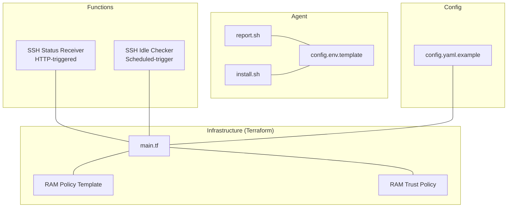
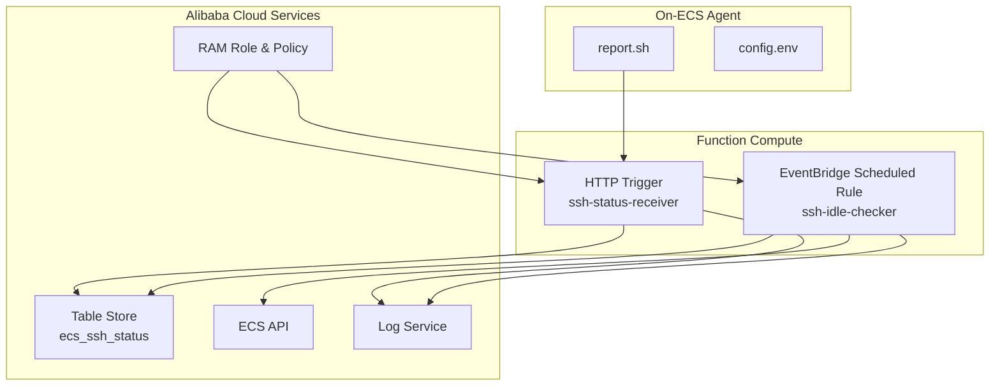
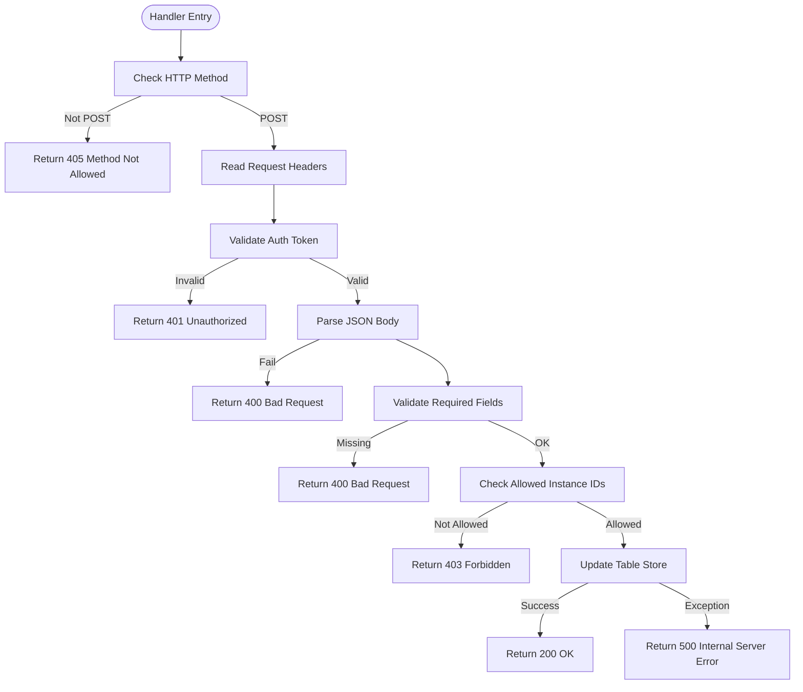
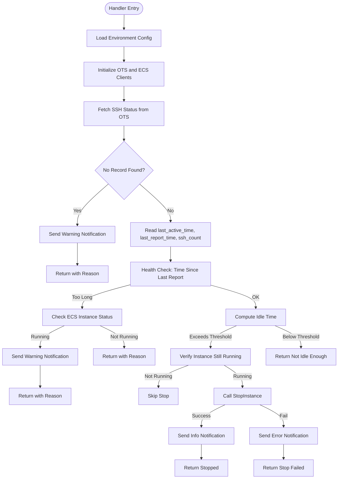
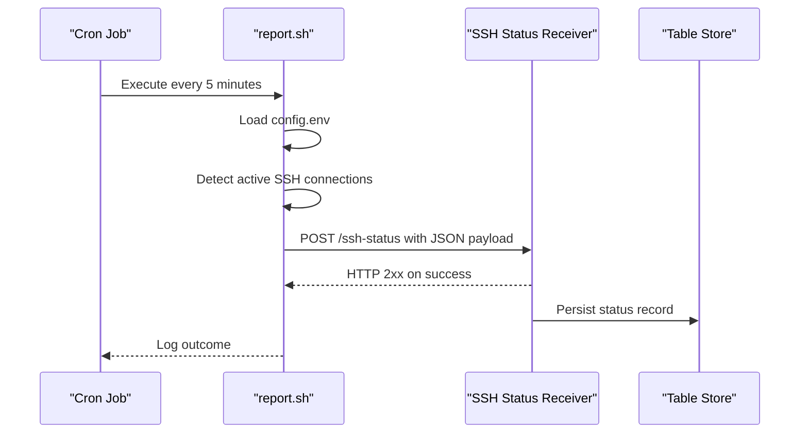
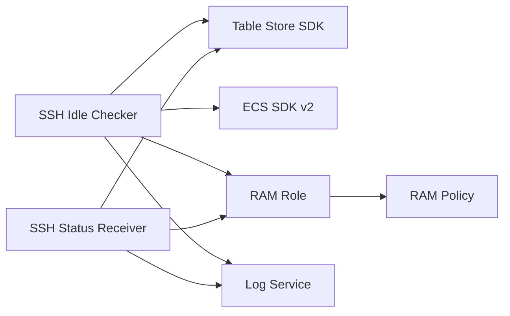

# Serverless Functions

<cite>
**Referenced Files in This Document**
- [functions/ssh-status-receiver/index.py](file://functions/ssh-status-receiver/index.py)
- [functions/ssh-status-receiver/requirements.txt](file://functions/ssh-status-receiver/requirements.txt)
- [functions/ssh-idle-checker/index.py](file://functions/ssh-idle-checker/index.py)
- [functions/ssh-idle-checker/requirements.txt](file://functions/ssh-idle-checker/requirements.txt)
- [config/config.yaml.example](file://config/config.yaml.example)
- [infra/main.tf](file://infra/main.tf)
- [infra/ram-policy-template.json](file://infra/ram-policy-template.json)
- [infra/ram-trust-policy.json](file://infra/ram-trust-policy.json)
- [deploy.sh](file://deploy.sh)
- [destroy.sh](file://destroy.sh)
- [ecs-agent/report.sh](file://ecs-agent/report.sh)
- [ecs-agent/install.sh](file://ecs-agent/install.sh)
- [ecs-agent/config.env.template](file://ecs-agent/config.env.template)
</cite>

## Table of Contents
1. [Introduction](#introduction)
2. [Project Structure](#project-structure)
3. [Core Components](#core-components)
4. [Architecture Overview](#architecture-overview)
5. [Detailed Component Analysis](#detailed-component-analysis)
6. [Dependency Analysis](#dependency-analysis)
7. [Performance Considerations](#performance-considerations)
8. [Troubleshooting Guide](#troubleshooting-guide)
9. [Conclusion](#conclusion)
10. [Appendices](#appendices)

## Introduction
This document describes the serverless functions that power ECS Auto-Stop on Alibaba Cloud Function Compute. It covers two primary functions:
- SSH Status Receiver: An HTTP-triggered function that receives SSH connection status from ECS instances and persists it to Table Store.
- SSH Idle Checker: A scheduled-trigger function that evaluates SSH activity and stops idle ECS instances safely.

It also documents the Python implementation details, Alibaba Cloud Function Compute runtime behavior, security model, logging patterns, error handling, and operational procedures.

## Project Structure
The repository is organized into modular components:
- functions/: Contains the Lambda-style Python functions for Function Compute
- infra/: Infrastructure-as-Code using Terraform to provision Function Compute, Table Store, EventBridge, RAM roles, and logging
- config/: Example configuration for thresholds and environment
- ecs-agent/: Agent scripts that run on target ECS instances to monitor SSH connections and report status
- deploy.sh and destroy.sh: Operational scripts to deploy and tear down resources

**Diagram sources**
- [infra/main.tf:1-305](file://infra/main.tf#L1-L305)
- [functions/ssh-status-receiver/index.py:1-205](file://functions/ssh-status-receiver/index.py#L1-L205)
- [functions/ssh-idle-checker/index.py:1-290](file://functions/ssh-idle-checker/index.py#L1-L290)
- [ecs-agent/report.sh:1-86](file://ecs-agent/report.sh#L1-L86)
- [ecs-agent/install.sh:1-73](file://ecs-agent/install.sh#L1-L73)
- [ecs-agent/config.env.template:1-12](file://ecs-agent/config.env.template#L1-L12)
- [config/config.yaml.example:1-42](file://config/config.yaml.example#L1-L42)

**Section sources**
- [infra/main.tf:1-305](file://infra/main.tf#L1-L305)
- [deploy.sh:1-162](file://deploy.sh#L1-L162)
- [destroy.sh:1-43](file://destroy.sh#L1-L43)

## Core Components
- SSH Status Receiver (HTTP-triggered)
  - Validates authentication token from request headers
  - Parses and validates JSON request body
  - Optionally filters by allowed instance IDs
  - Persists status to Table Store using OTSClient
- SSH Idle Checker (scheduled-trigger)
  - Reads SSH status from Table Store
  - Performs health checks against ECS instance status
  - Applies threshold-based decision logic to stop idle instances
  - Sends notifications via DingTalk webhook (optional)
  - Uses Alibaba Cloud ECS SDK for instance operations

**Section sources**
- [functions/ssh-status-receiver/index.py:110-205](file://functions/ssh-status-receiver/index.py#L110-L205)
- [functions/ssh-idle-checker/index.py:161-290](file://functions/ssh-idle-checker/index.py#L161-L290)

## Architecture Overview
The system integrates the ECS agent, Function Compute, Table Store, and EventBridge as follows:

**Diagram sources**
- [infra/main.tf:138-270](file://infra/main.tf#L138-L270)
- [functions/ssh-status-receiver/index.py:110-205](file://functions/ssh-status-receiver/index.py#L110-L205)
- [functions/ssh-idle-checker/index.py:161-290](file://functions/ssh-idle-checker/index.py#L161-L290)
- [ecs-agent/report.sh:69-85](file://ecs-agent/report.sh#L69-L85)

## Detailed Component Analysis

### SSH Status Receiver Function
Purpose:
- Receive periodic SSH connection status from ECS instances via HTTP POST
- Authenticate incoming requests
- Persist status to Table Store for downstream consumption

Key behaviors:
- HTTP trigger handler signature compatible with WSGI-like environments
- Authentication token validation via a custom header
- Input validation for required fields and optional allowed instance ID filtering
- Table Store write using PutRow with conditions

Processing logic flow:

**Diagram sources**
- [functions/ssh-status-receiver/index.py:110-205](file://functions/ssh-status-receiver/index.py#L110-L205)

Implementation highlights:
- Environment-driven configuration for OTS endpoint, instance name, table name, auth token, and allowed instance IDs
- Uses Alibaba Cloud Table Store SDK to put rows with conditions
- Comprehensive logging for audit and troubleshooting
- Minimal input parsing and validation to reduce attack surface

Security and validation:
- Authentication token enforced via a dedicated header
- Optional allow-list for instance IDs to restrict ingestion
- Strict JSON parsing and field presence checks

Error handling:
- Early exits with explicit HTTP status codes
- Centralized exception handling with logging and 500 responses

Performance considerations:
- Lightweight JSON parsing and minimal CPU work
- Single-table write operation per request
- Small memory footprint suitable for low-memory function configuration

**Section sources**
- [functions/ssh-status-receiver/index.py:1-205](file://functions/ssh-status-receiver/index.py#L1-L205)
- [functions/ssh-status-receiver/requirements.txt:1-2](file://functions/ssh-status-receiver/requirements.txt#L1-L2)

### SSH Idle Checker Function
Purpose:
- Periodically evaluate SSH activity for a target ECS instance
- Stop the instance if it remains idle beyond a configurable threshold
- Perform health checks to detect missing reports and agent issues

Key behaviors:
- Scheduled trigger via EventBridge timer
- Reads latest SSH status from Table Store
- Verifies instance status via ECS DescribeInstanceStatus
- Applies threshold-based decision logic
- Sends notifications via DingTalk webhook (optional)
- Defensive checks to avoid stopping non-running instances

Processing logic flow:

**Diagram sources**
- [functions/ssh-idle-checker/index.py:161-290](file://functions/ssh-idle-checker/index.py#L161-L290)

Implementation highlights:
- Environment-driven configuration for target instance, region, thresholds, and optional webhook
- Uses Alibaba Cloud ECS SDK v2 for international endpoints
- Robust error handling and logging for all operations
- Safety validations before stopping instances

Thresholds and decisions:
- Idle threshold: configurable seconds (default 1 hour)
- Health check threshold: configurable seconds (default 10 minutes)
- Decision logic: only stop if instance is currently running

Notifications:
- Optional DingTalk webhook integration for warnings, info, and errors

**Section sources**
- [functions/ssh-idle-checker/index.py:1-290](file://functions/ssh-idle-checker/index.py#L1-L290)
- [functions/ssh-idle-checker/requirements.txt:1-4](file://functions/ssh-idle-checker/requirements.txt#L1-L4)

### ECS Agent (On Target Instance)
Purpose:
- Monitor active SSH connections on the target ECS instance
- Periodically report status to the SSH Status Receiver via HTTP POST

Key behaviors:
- Loads configuration from a local environment file
- Counts active SSH connections using multiple detection methods
- Builds and sends a JSON payload with instance ID, SSH count, and timestamp
- Handles HTTP response codes and logs outcomes

Operational flow:

**Diagram sources**
- [ecs-agent/report.sh:69-85](file://ecs-agent/report.sh#L69-L85)
- [functions/ssh-status-receiver/index.py:110-205](file://functions/ssh-status-receiver/index.py#L110-L205)

**Section sources**
- [ecs-agent/report.sh:1-86](file://ecs-agent/report.sh#L1-L86)
- [ecs-agent/install.sh:1-73](file://ecs-agent/install.sh#L1-L73)
- [ecs-agent/config.env.template:1-12](file://ecs-agent/config.env.template#L1-L12)

## Dependency Analysis
Runtime and SDK dependencies:
- SSH Status Receiver
  - Table Store SDK for Python
- SSH Idle Checker
  - Table Store SDK for Python
  - Alibaba Cloud ECS SDK v2
  - OpenAPI client library for SDK configuration

Infrastructure dependencies:
- Function Compute service with attached RAM role
- RAM role with policies scoped to specific instance and OTS table
- Table Store instance and table
- EventBridge scheduled rule targeting the idle checker
- Log Service project/store for function logs

**Diagram sources**
- [functions/ssh-status-receiver/requirements.txt:1-2](file://functions/ssh-status-receiver/requirements.txt#L1-L2)
- [functions/ssh-idle-checker/requirements.txt:1-4](file://functions/ssh-idle-checker/requirements.txt#L1-L4)
- [infra/main.tf:106-132](file://infra/main.tf#L106-L132)
- [infra/ram-policy-template.json:1-36](file://infra/ram-policy-template.json#L1-L36)

**Section sources**
- [infra/main.tf:106-132](file://infra/main.tf#L106-L132)
- [infra/ram-policy-template.json:1-36](file://infra/ram-policy-template.json#L1-L36)
- [infra/ram-trust-policy.json:1-15](file://infra/ram-trust-policy.json#L1-L15)

## Performance Considerations
- Function memory and timeouts
  - SSH Status Receiver: small memory footprint and short timeout suitable for lightweight HTTP handling
  - SSH Idle Checker: higher memory and longer timeout to accommodate ECS API calls and potential retries
- Network latency
  - Minimize outbound calls; both functions perform single-table reads/writes and one ECS API call per invocation
- Concurrency and cold starts
  - Cold start impact is mitigated by simple handlers and minimal dependencies
- Logging overhead
  - Structured logging with INFO level for normal operations; errors logged with ERROR level
- Agent cadence
  - Agent runs every 5 minutes; align with EventBridge schedule to avoid redundant checks

[No sources needed since this section provides general guidance]

## Troubleshooting Guide
Common issues and resolutions:
- Authentication failures
  - Ensure the X-Auth-Token header matches the configured auth token
  - Verify the HTTP endpoint URL and that the trigger is configured correctly
- Missing or invalid request body
  - Confirm the payload includes instance_id, ssh_count, and timestamp
  - Validate JSON formatting and UTF-8 encoding
- Instance not in allowed list
  - Update the allowed instance IDs environment variable if multi-instance support is desired
- No status record found
  - Indicates the agent has not reported yet or the record expired unexpectedly
  - Check agent installation and cron job
- Instance not running but still receiving reports
  - Verify ECS instance status via console/API; adjust logic if needed
- Stop operation failed
  - Check IAM permissions and ECS API availability; retry after investigating logs
- Notifications not sent
  - Verify DingTalk webhook URL configuration and network connectivity

Operational commands:
- Deploy and teardown
  - Use the provided scripts to provision and remove resources
- Logs inspection
  - Access Function Compute logs via Log Service project/store
- Agent verification
  - Manually run the agent script to validate configuration and connectivity

**Section sources**
- [deploy.sh:1-162](file://deploy.sh#L1-L162)
- [destroy.sh:1-43](file://destroy.sh#L1-L43)
- [functions/ssh-status-receiver/index.py:140-180](file://functions/ssh-status-receiver/index.py#L140-L180)
- [functions/ssh-idle-checker/index.py:186-229](file://functions/ssh-idle-checker/index.py#L186-L229)

## Conclusion
The ECS Auto-Stop solution combines a lightweight HTTP-triggered function for status ingestion, a scheduled function for idle detection and safe stopping, and a simple agent that monitors SSH connections on target instances. The design emphasizes security (token-based auth, allow-lists), reliability (health checks, defensive validations), and observability (logging, notifications). Infrastructure provisioning via Terraform ensures consistent deployments and least-privilege access through RAM roles and policies.

[No sources needed since this section summarizes without analyzing specific files]

## Appendices

### Environment Variables and Configuration
- SSH Status Receiver
  - OTS_ENDPOINT, OTS_INSTANCE_NAME, OTS_TABLE_NAME
  - AUTH_TOKEN
  - ALLOWED_INSTANCE_IDS
- SSH Idle Checker
  - OTS_ENDPOINT, OTS_INSTANCE_NAME, OTS_TABLE_NAME
  - TARGET_INSTANCE_ID, REGION_ID
  - DINGTALK_WEBHOOK (optional)
- Agent
  - FC_ENDPOINT, INSTANCE_ID, AUTH_TOKEN

**Section sources**
- [functions/ssh-status-receiver/index.py:24-43](file://functions/ssh-status-receiver/index.py#L24-L43)
- [functions/ssh-idle-checker/index.py:54-68](file://functions/ssh-idle-checker/index.py#L54-L68)
- [ecs-agent/config.env.template:1-12](file://ecs-agent/config.env.template#L1-L12)
- [config/config.yaml.example:1-42](file://config/config.yaml.example#L1-L42)

### Security Model
- RAM trust policy allows Function Compute service to assume the role
- RAM policy grants:
  - ECS:StopInstance and DescribeInstanceStatus for the target instance
  - OTS: GetRow/PutRow/UpdateRow for the specific table
  - Log: PostLogStoreLogs for the function log store

**Section sources**
- [infra/ram-trust-policy.json:1-15](file://infra/ram-trust-policy.json#L1-L15)
- [infra/ram-policy-template.json:1-36](file://infra/ram-policy-template.json#L1-L36)

### Runtime Behavior and Handler Signatures
- SSH Status Receiver uses a WSGI-like handler signature compatible with Function Compute HTTP triggers
- SSH Idle Checker uses the standard Function Compute event handler signature for scheduled triggers

**Section sources**
- [functions/ssh-status-receiver/index.py:110-131](file://functions/ssh-status-receiver/index.py#L110-L131)
- [functions/ssh-idle-checker/index.py:161-166](file://functions/ssh-idle-checker/index.py#L161-L166)