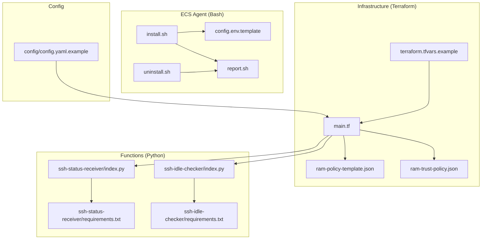
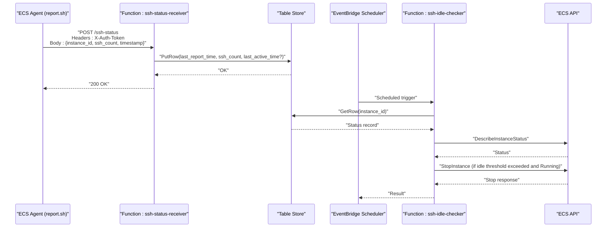
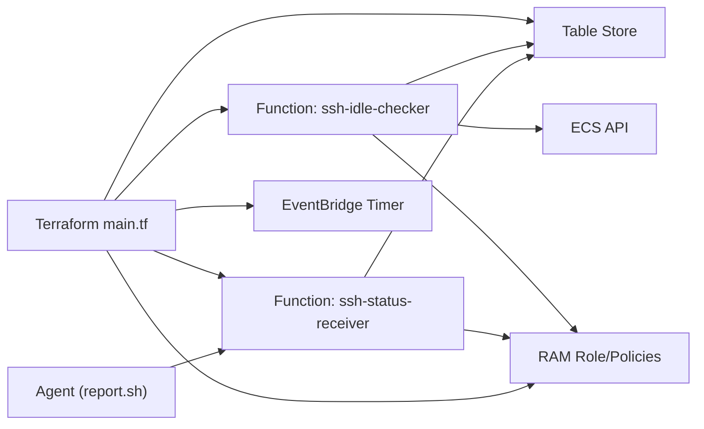

# Troubleshooting and FAQ

<cite>
**Referenced Files in This Document**
- [config.yaml.example](file://config/config.yaml.example)
- [terraform.tfvars.example](file://infra/terraform.tfvars.example)
- [main.tf](file://infra/main.tf)
- [ram-policy-template.json](file://infra/ram-policy-template.json)
- [ram-trust-policy.json](file://infra/ram-trust-policy.json)
- [deploy.sh](file://deploy.sh)
- [destroy.sh](file://destroy.sh)
- [install.sh](file://ecs-agent/install.sh)
- [uninstall.sh](file://ecs-agent/uninstall.sh)
- [config.env.template](file://ecs-agent/config.env.template)
- [report.sh](file://ecs-agent/report.sh)
- [index.py (ssh-status-receiver)](file://functions/ssh-status-receiver/index.py)
- [requirements.txt (ssh-status-receiver)](file://functions/ssh-status-receiver/requirements.txt)
- [index.py (ssh-idle-checker)](file://functions/ssh-idle-checker/index.py)
- [requirements.txt (ssh-idle-checker)](file://functions/ssh-idle-checker/requirements.txt)
</cite>

## Table of Contents
1. [Introduction](#introduction)
2. [Project Structure](#project-structure)
3. [Core Components](#core-components)
4. [Architecture Overview](#architecture-overview)
5. [Detailed Component Analysis](#detailed-component-analysis)
6. [Dependency Analysis](#dependency-analysis)
7. [Performance Considerations](#performance-considerations)
8. [Troubleshooting Guide](#troubleshooting-guide)
9. [FAQ](#faq)
10. [Conclusion](#conclusion)

## Introduction
This document provides comprehensive troubleshooting and FAQ guidance for ECS Auto-Stop. It covers common issues across agent installation, authentication, function execution, and infrastructure provisioning. It also includes systematic debugging procedures, error interpretation, resolution steps, diagnostic tools usage, performance tuning, and frequently asked questions.

## Project Structure
The project is organized into four major areas:
- Infrastructure (Terraform): provisions Function Compute, Table Store, EventBridge, RAM role/policy, and logging.
- Functions (Python): two serverless functions for receiving SSH status and checking idle instances.
- ECS Agent (Bash): runs on target ECS instances to monitor SSH connections and report status.
- Configuration: YAML and TF variables for environment-specific settings.

**Diagram sources**
- [main.tf](file://infra/main.tf)
- [terraform.tfvars.example](file://infra/terraform.tfvars.example)
- [ram-policy-template.json](file://infra/ram-policy-template.json)
- [ram-trust-policy.json](file://infra/ram-trust-policy.json)
- [index.py (ssh-status-receiver)](file://functions/ssh-status-receiver/index.py)
- [index.py (ssh-idle-checker)](file://functions/ssh-idle-checker/index.py)
- [requirements.txt (ssh-status-receiver)](file://functions/ssh-status-receiver/requirements.txt)
- [requirements.txt (ssh-idle-checker)](file://functions/ssh-idle-checker/requirements.txt)
- [install.sh](file://ecs-agent/install.sh)
- [uninstall.sh](file://ecs-agent/uninstall.sh)
- [config.env.template](file://ecs-agent/config.env.template)
- [report.sh](file://ecs-agent/report.sh)
- [config.yaml.example](file://config/config.yaml.example)

**Section sources**
- [main.tf](file://infra/main.tf)
- [terraform.tfvars.example](file://infra/terraform.tfvars.example)
- [index.py (ssh-status-receiver)](file://functions/ssh-status-receiver/index.py)
- [index.py (ssh-idle-checker)](file://functions/ssh-idle-checker/index.py)
- [install.sh](file://ecs-agent/install.sh)
- [report.sh](file://ecs-agent/report.sh)
- [config.yaml.example](file://config/config.yaml.example)

## Core Components
- Infrastructure provisioning: Creates OTS table, Function Compute service, RAM role/policy, EventBridge schedule, and HTTP trigger.
- SSH Status Receiver: Validates auth token, accepts POST, writes status to OTS, and responds with HTTP codes.
- SSH Idle Checker: Scheduled function that reads OTS, checks instance status, and stops the instance if idle beyond threshold.
- ECS Agent: Monitors SSH connections, builds payload, posts to HTTP endpoint, and logs outcomes.
- Configuration: YAML and TF variables define region, instance, thresholds, tokens, and optional notifications.

Key configuration touchpoints:
- Environment variables for functions (e.g., OTS endpoints, instance IDs, tokens).
- Cron schedule for agent reporting and EventBridge schedule for idle checker.
- RAM permissions scoped to specific instance and OTS resources.

**Section sources**
- [main.tf](file://infra/main.tf)
- [index.py (ssh-status-receiver)](file://functions/ssh-status-receiver/index.py)
- [index.py (ssh-idle-checker)](file://functions/ssh-idle-checker/index.py)
- [report.sh](file://ecs-agent/report.sh)
- [config.yaml.example](file://config/config.yaml.example)

## Architecture Overview
High-level flow:
- Agent runs on target ECS instance every 5 minutes, counting active SSH connections and posting to HTTP endpoint.
- HTTP endpoint validates token and writes status to OTS.
- Scheduled EventBridge triggers idle checker, which reads OTS, verifies instance status, and stops the instance if idle beyond threshold.
- Optional notifications are sent via webhook.

**Diagram sources**
- [report.sh](file://ecs-agent/report.sh)
- [index.py (ssh-status-receiver)](file://functions/ssh-status-receiver/index.py)
- [index.py (ssh-idle-checker)](file://functions/ssh-idle-checker/index.py)
- [main.tf](file://infra/main.tf)

## Detailed Component Analysis

### SSH Status Receiver (HTTP Endpoint)
Responsibilities:
- Validate authentication token from request headers.
- Accept only POST requests.
- Parse JSON body and validate required fields.
- Optionally restrict allowed instance IDs.
- Write status to OTS with last report time, SSH count, and last active time when applicable.

Common issues:
- Missing or invalid X-Auth-Token header.
- Non-POST method or malformed JSON body.
- Unauthorized instance ID.
- OTS write failure.

Operational signals:
- HTTP 200 on success.
- HTTP 401/403/400/500 with error messages in JSON body.

**Section sources**
- [index.py (ssh-status-receiver)](file://functions/ssh-status-receiver/index.py)
- [report.sh](file://ecs-agent/report.sh)

### SSH Idle Checker (Scheduled Function)
Responsibilities:
- Read SSH status from OTS for target instance.
- Perform health check against last report time.
- Verify instance status via ECS API.
- Stop instance if idle beyond threshold and instance is running.

Common issues:
- Missing target instance ID environment variable.
- OTS read/write permission failures.
- ECS API call failures.
- Instance not running when attempting to stop.

Operational signals:
- Action outcomes: none, skipped, stopped, stop_failed.
- Notifications sent on warnings or stop actions.

**Section sources**
- [index.py (ssh-idle-checker)](file://functions/ssh-idle-checker/index.py)
- [main.tf](file://infra/main.tf)

### ECS Agent (Monitoring and Reporting)
Responsibilities:
- Count active SSH connections using ss/netstat/who fallback.
- Build JSON payload with instance ID, SSH count, and timestamp.
- POST to Function Compute HTTP endpoint with X-Auth-Token header.
- Log success/failure and HTTP status codes.

Common issues:
- Missing or incomplete config.env.
- Network connectivity to Function Compute endpoint.
- Authentication mismatch with AUTH_TOKEN.
- Cron misconfiguration preventing periodic reporting.

**Section sources**
- [report.sh](file://ecs-agent/report.sh)
- [install.sh](file://ecs-agent/install.sh)
- [config.env.template](file://ecs-agent/config.env.template)

### Infrastructure Provisioning (Terraform)
Responsibilities:
- Create OTS instance/table.
- Create Function Compute service with attached RAM role and policy.
- Configure EventBridge timer and HTTP trigger.
- Output HTTP endpoint, OTS identifiers, and role ARN.

Common issues:
- Missing Alibaba Cloud credentials.
- Incorrect terraform.tfvars values.
- RAM policy insufficient for ECS/OTS operations.
- Region mismatch between agent and provisioned resources.

**Section sources**
- [main.tf](file://infra/main.tf)
- [terraform.tfvars.example](file://infra/terraform.tfvars.example)
- [ram-policy-template.json](file://infra/ram-policy-template.json)
- [ram-trust-policy.json](file://infra/ram-trust-policy.json)

## Dependency Analysis
Component dependencies and coupling:
- Agent depends on Function Compute HTTP endpoint and AUTH_TOKEN.
- Functions depend on OTS endpoints and RAM role credentials.
- Idle checker depends on ECS region and target instance ID.
- All components depend on correct region configuration.

**Diagram sources**
- [report.sh](file://ecs-agent/report.sh)
- [index.py (ssh-status-receiver)](file://functions/ssh-status-receiver/index.py)
- [index.py (ssh-idle-checker)](file://functions/ssh-idle-checker/index.py)
- [main.tf](file://infra/main.tf)
- [ram-policy-template.json](file://infra/ram-policy-template.json)

**Section sources**
- [main.tf](file://infra/main.tf)
- [index.py (ssh-status-receiver)](file://functions/ssh-status-receiver/index.py)
- [index.py (ssh-idle-checker)](file://functions/ssh-idle-checker/index.py)
- [report.sh](file://ecs-agent/report.sh)

## Performance Considerations
- Agent reporting cadence: Agent runs every 5 minutes; ensure this aligns with thresholds and reduce unnecessary churn.
- Function timeouts: Receiver timeout is 30s; checker is 60s. Ensure network conditions and OTS latency fit within these limits.
- OTS throughput: Capacity mode OTS instance supports burst; monitor for throttling under heavy reporting load.
- ECS API rate limits: Idle checker performs occasional describe/status calls; schedule should avoid excessive frequency.
- Logging overhead: Function Compute logging is enabled; ensure log retention and cost are acceptable.

[No sources needed since this section provides general guidance]

## Troubleshooting Guide

### General Debugging Procedure
1. Verify configuration
   - Confirm terraform.tfvars and config.yaml values.
   - Ensure region matches agent and provisioned resources.
2. Check connectivity
   - From the ECS instance, test HTTP reachability to the Function Compute endpoint.
   - Validate DNS resolution and outbound internet access.
3. Inspect logs
   - Agent logs on the instance: review /var/log/ssh-monitor.log.
   - Function logs in Log Service project/store.
4. Validate authentication
   - Ensure X-Auth-Token header matches AUTH_TOKEN.
   - Confirm AUTH_TOKEN is set consistently across agent and Function environment.
5. Test function endpoints
   - Manually POST to HTTP endpoint with a valid payload.
   - Confirm OTS row is written after successful POST.

**Section sources**
- [deploy.sh](file://deploy.sh)
- [report.sh](file://ecs-agent/report.sh)
- [index.py (ssh-status-receiver)](file://functions/ssh-status-receiver/index.py)
- [main.tf](file://infra/main.tf)

### Agent Installation Failures
Symptoms:
- Installation script exits early or reports missing privileges.
- Cron job not added or not running.

Checklist:
- Run install.sh as root/sudo.
- Verify /opt/ssh-monitor directory and config.env creation.
- Confirm cron marker and job existence.
- Manually run report.sh to validate environment and connectivity.

Resolution steps:
- Re-run install.sh with root privileges.
- Fix cron by editing crontab or re-running install.sh.
- Regenerate agent config via deploy.sh outputs.

**Section sources**
- [install.sh](file://ecs-agent/install.sh)
- [uninstall.sh](file://ecs-agent/uninstall.sh)
- [deploy.sh](file://deploy.sh)

### Authentication Errors
Symptoms:
- HTTP 401 Unauthorized from Function Compute.
- HTTP 403 Forbidden for unauthorized instance ID.

Checklist:
- Compare AUTH_TOKEN in agent config.env with Function environment variables.
- Confirm X-Auth-Token header is present in agent’s POST.
- Verify ALLOWED_INSTANCE_IDS includes the target instance ID.

Resolution steps:
- Regenerate agent config.env using deploy.sh outputs.
- Update Function environment variables if changed.
- Ensure agent and Function share identical tokens.

**Section sources**
- [report.sh](file://ecs-agent/report.sh)
- [index.py (ssh-status-receiver)](file://functions/ssh-status-receiver/index.py)
- [main.tf](file://infra/main.tf)

### Function Execution Problems
Symptoms:
- HTTP 400 Bad Request for malformed JSON or missing fields.
- HTTP 500 Internal Server Error during OTS write.
- Idle checker reports “no status record” or “no recent report.”

Checklist:
- Validate request body fields: instance_id, ssh_count, timestamp.
- Confirm OTS table exists and is writable.
- Check RAM role/policy grants OTS PutRow and ECS APIs.
- Verify EventBridge schedule is active and targets the correct function.

Resolution steps:
- Fix payload format and required fields.
- Recreate OTS table if corrupted.
- Adjust RAM policy to include ecs:StopInstance and ecs:DescribeInstanceStatus.
- Recreate EventBridge resources if needed.

**Section sources**
- [index.py (ssh-status-receiver)](file://functions/ssh-status-receiver/index.py)
- [index.py (ssh-idle-checker)](file://functions/ssh-idle-checker/index.py)
- [ram-policy-template.json](file://infra/ram-policy-template.json)
- [main.tf](file://infra/main.tf)

### Infrastructure Provisioning Issues
Symptoms:
- Terraform apply fails due to missing credentials or invalid variables.
- RAM policy denies OTS/ECS operations.
- HTTP endpoint not reachable after deployment.

Checklist:
- Set ALICLOUD_ACCESS_KEY and ALICLOUD_SECRET_KEY or configure aliyun CLI.
- Fill terraform.tfvars with region, target_instance_id, auth_token, optional dingtalk_webhook.
- Confirm RAM role trust policy allows Function Compute service.
- Validate OTS instance/table names and region alignment.

Resolution steps:
- Configure credentials and retry terraform init/plan/apply.
- Update terraform.tfvars and re-apply.
- Verify RAM policy statements include ecs:StopInstance, ecs:DescribeInstanceStatus, and OTS operations.

**Section sources**
- [deploy.sh](file://deploy.sh)
- [terraform.tfvars.example](file://infra/terraform.tfvars.example)
- [ram-policy-template.json](file://infra/ram-policy-template.json)
- [ram-trust-policy.json](file://infra/ram-trust-policy.json)
- [main.tf](file://infra/main.tf)

### Log Analysis and Status Verification
- Agent logs: Tail /var/log/ssh-monitor.log on the ECS instance; look for HTTP status codes and error messages.
- Function logs: Use Log Service project and logstore to search by function name and request IDs.
- OTS verification: Query the OTS table for the instance_id row to confirm last_report_time and ssh_count updates.
- Instance status: Use ECS console/API to verify Running state before stop attempts.

Diagnostic commands:
- On ECS instance: tail -f /var/log/ssh-monitor.log
- On local machine: terraform output to retrieve HTTP endpoint and resource identifiers.

**Section sources**
- [report.sh](file://ecs-agent/report.sh)
- [main.tf](file://infra/main.tf)

### Connectivity Testing
- From ECS instance, curl the Function Compute HTTP endpoint with a test payload and X-Auth-Token header.
- Validate DNS resolution and outbound connectivity to *.fc.aliyuncs.com and *.ots.aliyuncs.com.
- Test internal SSH connection detection using ss or netstat.

**Section sources**
- [report.sh](file://ecs-agent/report.sh)
- [config.env.template](file://ecs-agent/config.env.template)

### Error Message Interpretation
- 400 Bad Request: Missing required fields or invalid JSON body.
- 401 Unauthorized: Missing or incorrect X-Auth-Token.
- 403 Forbidden: Instance ID not in allowed list.
- 500 Internal Server Error: OTS write failure or unhandled exception.
- “No status record”: First-time run or agent not reporting.
- “No recent report”: Agent stopped reporting; check cron and logs.

**Section sources**
- [index.py (ssh-status-receiver)](file://functions/ssh-status-receiver/index.py)
- [index.py (ssh-idle-checker)](file://functions/ssh-idle-checker/index.py)

### Resolution Steps for Frequent Problems
- Agent not reporting:
  - Reinstall agent, verify cron job, and test report.sh manually.
- Authentication mismatch:
  - Regenerate agent config.env and ensure token consistency.
- OTS write failures:
  - Confirm RAM policy and OTS table existence; retry after corrections.
- Idle checker not stopping instances:
  - Verify instance is Running; check ECS permissions and region configuration.

**Section sources**
- [install.sh](file://ecs-agent/install.sh)
- [deploy.sh](file://deploy.sh)
- [index.py (ssh-idle-checker)](file://functions/ssh-idle-checker/index.py)
- [ram-policy-template.json](file://infra/ram-policy-template.json)

### Diagnostic Tools Usage
- Terraform: plan/apply/destroy lifecycle for infrastructure management.
- Log Service: query function logs by timestamp and request ID.
- OTS Console: browse rows and verify schema.
- curl: manual POST to HTTP endpoint with proper headers and payload.

**Section sources**
- [deploy.sh](file://deploy.sh)
- [destroy.sh](file://destroy.sh)
- [report.sh](file://ecs-agent/report.sh)
- [main.tf](file://infra/main.tf)

## FAQ

Q1: How do I generate a secure AUTH_TOKEN?
- Use a cryptographically secure random generator to produce a hex-encoded token. Ensure it matches between agent config.env and Function environment variables.

Q2: Why does the agent fail with “Configuration file not found”?
- Ensure /opt/ssh-monitor/config.env exists and contains FC_ENDPOINT, INSTANCE_ID, and AUTH_TOKEN. Re-run deploy.sh to regenerate the file.

Q3: The idle checker reports “no status record.” What should I do?
- This indicates the agent has not reported yet or is not running. Install/verify agent, test report.sh, and check logs.

Q4: The idle checker says “no recent report,” but the instance is still running. What now?
- Investigate whether the agent is still active. Check cron job, logs, and network connectivity. Restart agent if needed.

Q5: Can I change the idle threshold or check interval?
- Yes. Update thresholds in config.yaml and the EventBridge cron schedule in main.tf. Re-apply infrastructure changes.

Q6: How do I stop the agent cleanly?
- Run the uninstall script on the ECS instance. It removes cron job and directory while preserving logs for reference.

Q7: Why am I getting 403 Forbidden from the HTTP endpoint?
- The instance ID is not in the allowed list. Update ALLOWED_INSTANCE_IDS to include the target instance ID.

Q8: How often does the agent report, and can I change it?
- Default is every 5 minutes via cron. Adjust the cron schedule in install.sh or the crontab entry.

Q9: What permissions does the RAM role require?
- Allow ecs:StopInstance and ecs:DescribeInstanceStatus for the target instance, OTS PutRow/GetRow/UpdateRow for the table, and log:PostLogStoreLogs for the log store.

Q10: How do I clean up all resources?
- Use the destroy script to remove all cloud resources. Ensure the agent is uninstalled first to avoid errors.

**Section sources**
- [config.yaml.example](file://config/config.yaml.example)
- [main.tf](file://infra/main.tf)
- [ram-policy-template.json](file://infra/ram-policy-template.json)
- [install.sh](file://ecs-agent/install.sh)
- [uninstall.sh](file://ecs-agent/uninstall.sh)
- [deploy.sh](file://deploy.sh)
- [destroy.sh](file://destroy.sh)

## Conclusion
By following the structured troubleshooting procedures, validating configurations, and leveraging logs and diagnostics, most issues related to agent installation, authentication, function execution, and infrastructure provisioning can be resolved quickly. Regular monitoring of logs, adherence to IAM policies, and correct environment variable alignment are key to operating ECS Auto-Stop reliably.